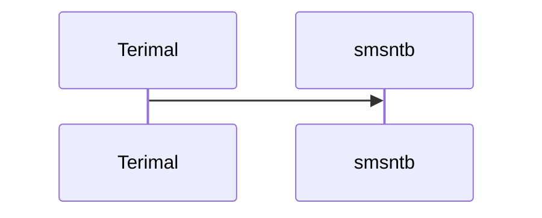
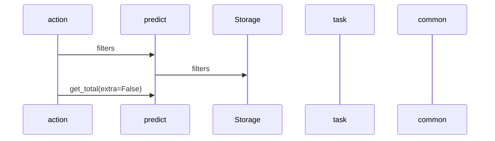

耐高温油漆,600
灰漆,100
氟碳面漆,680
防锈漆 钢结构,100
油漆,100
黑色油漆,100
银油漆,100
油漆,400
灰色油漆,100
油漆家用翻新,700
水性油漆,100
黑漆,100
汽车金属漆,100
钢结构漆,100
防锈油漆,500
高温油漆,100
货车油漆,700
汽车油漆,400
货车油漆,100
钢结构金属漆,700
铁门油漆,100
氟碳油漆,680
不锈钢漆,100
防锈漆金属漆铁门,100
金属漆氟碳漆,800
金属油漆,100
防锈漆彩钢瓦,900
自动喷漆,100
户外漆,100
金属氟碳漆,100
漆油油漆 金属漆,100
桶装油漆,100
银灰色油漆,100
白色油漆,100
油漆家用 金属漆,100
油漆家用 自喷漆,100
黑色漆,100
漆,500
防锈漆,100
彩钢瓦翻新漆,600
工业油漆,100
油漆金属漆,800
蓝色油漆,100
黑色氟碳漆,100
喷漆,100
车漆 补漆,100
镀锌漆,100
油漆喷漆,100
铁门漆,700
外墙油漆,100
防锈漆金属漆铁门,500
金属防锈漆 防腐漆,700
金属油漆,1200
水性金属漆,500
油漆涂料,700
船用油漆,100
黑色油漆 黑漆,100
铁门漆,100
防腐漆,100
汽车漆 油漆,400
金属氟碳面漆,800
醇酸磁漆,100
防锈油漆,100
白色油漆 白漆,100
钢结构油漆,700
金属漆,700
防锈底漆,100
油漆家用 金属漆,700
彩钢瓦专用漆,100
耐高温油漆,100
钢结构油漆,2800
水性金属漆,100
汽车漆 油漆,100
速干漆,100
快干油漆,100
钢结构金属漆,100
油漆 木器漆,100
防锈漆 金属漆,100
亮油漆,100
大红油漆,100
钢结构,100
钢结构氟碳漆,700
金属防锈漆,100
漆油油漆 防锈漆,100
漆,100
不锈钢喷漆,100
环氧底漆,100
钢结构油漆,100
黑油漆 黑漆,100
油漆 白漆,100
黄色油漆,100
红色油漆,100
镀锌油漆,100
白油漆,100
金漆,100
油漆涂料,100
汽车漆油漆 金属漆,100
不锈钢油漆,100
白油漆 白漆,100
水性油漆水性漆,100
绿色油漆,100
栏杆油漆,100
黑油漆,100
碳氟,100
防锈自喷漆,100
金属喷漆,100
银色漆,100
哑光氟碳漆,100
车用油漆,100
银色油漆,100
大门油漆,700
防锈漆 金属漆 防腐漆,700
氟碳漆金属漆,600
防盗门油漆,100
油漆家用,500
耐高温漆,100
防锈漆防腐漆,400
浮漂油漆,100
防锈漆彩钢瓦,100
户外油漆,100
氟碳漆,600
彩钢瓦翻新漆,100
氟碳金属漆,600
油漆金属漆,700
防锈漆 金属漆,700
银色防锈漆,100
漆油油漆,100
室外油漆,100
油漆防锈漆,100
汽车油漆,100
油漆防锈漆铁栏杆,100
清漆,700
汽车防锈漆,100
防腐油漆,100
防锈漆防腐漆,100
防锈漆金属漆铁门,700
栏杆漆,100
油漆防锈漆,400
油漆家用,100

# add1214

## 嫦娥五号回归

嫦娥五号发射完土壤之后，人就没了，我们发了8吨的嫦娥五号上天，现在只剩下两千克的土壤。两千克，每一克都值得千金。

而从土壤上来看获得显然是不公平的，我们还获得了相当多的经验，相当完备的自动化技术，以及继续探索，继续查看月球的可能性。

无敌！

## pydantic datetime form 替换

### 方案

1. 使用 validator 替换，写在 core 里面，继承这个类
2. 写一个新的类型，用于解析特定的格式的字符串
3. 使用date类型，转datetime
4. 解决了，新写一个 类型，解析datetime，并且把pydantic里面的parse_datetime拉出来用
   1. parse_datetime是pydantic.validators里面的，很好用，如果考虑扩展其他的类型，这里会比较重要

## 外出拜访交流会

### 厉成

淘内

和早期淘宝不一样，希望搞定通用的东西，第三方服务为大商家，垂直类目等做事情

淘外

### 潘婷婷

淘内

侧重在小程序，目前淘内跟进比较少，除了互动，其他项目也有接入的点

淘外

淘外的着重点，在上架商品和售后服务的部分，不像淘内的精细化。需要考虑淘外的实力能够做到的

### 张丽晶

淘内

对大商家增加定制化数据的能力，人群细分和CRM

运营能力需要提升，加快商家学习了解美折的能力，尽快体会到美折的价值

数据银行，淘宝、服务商、商家共同建立的内容

### 翁光秀

淘外

商家注重于仓库、货源管理等，线上工具的使用比较少用，也不太愿意关心

### 邵竹秀

大卖家

老客维系

自动化工具

老客唤醒，自动生成图文详情页

短信发的比较多

很少做推广的

有赞，私运营

### 崔洁

顶部发送引导效果很好，直接设定好条件发送

产品更多转向自动化地发送

### 赵汉毓

小程序

服务预约，简单场景可以做

商家对于店铺粉丝的运营会越来越个性化

小游戏、0元试用的运营方式

互动需求 + 私域运营

### 黄祎翎

一些玩法向的打折促销功能还是有的

根据优先级补齐促销功能

### 陈琳渝

淘内

打造敏捷运营系统，新上的产品或者项目

比较全面的运营，进行配合

在美折做尝试，积累经验

产品上根据不同用户推荐不同功能

新项目运营介入没有那么快

会从抖音快手开始

### 陈贤栋

抖音快手

商家特点，选品和价格很重要，选品的数据挖掘

开店容易，不需要很多知识

规则体系套用阿里的，抖音快手直接复制

粉丝很重要，CRM功能更重要，私域管理

平台对商家的运营是弱关注、弱运营的，创造营销玩法

商家控制人员成本的意识很强，大部分都外包了，外包和外包效果监控

退货率很高，库存和财务的精细化的管理，比较重要

多店多平台，商品管理和搬家软件，多平台数据整合？这个显然越界了，但是可行吗？

### 洪杰

量在增加、发送人数变少

相似类目的商家交换买家人群，作为服务商加强商家群体的连接

### 李璐慧

电商平台对内容的强化

图文-短视频-直播

留存时间增长，转化率增高，退款率增高

水印-短视频内容-直播素材、抽奖、直播整活

商品讲解-直播回放剪切自动化

直播间的交互，留住观众

流量的红利效应

产业聚集地区的改变

娱乐性平台流量很大

内容管理（新）

1. 抖快商家会运营老客户吗？长期的CRM是否需要呢？
2. 直播平台需要新内容和新商品，新商品和新内容耗尽时的选择

# add1207

## 例会

拼多多增量

跨月续费或拉新补充

自然流量减少

平台是否能够保证持续增长

抖快流量红利

服务市场考虑过支持移动端么


用户等级划分

用户目的划分

商家消耗的问题


## 复购率问题

以订单数量代替用户数量来计算复购率

原公式：

设30天内订购的用户为 A，设 A 中在三十天前有订购的用户为 B，则```复购率=B的数量/A的数量```

更新公式：

设30天内的订单数量为 a，订购的用户为 A，设在 A 中三十天前订购的订单数量为 b，则```复购率=b/a```

## 调研热词挖掘

we were born of the dust

made man by the dust

undone by the dust

fear the old thick dust

## 李兵1on1

### 最近做的事情

1. 出词方向上的事情
2. 双十二短信
3. 场景推广的托管
4. 拼多多整体上是在堆功能，然后整理一下代码、处理问题等

## 方块游戏平台

游戏很少啊，怎么没有一点声音呢

# 只狼

## 游戏性

### 装备

忍义手就是只狼的装备，飞镖、斧子、长枪等装备都可以通过忍义手安装、更换，对不同敌人，一些装备会产生奇效。

同时可以进行升级，产生不同的效果，有了对不同敌人，使用不同属性的 build，是可以进行探索的一部分

### 成长

玩家可以通过寻找佛珠、葫芦种子、击败敌人来分别提升生命值、葫芦的使用次数、攻击力，可以通过游戏过程中获得的技能书学习技能，当然，忍义手的升级和使用，也是成长的一部分

### 战斗

战斗基础技巧是格挡、垫步和看破，在敌人血条的基础上增加了架势条，满架势条的情况下可以进行处决，这使得战斗富有节奏感，与敌人对决时的沉浸感变得很强

### 画面和表现

画面很优美，优化也不错，玩得很流畅

## 游戏内容

### 剧情

只狼作为皇子的忍者，在三年前去平田家接回皇子，但是被自己的义父背刺死去，而后皇子授予了只狼龙胤之力，拥有了起死回生的能力。

皇子被囚禁，失去了皇子的只狼浑浑噩噩地度过了三年，爱玛给出书信，请求只狼前往望月楼救回皇子，却不慎被弦一郎斩断手臂，佛雕师用忍义手代替了斩断的手臂，只狼于是继续踏上救皇子的道路。

救皇子的同时，只狼发现了起死回生的秘密。而击败弦一郎，救回皇子之后，只狼也答应要让龙胤的诅咒就此断绝，作为皇子的忍者，只狼取回了前往仙乡的材料，前往仙乡获得了断绝不死的材料，同时也发现了不死的来源，仙峰寺不死的真相。

结局是开放式的，官方的结局是龙之还乡，即很有可能会有「只狼2」

### 主题

主题是追求不死。不同立场的群体使用不同的方法来达到不死。苇名的弦一郎希望通过皇子获得龙胤之力。仙峰寺通过不死的虫子获得不死的力量，甚至抓捕孩童做实验。仙乡通过供奉和吸收精气来维持不死。不论是哪一方势力，不管是出于什么样的目的，最终都变得下作卑劣，而高高在上的樱龙，也不过是苟延残喘。

围绕不死的角度去思考和探讨，使得这个动作游戏有了深度，而在其中的支线、透露出来的信息，都更能体现出作者想要表达的观点——死是应当有的终点，不死只是自私的欲望。

当然还有副主题，苇名国的日暮，破灭的必然，天下大势不可阻挡的规律，营造了这样的沧桑感，整个游戏都更加厚重起来。

## 星座书上

星座书上，说我们不和

最后我偷偷把那页撕掉

真的爱情没法预料

何必让你知道

## 九品芝麻官

1. 贪官奸，清官要更奸
2. 我全都要
3. 堂下何人为何状告本官
4. 我一进来就看见常威在打来福
5. 来人呐，喂公子吃饼
6. 我玩完了不给钱，就不算piao咯
7. 你叫啊，叫破喉咙也不会有人来救你的
8. 寂寞空虚冷
9. 此乃正义之言
10. 大...
11. 我进来了，我又出去了，打我啊笨蛋！
12. 阴阳人烂屁股
13. 我要写一个惨字
14. 我是天生神力啊
15. 你用明朝的剑，斩清朝的官啊
16. 让她生让她生

你我都知道，一个英雄单位的价值，是无论多少个士兵、高级士兵都不能和他匹敌的

## 网上冲浪选手从恋爱到生孩子的舆论压力

### 性别对立

### 单身主义

### 家庭暴力、家庭关系

### 生育率问题

### 幼儿教育

# add1130

## 后端预期内报错和前端统一处理

一些报错，比如创建 Plan，出现不符合条件的报错，前端处理是直接 alert 的，甚至会记录到 sentry。

需要后端区分出哪些是真正需要报错告知用户的，并且要写日志，返回合适的 msg，前端 hold 住，正确使用组建 message 展示消息，而不是使用 alert 直接报错。

## unit每日报告和plan每日报告中的日期字段问题

问题由来已久，你懂得，需要注意的是

1. 索引，我们用日期字段 'd' 做了索引的，所以需要 gen_index
2. 更新所有的每日报表字段，修正线上数据
3. 更新获取和写入

## 找一下类目商家最多的用户

其实是算一下我们现在的用户，他的商品的类目大概分布情况

## 深海迷航的病毒

新冠病毒让我想到了深海迷航的剧情

一群外星人到了深海迷航所在的星球，进行殖民，外星人科技发达，很快就占领了星球，但是逐渐的他们发现他们得了一种奇怪的病，始终无法找到解药，最终外星人决定封锁整个星球

# add1123

## 推广-staff相关

1. 用户操作和系统操作的部分要分开
2. 用户每日的消耗可以根据每日报告做一下统计，看看搜索和场景推广的消耗情况等

## 推广-场景推广策略调研

直接去文档

hello，虎虎推广这边自己计算用户复购率的时候，发现和服务市场计算下来的结果不太一样。

想问一下，上海那边有对拼多多服务市场的复购率有研究吗？

我们用的是 30天内的到期的订单有续订的数量/30天内到期的订单数量 作为复购率，这样计算下来大概有 3%，但是服务市场显示我们只有 1% 的复购

### 事情

1. 创建接口，增加场景托管策略
2. 场景推广的分时报告，资源位、人群的每日报告
3. 修改场景推广的基础出价、最高出价、投放策略接口
4. 资源位中提供报表数据

### 接口事情

/plan/create/new

plan_type 支持场景推广的托管类型

```python
# 场景推广的托管类型

HIGH_IMPRESSION = 0x30, '曝光'
ACTIVITY_TARGET = 0x90, '场景双十二'
```

托管具体设置 auto_words 字段移除，增加 auto_settings

托管单元数据增加 max_bid 字段

修改后入参：

```javascript
{
  name: '推广名称',  // 推广名
  plan_strategy: 0x1,  // 推广策略
  scene_type: 0x2,  // 场景类型
  plan_type: 0x30,  // 推广类型
  max_cost: 100000,  // 日限额
  unit_data_list: [...],  // 单元数据
	bid?: 1000,  // 场景推广默认出价
	unit_default_max_bid?: 1000,  // 场景推广默认最高出价
	keyword_max_bid?: 1000,  // 关键词最高出价
	auto_settings?: {  // 托管设置
    // 搜索推广
    keyword?: 1,     // 自动出词
    keyword_bid?: 1,  // 关键词自动出价

    // 场景推广
    bid?: 1,         // 单元自动出价
    premium_rate?: 1,  // 单元自动溢价
    audience?: 1,    // 自动人群
    unit_bid?: 1,    // 自动资源位
    discounts?: 1,   // 自动分时折扣
	},
}
```

---

/plan/report_summary

可以接受今日数据的时间范围```start_t == end_t```的情况了

---

/plan/update/plan_type

可以接受修改场景推广的托管类型了

---

/plan/update/unit_default_max_bid

入参

```javascript
{
  plan_id: 123,  // 计划ID
  unit_default_max_bid: 100,  // 单元最高出价，单位（厘）
}
```

返回

```javascript
// 返回推广单元数据
{plan=Plan}
```
---

/plan/update/auto_settings

入参

```javascript
{
  plan_id: 123,  // 计划ID
	auto_settings: {  // 托管设置
    // 搜索推广
    keyword?: 1,     // 自动出词
    keyword_bid?: 1,  // 关键词自动出价

    // 场景推广
    bid?: 1,         // 单元自动出价
    premium_rate?: 1,  // 单元自动溢价
    audience?: 1,    // 自动人群
    unit_bid?: 1,    // 自动资源位
    discounts?: 1,   // 自动分时折扣
	},
}
```

返回

```javascript
// 返回推广单元数据
{plan=Plan}
```

---

/unit_bid/list

增加返回值增加报表数据

```javascript
{
  unit_bid_list: [
    {
      ...UnitBid,
      report: {
        click: 0,
        cpc: 0,
        cpm: 0,
        ctr: 0,
        cvr: 0,
        gmv: 0,
        impression: 0,
        order_num: 0,
        roi: 0,
        spend: 0,
      },
    },
    ...
  ],
}
```

---

/unit_bid/create

入参

```javascript
{
  plan_id: 111,
  unit_id: 222,
  reference_type: 2,  // unit_bid 类型 1：人群  2：资源位
  unit_bid_list: [
    {
      reference_id: 0,  // 资源位的ID
      sub_reference_id: 0,  // 暂时没有用，填0
      bid_value: 10000,  // 溢价比例，万分比
    },
    ...
  ],
}
```

返回

```javascript
{
	unit_bid_list=[UnitBid, ...]
}
```

---

/unit_bid/delete

入参

```javascript
{
  plan_id: 111,
  unit_id: 222,
  reference_type: 2,  // unit_bid 类型 1：人群  2：资源位
  bid_id: 333,  // 资源位ID
}
```

返回

```javascript
{
  unit_bid=UnitBid
}
```


## 短信双十二发送引导

### 设计稿

营销、关怀的排序问题，主要两方面，1. 营销、关怀 2. 已发送、已开启 和 未发送、未开启的状态

未激活的 tab 上有一个 0.5pt 的border

单位，px pt

### 开发

1. 样式调整
2. 铺上所有阶段

流程二次确认，这是我的问题，当时没有想到，而且没有和兵哥讨论这个事情

1. 是否允许创建两次计划？
2. 创建过程比较长，我要不要就转个圈圈让他等一等？
3. 创建完成之后跳到哪里？还是就停留在原地？
4. 关怀是开启了就不管？暂停的怎么说？
5. 双十二未购买截止到11月30日，包括11月30日吗？
6. 擦，有问题，这里如果开启了，然后关闭了，会认为是已经开启过的状态

兵哥

1. 创建完成之后应该要增加一个接口来记录刚刚发送的任务，把act_id记录下来比较好？有必要修改创建接口的代码吗？
2. 创建关怀的接口有点大，我得找你了解一下，看看是不是一样的情况

### 测试之后

1. 模板增加应该需要添加 render_keys 但是居然没有这样的功能？真奇怪啊
2. 测试反馈进度
   1. done
   2. 需要兵哥的帮助
   3. done
   4. 内容过长，当成两条发了
   5. done，时间进行了修改
   6. 再沟通一下吧，真的很难找到一种办法把按钮对调过来

# add1116

## 下次圆桌分享

###  方向

1. 制作主图思路、策略
2. 一款主图的作用、生命周期
3. 爆款主题分析
4. 怎么测图

## 为什么我需要Record

### 调用频率限制

1. 如果同步去做，那么会遇上排队，接口返回会非常慢
2. 异步可以调频率
3. 但是这样的异步真的可以解决吗？有些接口是会跑多个接口的，比如创建计划

### 留下足够的操作日志

1. Record 中需要包括：给API执行的参数，执行失败的回滚参数，以及新旧数值对比，这样才能留下足够的操作日志
2. 这样 Record 的功能不就多了吗？包括API执行操作和日志展示的性质。这样做符合规范吗？

### 执行的速度

1. 一次操作的执行速度因为调用API而变慢，使用 Record 提高了反应速度
2. 有速度那不是有延迟吗？如果按照频率来限制，那么延迟会更高，调用失败和延迟，选一个
3. 确实保证了速度和调用频繁造成的成功率问题，但是，写入DB的次数变多了，一个操作大概会需要 3-4 次 DB 写入，这样做值得吗？

### 代码维护的难度

1. 同步的代码维护已经比较艰难了
2. 异步的代码也需要维护，并且在执行前还要做 valid_execute，这个和操作时的 valid 还不太一样

### 流程

产生record，然后进队列，如果redis中有任务key在进行中，则不起任务，否则触发一个任务，设置key（乐观锁），这个key需要一个时间，否则出错就会炸

任务开始，

## 双十二2次过需求

### 全店、近一个月、双十二未购买情况

双十二需要做，其他需要看看

http://yangkeduo.com/proxy/api/search_suggest?pdduid=0&query=%E4%B8%80%E6%AC%A1%E6%80%A7%E9%A4%90%E5%85%B7&plat=H5&source=index

### 充值新的类型

不用加staff支持了，写个脚本导出。让兵哥或者新人写吧

### 签名问题

没有店铺签名的情况，写淘宝和天猫，不要

| 办公室用途 | 名称 |
| ---------- | ---- |
| 财务       | 徐州 |
| 人事       | 豫州 |
| 备用1      | 青州 |
| 备用2      | 兖州 |
| 洽谈       | 冀州 |
| 大会议室   | 雍州 |
| 小会议室1  | 扬州 |
| 小会议室2  | 梁州 |
| 茶水间     | 荆州 |

| 办公室用途 | 名称     |
| ---------- | -------- |
| 财务       | 七星     |
| 人事       | 双月     |
| 备用1      | 朱雀     |
| 备用2      | 玄武     |
| 洽谈       | 闻道之座 |
| 大会议室   | 天禅院   |
| 小会议室1  | 青龙     |
| 小会议室2  | 白虎     |
| 茶水间     | 半山     |


## 权限判断&续费逻辑

### 用户增加等级

1. user上增加用户等级
   1. 如何判断用户当前的等级
      1. 考虑 低等级-低等级-低等级
      2. 考虑 低等级-低等级-高等级
      3. 考虑 低等级-高等级-低等级
      4. 考虑 高等级-低等级-低等级
      5. 考虑 低等级-高等级-高等级
      6. 考虑 高等级-低等级-高等级
      7. 考虑 高等级-高等级-低等级
      8. 考虑 高等级-高等级-高等级
   2. 何时刷新用户当前的等级？
      1. 用户新订购时？无法获知用户又订购了，如果用户是从虎虎触发订购的，需要订购已完成按钮进行手动刷新，如果用户自己订购了，则根本无法感知
      2. 用户登录时进行刷新，这一招有一点兜底
      3. 需不需要给出一个用户的手动更新按钮，用户认为版本不对？刷新订购信息
2. 增加用户等级权限表格
   1. 这个跟着文档来做就是了
3. 增加权限表格使用的情况，要考虑目前用户已经超过权限的情况
   1. 这个跟着文档来做就是了

### 接口

/cb

返回 user，增加两个值

huhu_level int 用户等级

huhu_level_expire_t string 用户等级的结束时间

新增一个接口

/user/refresh/huhu_level

刷新用户的用户等级和结束时间

入参 无

返回 {success: 1, user=user}

## 叶问 on 王毅钧

### 预备

1. 拼多多推广的现状
   1. 用户粘性低
   2. 推广方案和推广经验少
   3. 没有技术积累，需要探索
   4. 公司对拼多多推广的期望
2. 抖音、快手平台入驻情况
3. 短信目前的情况，工信部发放的号段，短信发送能力支持
4. 人员招聘，是否需要我去做电面啥的
5. 打印机、拍照等线下店铺运营的商品的情况
   1. 看起来水非常深

### 总结

1. 业务上，拼多多推广需要我和芦荟一起去负责，目前公司是对这块有过调研，期望上是可以自负盈亏的
2. 拼多多期望付费用户 5000+，年收入在 一百万到两百万之间，cover成本之后应当还是有结余的
3. 拼多多推广如何出现效果，很重要，但没有那么急，这是一个偏向运营形式的项目
4. 工信部号码，目前不急，看看能不能续约
5. 人员招聘的事件，找兵哥

# add1109

## 双十二短信发送引导需求评审

### 预计人数

预计发送人数

对于今日登陆的用户，我们进行预先计算明天的预计人数，缓存一天

对于无预计人数缓存的用户，现在算一遍预计人数

仅仅预计现阶段的四个预计人数

- 获取发送引导 init 数据的接口
  - 预测人数
    - 已经有缓存的
    - 无缓存的
  - 计划状态
    - 筛选当前发送引导的计划，新表比较靠谱，便于统计
- Hover到新的tab上时，预计发送人数接口

###提交发送任务

提交发送任务之后，需要发预测请求，然后发「发送任务」请求

这部分任务可能需要一个新的source来标记

两步走

- 需要新起一个预测请求，有预测人数缓存数据和预测缓存已过期的情况存在
- 发发送任务的请求，这个任务需要和本次发送引导相关联起来
  - 关联的情况需要和兵哥确认营销任务和通知任务的不同之处

### 筛选人数为0的情况

A:0 B:0 C:1222 D:23 E:0 F:99

排序

C:1222 D:23 F:99 A:0 B:0 E:0

无筛选人数的情况统一处理为去筛选页面，调整文案

- 这是一个纯前端的事情

### 余额不足的情况

余额不足充值的按钮需要增加一个新的来源

- 增加新来源，需要给定字段和值
- 增加新的stafftab，这里可能需要和兰兰或者崔洁确认哪里有这个东西

### 计划发送的状态问题

对于某一次活动的状态，每个用户需要关联活动和对应的计划

## 出词功能实现

1. 特征处理，需要做吗？用来计算TD-IDF值。感觉不太需要，直接先用模型套一个出来

## 出词需要继续跟进的事情

1. 替换一些用户的词进行跟进
2. 如何拿到更多数据，放到模型中
   1. 胡之超：使用内网访问 oss，使用 oss 访问订单，获取更多订单数据
3. 如何更好地分析数据
   1. 去除停用词
   2. 品牌词不切词
   3. 考虑各种型号的频率
4. 如何去找

## 磁盘空间不足的问题

1. 数据库里面的 xxx_history 表中的未使用，但是占用的空间特别大，大概5g的样子
2. docker pdd_job_1 和 pdd_job_2 容器中的 json.log 很多，占用大概 8g 的样子


1. 日志使用量，每日的pdd.log日志量达到了1.5g，压缩后是220m左右，以30天rotate一次来看，需要7g左右的空间保存

## 推广案例分享

### 一些好案例

- [水果类目](https://mms.pinduoduo.com/bbs/article/detail?postId=74044652)
  - [先例](https://mms.pinduoduo.com/bbs/article/detail?postId=13626916)
    - 选商品：已有销量的商品
    - 多多进宝，主要看成交笔数、佣金比例（30%【争论】）
    - 营销活动，双十二活动，搜索推荐专区推荐、领券
    - 搜索推广，主要看点击率CTR、ROI、单量ordernum，关注主词、营销词，这些词价格稍微高一些，点击率理想->10%以上，ROI->7.4
    - 场景推广，CPX相关的
  - 商品：已有销量的商品
  - 搜索推广：选词，血橙、橙子，一类词，精准词。当天数据，看曝光、点击率、ROI。高价博取曝光，方便后面降低价格
    - 创意优化，测图的时候用其他图，测完智能创意，多个标题，图片取决于主图轮播图是否做得好
    - 图片，图80%，文字20%
  - 场景推广
  - 多多直播

- [场景推广女装](https://mms.pinduoduo.com/bbs/article/detail?postId=535004)
  - 选款：季节性，流行元素
  - 测款：时间因素，什么时候启动（季节性），点击、收藏量
  - 场景推广：低出价，高溢价
  - 后面：前期搜索推广投入少，后面商品权重起来，增加搜索推广花费
- [焕焕家居](https://mms.pinduoduo.com/bbs/article/detail?postId=550178)
  - 选款，有利润空间，应季热销，0销量的不行
  - 测款，点击率3%，转化率4%，即有潜力
  - 优化，一周时间左右
  - 稳定销量，保证访客增加不减少
  - 自然流量占比与交易额关系

### 基础操作

选款

销量、定价

推广

多多进宝

看成交笔数、佣金比例

营销活动

双十二

- 帧开始
- 收包，解包，执行
- 发包
- 执行时序任务
- 执行钩子任务
- 帧结束

# 放开那女巫

著名大型油画《卡特在边陲镇》

```
ed2k://|file|cn_windows_10_consumer_editions_version_1909_updated_jan_2020_x64_dvd_47161f17.iso|5417457664|274FEBA5BF0C874C291674182FA9C851|/
```


# add1102

我科

U201215063

123wangyijun

自然选择，前进四！

计划的创建时间，每天定时任务，将昨天的用户计划，用该计划的第一次计划报表日期作为创建时间，进行修正

## 报表数据问题

当日计划数据分时报告hourly.report有数据，但是实际上单元列表中展示出来的entity.report无数据

解决办法：

1. 使用当日的分时数据累加得到单元的数据，而非使用接口获取
2. 使场景推广也获取分时数据，以期分离获取报表和展示报表的问题
3. 砍掉第二条，前端限死场景推广报表必须选昨天之前的一段时间

## 分词和出词调研

从出词的角度上来看，思路应当是，有一个中文词库用于给出核心词形式相关语义相近的词。

### 那么首先如何解决语料的问题？

1. 爬虫，给定核心词，爬虫去爬网页中相关的词，显然这不现实，先pass
2. 使用御膳房数据，给出一个接口，返回商品、相似商品的搜索词，用搜索词作为语料喂给学习，来构建wordnet
3. 使用订单数据，先做分词，移除一些不相关的词，然后作为语料来喂给学习，构建wordnet

### 那么其次如何学习语料中的相关性呢？

拥有、构造一个中文词库、文本主题模型

nltk 怎么说

[nltk 教程](https://www.nltk.org/book/)

nltk 介绍：

1. 根据语料得到语料中的词出现的次数、频率等信息
2. 有已有一些语料，可以通过 download 得到

# add1027

## 调价会议

添加关键词15个

爆款，争取排名

低价，ROI，降低成本

三天无展现，五天无点击，七天无转化

对于有数据的关键词，调低价格，但是不删除

在高曝光的时间段，降价低曝光的关键词价格

调价是为了曝光，请用曝光来评判价格效果

## 为什么用户会进不来呢？

185人订购，62人进来，123人未进入

nginx请求GET /cb有88人

## 计划分析功能

### 分析商品推广数据

1. 定时任务分析推广的商品
2. 在获取每日的推广报告之后进行分析
3. 记录该商品在各推广单元中的：
   1. 曝光、点击、订单、花费、订单金额

### 获取分析数据接口

1. 获取商品在几个单位时间内的分析数据
2. 商品的关键词列表
3. 计算给出一些结论

   1. 点击率结论
   2. 订单转化结论
   3. 趋势结论
   4. 质量分结论

### 接口定义

接口 /goods/analysis

参数

goods_id int required 商品ID

start_t string required 开始时间

end_t string required 结束时间

返回

```
{
  analysis: {
    keyword_score_text: '', // 关键词质量分结论
    ctr_text: '', // 点击率结论
    roi_text: '', // 订单转化率结论
    trend_text: '', // 趋势结论
  },
};
```


# add1019

关键词搜索热度高，但出价其实很低

MOD: 增加充值活动背景图补色配置

## 淘宝发送引导

1. 各种图片需要写在代码配置里面了，不能用css写死了；写死也没关系，就是比较难写
2. 埋点的内容还没有做，并且天猫和淘宝的埋点也要配置化，做区分
3. tabContainer 中间的 border 的高度真的很尴尬，需要调整
4. active 的title 颜色有问题，需要整理
5. 问题11.3-11.6显示哪个tab？

## 看到的问题

1. KeywordHistory 占用空间过大，但现在history这个表没用，所以是否可以移除了
2. 报错问题，看起来现在是相关内容的，但是报错很蛋疼
   1. 报错问题大体上是因为同步拉得太长了
   2. 针对单个用户，还是需要让他能够尽快的同步计划信息，不要拉得比较长
   3. 分批去拉

# add1012

```
V1,50,960,960,0,1000,1000,0
V2,300,5880,5880,0,6120,6120,0
V3,1000,20000,20000,100,20830,20830,104
V4,2000,40820,40820,0,42550,42550,0
V5,5000,104170,104170,521,108700,108700,543
V6,10000,212770,212770,0,222222,222222,0

https://img.alicdn.com/bao/uploaded/i3/696944147/O1CN01KEt8xt1gVN6UheAbZ_!!2-item_pic.png

https://img.alicdn.com/bao/uploaded/i3/696944147/O1CN01o4CXhv1gVN6YBbwYz_!!2-item_pic.png

https://img.alicdn.com/bao/uploaded/i1/696944147/O1CN011oti4I1gVN6ULCnut_!!2-item_pic.png
```

1. 标签的背景图
2. 后端校验配置化的充值项的问题
3. 充值角标的配置问题
4. 还有一件事！——各种图片的宽度问题，需要调整吗？
5. 结束了，该去找崔洁测试了

## 短信发送引导

1. 第一波预售的时间和第二阶段有重叠
2.

## 后端代码编码体验提升！

### db.Collection 没有vscode代码提示

### report 中的字段问题

### plan_statistics 和 plan_report 对齐，里面的d字段改成report_date

## 用户转化漏斗

考核项是需要知道用户使用虎虎的情况

登录->自主操作（甚至可以是查看计划、单元等）->产生消耗

1. 复购率计算
   1. 叶师傅，美折这边有自己计算订单的复购率吗？服务市场上的复购率是直接按照一年内重复订单量除以总订单量得到的吗？
2. 出词和语义分析，问胡之超
3. 看下美折代码，活动配置化相关
4. 推送相关Done

出现了多个相同关键词ID相同的问题

## 周三讲座

1. 好
2. 有
3.

## 用户采访

1. 失望系用户，认为测图没有用
2. 自身销量还可以
3. 场景推广比较高
4. 看起来比较急
5. 不知道怎么操作
6. 懂的不是很多
7. 知道我们是在干什么的

### 店铺降权

1. 流量上看感觉降权了

### 用户期望

1. 点击率、转化率，但是很低
2. 每日花费100元以内
3. 关键词精准匹配【重点】
4. 得看看是不是知道关键词的长尾等

### 测图

1. 多多进宝、场景推广测图

### 采访的流程

- 介绍自己，虎虎推广，目前的情况，希望能够听到用户建议，完善我们的推广工具
- 问一问商家店铺情况
  - 商家开店多久了，卖什么的，做推广多久了，主要用推广的哪些产品？多多进宝、搜索推广、场景推广。销量情况？
  - 商家是否在其他平台上开店，是否用了其他平台的推广或者直通车
  - 商家目前用的拼多多推广工具有哪些
- 商家推广知识相关（和商家店铺、商家推广经历有关系）
  - 是否知道搜索推广中关键词的质量分、排名、出价
  - 是否知道报表各个字段的意思，会关注哪些
  - 是否知道推广的一些步骤和目的，测款、测图、爆款、ROI、低价引流等

- 商家经验上、经历中觉得推广效果如何？主要的问题是在哪里？和商家的推广目的结合起来问一问
  - 场景推广的问题，转化率低
  - 搜索推广的问题，关键词，质量分，价格
  - 看报表的重点会突出在哪里
- 商家推广预期
  - 认为投入多少是合理的
  - 认为带来多少展现、点击、转化是合理的，为什么会有这样的预期？（商家成本、相同类目商家情况）
  - 做推广的目的，爆款、低价引流、ROI
- 虎虎推广
  - 用虎虎推广有什么问题？使用体验、功能缺失、对虎虎的期望
  - 如果有用其他推广工具，其他推广工具做得好的地方

# add1009

## 出词问题

1. 用 jieba 库先分词看看，然后随便组装一些词，搞定01问题

现在是搞定了有无问题，现在的问题是：

1. 需要给其他的计划都开启出词，目前出词对托管类型没有特别的处理，就普通出词
2. 目前看起来的出词质量非常低级，需要考虑 jieba 库的标签功能，用来做区分，提高出词的智能
3. 然后是 word2vec，gensim库的使用，把商家的关键词都统合起来，用来看看各种关键词之间的关系，是否和商家、品类挂钩都还需要考虑，以及产品上的包装

## 策略问题

现在的策略问题是：

1. 和其他的策略没有什么不同，看起来完全没什么用
2. 低价和平衡，基本没有改动的地方
3. 爆款的加价，也是无脑加的
4. 不清楚应该需要什么办法去做

## 日志和磁盘空间问题

熊，拼多多这边因为每天调用拼多多的接口比较多，产生的日志越来越多，占用磁盘空间很大，想问一下，美折在处理调用淘宝接口的日志上，有做过什么操作，可以省点日志量的吗？

# add0923

## 短信Q3

7.13 帮陈琳渝发淘外美折营销短信，量比较大，做测试用，导出了发送失败的号码提供给陈琳渝。总共花费了一个工作日的时间

8.28 跟进微淘签到发淘外短信，沟通创建模板、接口调用等问题

9.1 99短信充值活动，从确认需求到开发走查上线，总共花费一个工作日时间

9.15 沟通短信充值配置化的问题，花费半日工作日

## 短信Q4

1. 短信充值活动配置化的需求，预估大概2-3工作日
2. 双十一、双十二、年货节？的活动发送引导，预估要1.5个工作日

## 访谈

1. 推广什么时候接触的
   1. 刚开店就接触了
2. 在拼多多和淘宝都有店，为了赚钱
   1. 淘宝也用了直通车
   2. 每天200多
3. 订单量
4. 店家自己问了智能托管的事情
5. 店家希望从我们这里


## chiji

啊我突然想到一个吃鸡点子

现在吃鸡是缩圈，本质上是为了把玩家往一个地方赶，让他们厮杀，胜利条件是存活到最后一个

我们可以依然采取把玩家往一个地方赶的做法，但是不是缩圈，而是在随机的地点放毒罐子，毒雾开始慢慢蔓延（劣质毒罐会爆炸导致蔓延速度加快），减少大部分可以生存的空间。在毒雾开始蔓延后x分钟公布出口，最终缩往一个出口处，可以是飞机、轮船或者固定出口等逃离方式，公布出口y分钟后，飞机、轮船到达、出口开启，玩家可以开始撤离

胜利条件是最多五人（一百人匹配）到达出口。到达出口的玩家获得无敌，不再能够攻击，可以观战。支持最多三人组队，不再显示剩余人数，不再显示“xx”击杀了“yy”，但杀人过多（远超平均）的玩家直接显示给所有玩家该玩家名称和玩家杀人数，最多展示3人。不再能够所有人喊话，组队可以语音。

细节调整：

背包、容量

基本思路，把投掷类道具分开，设置硬上限，但依然和背包容量共享。医疗用品、子弹、武器配件共享背包容量

玩家无防弹衣可携带，手雷x1和闪光弹x1，或者烟雾弹x1

防弹衣提供烟雾弹x1，手雷x1，也就是有防弹衣可携带，手雷x2、闪光弹x1，烟雾弹x1或者烟雾弹x2，手雷x1

背包提供闪光弹x1或手雷x1，手雷x1

不带投掷物，依然可以使用对应的背包容量，但是带了相应的投掷物，那么这部分容量就被占用了。

公平性问题：

这真是谁快谁优势？先到和后到一直是一个比较难以说清谁公平的问题。增加了y分钟后，才能撤离。

存在无人生还？确实，最多十人，最少零人。所以游戏终止条件是：

1. 十人成功撤离，飞机飞走，轮船开走，出口关闭，游戏结束，其他人直接死亡，结束
2. 除了成功撤离的所有人全部死亡，不再有玩家可以成功撤离，游戏结束

所以烟雾弹是最牛逼的装备？减少玩家拥有的烟雾弹，确实是比较重要的任务，否则撤离将会变得非常简单。

撤离点的地形要求将会比较苛刻，是否撤离点将会比较固定？是的，不好的撤离点会造成攻守双方的天然差距非常大，这使得有些地方永远、非常少的可能成为撤离点。随机投放的毒罐有时更加暴露了撤离点的可能，因此有劣质的毒罐来迷惑玩家。除此之外的撤离点依然选择颇多


测试服战神：

术士、战士、猎人

# add0914

## 一些问题

1. 需要支持已有的计划转向托管

Crazy noisy bizarre town

Let the joy of love, give you an answer!

创建接口

/plan/create/scene

传参 PlanCreateWithUnitForm

unit_data_list 里面需要加上 bid（出价）

1. 接口中的scene_type需要排查
2. 需要增加unit的scene_type和plan_type
3. 需要增加plan的bid
4. 需要增加report的scene_type

### 低价策略（省钱策略）

1. 通过分时报告看何时的数据会比较好，转化比较高，曝光比较高，应当在此时投放
2. 通过关键词的7日的数据，把单量在一定数量以上，成交金额比较高的几个词，适当提价，提高曝光度，总体来说是关键词的排序应当遵循出价/成交金额从高到低的顺序，这样的好处是均匀地分配流量，以期获得比较好的收益，但是需要有比较长时间，比较可信的数据去做。
3. 感觉可以通过分阶段的情况去看
   1. 前面3-4天，以展现量为排序的基础去看，

Ashen one, Mayst thou thy peace discov'r.

以7周数据来看，看成交量比较高、展现量比较低的关键词，可以适当提高出价，提高曝光度，带来更多订单

## 场景推广的协议

### 计划协议

获取列表

创建计划，接口测试

### 单元协议

获取列表

创建单元

修改单元bid

### 资源位

获取列表

创建资源位（todo）

田村英吉、片山新太郎、平田一郎

# add0908

## 实时数据保存

1. 24小时数据是否总和和每天数据相同的
2. 是否需要保存所有用户的实时数据
   1. 应该不需要，因为拿来也没用，保存托管的用户的实时数据更好一些
   2. 如果我需要研究
3. 因此有这样的问题：如何获取实时数据？
4. 只有计划和单元维度可以请求每小时情况，需要请求

热点短信需要修改顺序

1. 发什么短信？
2. 要发给谁？

mobile update 正则匹配

## 工作

数据

服务市场排名

周三找到付费用户评价，周四从16到10

服务订购

免费用户10-17人，在服务市场排名后达到20人，有一人订购一年，并退订

托管推广计划

用户相对多了一些，计划创建的也多了，周末用户创建的更多

爆款>=低价>=平衡

我打引流

每日大概70人次，优化落地页之后转化大概有百分之20+，接近三分之一

## 关键词价格调整使用体验

1. 需要知道今日的排名，指报告中的排名的文字描述，用于确认价格和质量分的表现（待定）
2. 需要排序，将无展现、无点击、无转化的关键词往后排333336
3. 对关键词的字段整合一下，将相关度较高的分组
   1. 质量分、出价
   2. 展现量、点击量（点击率）、下单量（点击转化率）
   3. 平均点击花费、千次展现成本、花费、交易额、投入产出比
   4. 点击率、点击转化率
4. 添加关键词，已有的关键词不再展示在右侧，左侧推荐的关键词中已有的关键词展示已存在
5. 增加添加自定义关键词的出价和关键词统一出价

# add0831

名字姓孙中间是小再加一个表示好看意思的字的人类都是天使

## 放心推

1. 如何确定是点击造成的订单

## 需要和拼多多确认的问题

1. 删除了的计划现在还能继续投放？
2. 新建计划，明明有余额的情况下，却显示成了余额不足？

## 出词的一些思路

1. 对推荐中的词，排名高，点击率还行的词，可以拆开，空格分割，加一些长尾词
2. 排名靠后20名开外，连续一周无报告数据、ROI为0，删除

## 报告的问题

1. 对于持续投放的广告，今日的转化量将会算在今日的报告中
2. 那么针对昨日有消耗，但是昨日关掉，那么今天的转化量会算在这里面吗？

昨日已经删除的计划今天仍有展示，仍可以获取到今日的报告数据，报告数据中有展现。同步了计划，确认确实已经删除计划了，但是请求小时数据可以看到单元/计划确实有点击，比较奇怪

对于第一个问题，目前不太好归结论，确实每天的数据并没有变化。但是后几天还是产生了一些报告

点击率、销量

对于第一个问题

1. 当日的订单算到了当天的转化中，之后产生了订单转化，没有修改之前的报告
2. 发现已经删除的计划仍有投放报告，有展现和点击数据

对于第二个问题

1. 可以请求到之前的报告

短信大促活动可配置

目前短信大促活动需要开发进行代码修改，大部分内容都比较固定，可以整理一下，做成在staff配置的方式

## 一次性餐具老板9.1关键字报告

1. 花的最多的关键词是 饭店一次性餐具，花了将近 77 元，roi 2.88，平均点击单价 0.54 元，六单
2. roi 最高的是 一次性碗，roi 7.87，平均点击单价是 0.52 元，花了大概 4.7元，一单
3. 一次性勺子批发展现量 203，roi 0，单价 0.37、一次性筷子四件套，展现 144，roi 0，单价 0.42，一次性碗筷 展现 125，单价 0.54，roi 0
4. 一些排名比较高的词，20位以内的，
   1. 一次性碗筷套装 排名 7-10，点击单价 0.47，
   2. 餐具 排名 16-20，展现4，无点击，
   3. 餐具套装，排名 7-10，展现3，无点击

今天是落败的黑猩猩，沉默的亨普利与厌世宝王毅钧

今天可以骑车回家，不错

四天神

你是否独立山巅，任由风霜侵袭，直至沧海变为桑田，高山沉入海底

不要难过，这就是轮回——我既非起点，也非终点，有朝一日，你也会响应召唤，捍卫你所热爱的一切！到那时，寻求这世上所有的光明和希望，并奋战到底！

试炼！开始！

不要。。。放弃。。。希望！！

俄狄浦斯王

预言的自我实现。正是所有知晓预言的人都按照自己的方式选择了相信或者不相信预言，因此预言得到了实现。

俄狄浦斯效应

1. 知晓预言的内容，但是对一些相关因素却保持无知
2. 由相信或不相信预言，所采取的不同的行动

问，俄狄浦斯效应是否因为知道预言，因此存在心理暗示，所以能够实现？

## 叶文1on1

### 前面

1. 最近的工作
   1. 拼多多功能补全
   2. 托管计划创建和策略
   3. 策略补完
   4. 看看客户需要啥
2. 拼多多的实际进展
   1. 目前用户还是只有那位 一次性餐具 的老板
   2. 能够吸引到的都是中小商家
   3. 目前策略还不是很完善，去自己调整也是看着哪个数据好，就去调整哪个
3. 自己的感觉
   1. 芦荟来了之后我只需要写后端代码，爽到了
   2. 不太敢迈出一大步，但迈出了其实感觉就还好
   3. 产品上没有做足够多的事情，这是需要向芦荟学习的
   4. 最近看起来事情还挺多的，不过忙的效果会比较有用一点
4. 一些疑问
   1. 按照目前情况看3季度的目标依然是无法实现的
   2. 如何度过拉用户的这样一个时期
   3. 我们如何盈利，按照目前的收费情况，至少得有x万以上的用户才能 cover 成本
5. 其他
   1. 看起来精神不太好

### 实际


# add0824

1. 商户的余额情况，取一天或两天的账户数据
2. 接口协议

这个用户现在给他送了一个月的虎虎软件，然后问有没有用过推广

出词方向的事情整理

硬上限：数量上限

软上限：伤害上限

平方根缩放：对目标的伤害随着目标数量的增加边际递减

```json
[
  {
    "name":"推广单元_762",
    "smart_creative": {
      "title":"手工制作生日礼物",
      "enable":1
    },
    "goods_id":76163390719,
    "is_trustee_keyword": 1,
  }
]
```

新用户免费送

落地页，手机号，免费送

## ROI 策略

### 流程

对应ROI进行加价和降价

加价规则，可以分成几组，选用一组进行命中

一组规则中有多条规则，任意一条规则命中时降价

降价同理

### 规则

1. ROI
2. 销量
3. 点击率
4.

## 运营讲座

### 用户满意度

是否愿意推荐，nps推荐值

好评

退款率

投诉

### 续订和续费

续订入口

即将到期，强提醒，到期弹窗或横幅

突出横幅，精简

易流失用户，折扣

### 版本升级

升级策略

使用过程中，下一步

用户主动，功能版本对比，用户自主选择

功能版本分级

使用限制区分版本

增值服务升级，早买早享受

### 流失

流失原因分析，客服反馈，差评反馈

产品功能缺失，价格过高

召回策略，测试，迭代为常态化

召回对象，什么版本，过期多久，

话术

路径，如何重新订购，直接给链接，联系客服

召回途径，电话，短信，客服

召回时机

### 活动

活动定价

活动时机和运营活动的目标，收入、续订或升级

### 运营支持

用户，订单，流量渠道，竞品

## 李兵面谈

### 前面

1. 我最近一个月的工作
   1. 补全拼多多的API功能
   2. jenkins 上线和前端 sentry
   3. 用户手机号流程
   4. 加价托管流程
2. 拼多多最近的进展
   1. 拉新用户，服务市场排名，上海虎虎和我打的导流，以及拉用户的一些办法，送软件等等
   2. 托管策略的实现
   3. jenkins 部署
3. 个人的感觉
   1. 产品的嗅觉还是不如luhui敏锐，也没有像她那么热情，确实值得我去学习
   2. 更多的关注在代码上
   3. 不太敢迈出产品上的步伐
   4. 用户更多的还是在省钱上更需要我们
   5. 拼多多的生死存亡问题
4. 之后的工作
   1. 托管策略的完善，加词和ROI的托管
   2. 对用户的引流，如何增加用户，使用户进入进来，也需要我们去积极跟进，配合销售工作
   3. 加词的技术调研
5. 题外话
   1. 昨天的面试，和夏佳沟通后，认为问题问得太大了，render 优化，virtualdom 的意义

### 实际谈话


## 夏佳面试

自我介绍，大搜车，全栈，前端

问业务方向，淘宝相关到拼多多、抖音等

前端团队规模，专职前端6-7人

后端python相关的，按照我的道听途说，php会被按死

05分，开始讲述面试题

07分，开始做+n，回忆一下代码

09分，开始动笔写，写了一个switch

10分，说思路，但思路里面没说到switch，说完之后删掉了 switch

11分半，开始写代码，移除合法性

13分，写出 year，有问题

```js
(month + period) / 12
(month + period) % 12
```

14分，写出 month

15分半，写完，给用例

17分，跑到console里面运行

18分半，改了一下结果，结果在1-12月之间正确了

19分半，问大于12的情况，我感觉按照这样的写法，可能做不了

23分，写了一个完全不能理解的```if (getIntYear === 1)```的代码，这显然不通用，看来把前面 ```(month + period) / 12 ==0 ```的情况当做特例了

25分，修改了一下代码之后，看起来还行，我能get到她的思路了，还差一点，最后改好了，逻辑没有问题

30分，介绍了一下思路，问题是没有取整

31分，问取整方法，ceil,floor,round，没有遇到奇怪的坑

33分，问负数取整，问parseInt，不太常用

36分，前端相关的问题，vue和react更喜欢哪个？无差异、偏向，vue写起来比较好上手

38分，问react问题，问 render 耗时比较严重，怎么去优化？回答了一下过程，对differ数据的操作，

42分，重新声明问题，回答业务抽离、解耦，render结果的复用，按需渲染

45分半，业务层如何告诉底层不需要渲染的，componentShouldUpdate

48分，解答了一下问题

49分，virtual dom 存在的价值是什么？回答 为了框架的开发者抽象的，dom和代码之间的转换，让开发者更加考虑业务逻辑，而不是dom操作

51分半，重新声明问题，最开始，可能是操作dom节点，有了virtualdom，我们可以不用手动操作dom节点，还有没有其他价值。回答了啥，没记

54分半，如果我们明确知道如何操作dom，我们手动显然更快，但是借助了virtualdom，它帮助了我们状态管理，减少了操作dom的次数

## 拼多多接口注意点

### 查询关键词列表

keyword.query.list

1. 如果关键词在选定的时间内有展现，则返回的列表中会有报告数据
2. 关键词的报表数据中多了一些字段
   1. 平均推广位置
   2. 广告排名（平均）
   3. 广告排名（中位数）

### 计划创建

1. 日限额在 100-1000000 元之间，单位是厘
2. 分时折扣可以不设置，设置的情况下 0-23 小时都需要传入，示例见 [分时折扣](#更新分时折扣)
3. 单元信息是个列表，有且仅有一个元素，即必须生成一个单元。创建空计划是不可以的；创建计划，并且有多个单元的，则需要创建好计划后，再将其他单元创建
4. 计划名字可以很长，超过100字符仍然可以创建

### 当天是否允许修改计划的预算

plan.query.can.update.max.cost

1. 每天的预算修改次数为**5**次

### 查询计划列表

plan.query.list

1. 如果计划在选定时间内有报告数据，则返回的列表中会有报告数据

### 启动或暂停计划

plan.update.data.operate.status

1. 可以重复调用，不会因为状态相同而报错

### 更新分时折扣

plan.update.plan.discount

1. 更新分时折扣需要将 0-23 点的折扣都写上去，例如如下的请求参数是正确的：

```json
{
  planId: 123123,
  planDiscount: {
    discounts: [
      {index: 0, rate: 150},
      {index: 1, rate: 120},
      {index: 2, rate: 100},
      {index: 3, rate: 100},
      // 中间省略
      {index: 21, rate: 120},
      {index: 22, rate: 100},
      {index: 23, rate: 100},
    ],
  },
}
```

### 分天查询报表

report.daily.report.query

1. 最多支持查询 90 天内的数据
2. 查询对应的维度，需要传对应维度的id，queryDimensionType和entityId对应
3. 查询关键词、创意，需要额外传单元Id，查询资源位，需要额外传单元Id、资源位Id
4. 结果列表是分天的列表
5. 用途上，可以查某个关键词、单元、计划跨天的报告数据，需要对应的Id

### 分级查询报表

report.entity.report.query

1. 最多支持查询 90 天内的数据
2. 查询某一级下的某个维度数据，不能跨级查询，只能查下一级
   1. 广告主->计划->单元->（关键词、创意、资源位）
   2. 广告主维度，可以查计划；计划维度，可以查单元；单元维度，可以查关键字、创意等
   3. 结果列表是以查询的维度的id聚合的，如计划维度，查单元报表，返回结果列表的id是单元id
   4. 用途上，可以查用户维度上的报告数据，不需要子维度的id，如果还需要分天，则需要控制开始、结束时间多次调用

### 创建单元

unit.create

1. 搜索推广创建单元必须要有关键词和创意信息，创意信息可以是智能创意或创意列表，关键词也可以选智能词包或关键词列表，两个都是二选一
2. 单元名称可以很长，尝试过超过100字符，仍然可以创建不报错

### 创建创意

unit.creative.create

1. 虽然看起来图片链接和创意标题是个列表，但从创意列表接口获取到的数据结构来看，图片链接和创意标题均不是列表，因此这里传一个就好了，目前没有试过传多个图片链接会不会报错
2. 创意的标题长度在 16-60 字

### 智能创意流量比例分配

unit.creative.distribute.flow.rate

1. 智能创意流量分配接口调用，只有在单元有推广中的智能创意，并且单元也有推广中普通创意，才能调用成功，否则，即使是接口返回了 success 为 True，再次查询智能创意流量比例也是没有改变的
2. 比例值是万分比，10000 表示 100%

# add0817

[sentry 报错链接](https://1c280db3af164910ad864c82afd4d1b8@sentry.i.meideng.net/api/45)

快用完的牙膏，挤不出来的沐浴露，满了的垃圾桶，逐渐发黄的小树

妙啊，低保给的是机会，而不是更多的随机装备，或者高装等的垃圾装备，这让肝有了意义，加快了成型速度，但是不至于垃圾装备泛滥，减少了玩家我拿到的装备都是垃圾装备的观感。

---

==高亮==

[^注释]: 这是注释内容

这是被注释的语句[^注释]

正常~下标~正常


---

# add0810

广告推广，新用户免费领取200元红包

早上问了一下叶师傅，简单地 SSH 上机器，然后执行上线指令就行了，所以应该要增加一个 remote hosts，这样的话需要我把 jenkins 的 id_rsa.pub 的内容加到机器上吧

hostname: ads.huhuguanjia.com

凭据的

用户名 root

类型 ssh username with private key

https://fuwu.pinduoduo.com/service-market/order-confirm?skuId=19337&activityId=&prizeId=&detailId=2430

## 收集手机号码

### 省心快车

1. 用户信息下方，增加了留联系号码的提示：为了您的账号异常可以及时联系到您，请留你您的联系方式。点击修改 icon 后弹出 Modal
2. 依《网络安全法》二十四条要求,互联网服务需进行账号实名，为确保您 账户的安全及正常使用,请完成手机号绑定，感谢您的理解及支持!
3. 填写手机号码，发送验证码验证
4. 进入没有弹出填写手机号码，有更明显的QQ咨询

###推广宝

1. 进入弹出免费领取会员提醒
   1. 您当前不是认证会员，验证手机号，立即免费为您开通会员，畅享更多会员专属优惠与福利，再送88元红包。
   2. 填写手机号码，发送验证码验证
   3. 刷新后没有再次弹出了
2. 右上角用户名后有红色的（未认证），点击弹出 Modal
   1. 依《网络安全法》第24条要求，互联网服务需账号实名，为确保您账户的安全及正常使用，请尽快完成手机绑定，感谢您的理解及支持！
   2. 填写手机号，发送验证码验证

## 66邮件

勇敢

亲爱的66姐，你好！一直以来，我都感觉没有什么动力，读书的时候就觉得考上好大学就是动力，但是工作之后，攒钱买房的日子遥遥无期，其他的目标也看着

亲爱的66姐，你好！我已经工作了4年了，是个码农，最近感到迷惘。其实能够感觉到，互联网确实是时代的浪潮，我自己如果没有那么努力，最终也可以被时代裹挟着前进。如果自己能够努力奋进，其实也能大有可为。可是现在明显冲劲不足，觉得混一天是一天的日子也是不错，没有动力，也没有追求的心气。想问66姐，在没什么动力的时候，怎么振奋自己，让自己能够有理由继续去奋斗呢？

最近却越来越觉得自己成长的太慢了，我是华中科大毕业，但大学一心打游戏，学业及格万岁，毕业前两年在游戏公司也是不断地在写业务，做一些重复性的工作，现在在互联网公司虽然一年多了却一直觉得自己知识不够用了。相比之下，周围的同事人均 985，并且很多都有竞赛经验，而且很早就接触计算机。

在公司不断前进的情况下，我自己就像阿喀琉斯乌龟一样，永远跟不上他们

```
亲爱的66姐，你好！

之前听心灵砒霜，也总想问问题，但是总是理不清楚自己根本问题在哪里。

我是华中科大毕业的，我身边的同事朋友们都挺厉害的。我毕业已经四年，工作水平一般，因为自己从游戏的行业去了互联网行业，就一直觉得自己的技术没有同事们全面，同事们也在工作上非常负责，总能比我做得更好。于是我自己就有一种灰心哥的消极思想，觉得我没用，我想逃。有次回老家，我一位亲戚看到我，就和我说「不自信」，尽管实际交流下来小伙子还挺好，但表现起来就不自信。

所以想问问66姐，怎么摆脱这种灰心哥的心态，怎么从别人的阴影下走出来。

66loveslife@gmail.com
```

## 战争之王

英文名字叫 Lord Of War，Yuri 在片中纠正过 Andy，应该叫 WarLord，即军阀，但是 Andy 更喜欢 Lord Of War，觉得 Yuri 才是真正的战争之王。正如 Yuri 所说，如果没有他这样的军火贩子，双方可能连像样的战争都打不起来。

Yuri 与萨米昂。萨米昂作为美国 CIA 的手下，他一直替美国卖军火，是行业内的老前辈，一直告诉 Yuri 要选边站（take sides）。苏联冷战时期，Yuri 敏锐的嗅觉使他快了萨米昂一步，早早地成为了乌克兰的代理军火商人，而萨米昂只能扫兴离去，而后送给 Yuri 有炸弹的车，被他转手送给乌克兰将军，直接炸死了乌克兰将军。萨米昂之后被 Andy 抓住，Andy 握着 Yuri 的手亲手杀了萨米昂。而后 Yuri 发生了很大的改变。这个改变有两个方面，这两个改变使得 Yuri 的结局变得注定。第一个是 Yuri 自己，Yuri 和萨米昂是对手，但 Yuri 是敬重萨米昂的，萨米昂的死给他的精神造成了打击。其次萨米昂的身份、下场给了 Yuri 非常大的警告：如果不停止贩卖军火，总有一天，他的下场也就和萨米昂是一样的。第二个是 Yuri 的身份，萨米昂是 take sides 的，美国 CIA 一直靠萨米昂贩卖军火，现在萨米昂死了，Yuri 作为同样在非洲贩卖军火的走私商人，他必然会被美国 CIA 盯上，而萨米昂的警告（Yuri, remember, take sides）已经冷战之后的格局，也将会把 Yuri 向美国 CIA 一方推。最终 Yuri 没有选择，妻离子散，家破弟亡，只能在贩卖军火的路上走下去。

Yuri 与杰克。杰克作为国际刑警，尊法守法，是个不折不扣的正义的理想主义人物。杰克和 Yuri 有五次较量，一开始 kono 号调查，结果被 Yuri 扑了个空，第二次在乌克兰军营，被抓了个正着，但 Yuri 机智地利用法律漏洞逃过了追捕，第三次在非洲，运送途中被抓了个正着，Yuri 又机智地把枪械全部免费送给当地人，这次杰克扣押了他 24 小时，第四次杰克在做 Yuri 妻子的工作，Yuri 的妻子被说动了，Yuri 的弱点暴露出来，最后 Yuri 因弟弟遗体中的子弹被抓，杰克和 Yuri 又有一次对话，杰克的理想主义被噎得不轻。杰克所表现出来的是正义，他为了和平到处奔波，不断追查各种军火走私，为自己的理想付出了相当多的行动。但最终被 Yuri 狠狠打脸，Yuri 被释放，一点事都没有，因为此时 Yuri 已经和美国 CIA 走在一道了。可能杰克遭受了这样的打击，最终真的会辞职吧。

当我们看着以前的文学作品时，解读出来的对社会现象的反思，是否应该去考虑当时的社会情况，人民的舆论倾向，作者的思维以及他在作品中想要表达的东西。


# add 0804

yixienhance

330吨TNT

未收集到对应的信息

## 一些想法

如果我们要做托管，首先需要数据去做训练，没有数据就都没办法做了

循序渐进，我们可以看一下优化流程中哪些可以放心入手，提供功能但不用过多广告技能的地方

### 创意图片处理、创意标题优化、分时预算

图片水印

标题优化敏感词、热词检查等

投放分时折扣和分时预算，自动检查预算，并且给自动暂停

### 祭十二郎文

韩愈和十二郎一块在嫂嫂家长大，韩愈弱冠后来京城考取功名，求得俸禄养活家人，每每想接十二郎来身边，又遭到贬职。本以为是短暂的分别，结果却天人两隔

## 手机号码收集

### 省心快车

依《网络安全法》二十四条要求,互联网服务需进行账号实名，为确保您 账户的安全及正常使用,请完成手机号绑定，感谢您的理解及支持!

网络安全法 蓝字，无链接

有验证码验证

刚进入的时候没有弹窗

### 超级店长打单

1. 商品属性
   1. 准确填写属性将有利于商品在搜索和推荐中曝光
   2. 品牌、材质、适用人群

### 推广宝

1. 进入弹框
2. 免费领取会员提醒
   1. 您当前不是认证会员，验证手机号，立即免费为您开通会员，畅享更多会员专属优惠与福利，再送88元红包。
3. 验证码验证
4. 右上角未认证，点击弹出安全认证，同样的填写手机号，验证码

### 关注点

1. 未开户用户，引导领取红包
2. 已开户用户，引导绑定手机号码
3. 对于新手引导的过程的兼容

### 方案

未开户用户登录进入首页

1. 弹出红包领取弹层，用户点击领取后，切换到填写手机号弹层
   1. 请留下联系方式，方便红包申请和发放后联系您
2. 用户点关闭或者刷新页面，今天就不再弹出了

---

开户用户登录进入首页

1. 如果弹出创建计划新手引导，点击稍后再说后，弹出填写手机号的弹层
   1. 依《网络安全法》二十四条要求，互联网服务需进行账号实名，为确保您 账户的安全及正常使用,请完成手机号绑定，感谢您的理解及支持!
2. 如果没有新手引导，则直接弹出填写手机号弹层
3. 用户点关闭或刷新页面，今日不再弹出

# 联系与割裂

我们应当在多大的范围内保持联系，而对外可以保持割裂呢？

# 多姿多彩

相同范式的事物，在不同细节上的不同，可以展现出其多样性


# add 0727

俄狄浦斯王的悲剧

预言的存在使得俄狄浦斯王的命运改变了，他们相信预言，并潜移默化地往预言的方向走。现实中显然也有这样的例子，而且很多，算命，取名，都是存在俄狄浦斯效应的。

你是否独立山巅，任由风霜侵袭，直至沧海变为桑田，高山沉入海底。

以悠扬旋律起始，复调加入，鼓点配合，增加气势

一代又一代的螳螂妖，越过长城，摧毁我们的村庄，袭扰我们的家园，但永远都没有办法占领四风谷，因为我们同心协力，比肩战斗，成为我们最为坚韧的第二道长城。这片土地，过去属于我们的祖先，现在属于我们，未来属于我们的子孙，这绝不会被改变。

愤怒、狂妄、恐惧、迷惘、多疑、暴虐、仇恨

愤怒：使资源回复量增加

狂妄：冷却时间减少

恐惧：AOE惊吓

迷惘：指定敌人伤害降低

多疑：召唤大怪[怀疑]

暴虐：受到伤害增加，造成伤害增加

仇恨：指定大量伤害

# add 0720

## 推广宝样式

Primary-color: \#ff6a6a

error-color: #ff2a00

我国的生育政策总是较为落后的，并不会因为当前的数据就估算未来的情况。所以正常情况下他们目前不会做任何事，等到2025-2026年声浪变得更大的时候，他们会承认出现问题，并期望去调整，但并不一定有用，最后便说我们本可以做些什么，但现在已经无能为力了。不过这也无所谓，这并不影响我以走上普通人生活为目标，最终我将会延续我的生命给下一代，我将奉献我的一生，只为平凡的活下去。

如果猎人的宠物技能只能分成三系，并且技能基本都一样，没有任何区别。那是真的可以把兽栏取消，把宝宝样式增加到幻化中。。这样猎人也可以真的就把自己的兽栏幻化填满了。。

### 尘世美

听起来是一个比较欢快的乐曲，但是实际并没有非常用力的演唱，属于许嵩一开始的风格

需要主张连接，将人与人的距离拉近，避免利益、文化上造成的过度割裂

宏，尤其是插件，是设计师（古老的程序员）为玩家提供的便利，同时这样做促进了玩家社区发展和交流，也为设计师在改动时提供了参考

不好的地方就是插件和宏使得设计师在刀尖跳舞，一代又一代的版本，每个版本都在插件与设计师游戏内容的对决中循环，以致于游戏的难度看起来比以前难得更多

现在一个游戏内容需要经过数据挖掘、内测和公测攻略、插件增强、玩家技术分享交流，wow不是单单靠玩家自己在游戏内探索的游戏了

想想设计师7.0的解谜任务，这样的东西放在以前，几个大版本后，可能都少有人注意

但是，失去自由，获得更多，脱下镣铐，输掉一切

## 面试流程

| 时间 | 事件                                                         |
| ---- | ------------------------------------------------------------ |
| 56   | 面试开始，面试人介绍，沟通看起来还可以，看起来项目经历丰富   |
| 01   | +n 开始，提出循环，给出用例之后发现不行                      |
| 04   | 提出可能跨多年，开始修改 month + n %12，思路是先 年月日的方式 |
| 08   | 认为年份处理完成                                             |
| 13   | 限定 12 个月以内                                             |
| 14   | 自己意识到 取余 的范围问题                                   |
| 20   | 开始过滤，提出 hashset                                       |
| 22   | 复述一遍题目，强调了有序，给出了 O(n+m) 的复杂度方案         |
| 35   | 写完，自查处理了 i++ 问题                                    |
| 40   | 没有处理 重复                                                |
| 41   | 继续 +n                                                      |
| 50   | 还是凑答案，炸了                                             |
| 52   | 问了为什么会选择美登                                         |
|      |                                                              |

# 美折短信营销推送

https://www.meixinduanxin.com/hooks/sender/yunpian/reply/5f0d5b090359e4a3e0e8adbc

兮夜这个垃圾笑死我了->兮垃笑我->希腊小窝

孩童散学归来早，不写作业玩电脑

掼，用力摔、扔、甩

BYD han


我的名字叫敏泰~

沉舟侧畔千帆过，病树前头万木春

桃花女破周公

周公算命，泄露天机，桃花女自矜实力强大，干扰宿命。

两人斗法，伤及无辜。最终也没成，真是不知道为什么会有这样的故事。

不过是主任的任务罢了。贴完传单，刚准备走上地铁的小王对城管说。

包A-1-1

5f0d5b090359e4a3e0e8adbc

https://www.meixinduanxin.com/hooks/sender/yunpian/reply/5f0d5b090359e4a3e0e8adbc

因软件过期您的活动已被强制关闭，为避免损失，请您尽快续订，点此链接省5元 https://c.tb.cn/Y4.Y01eh

包A-1-2

水印上新啦！80%用户用它搜索点击提升20%！快来试试，点此续订更省5元 https://c.tb.cn/Y4.Y01eh

包A-1-3

对不起，您的软件已过期。感谢您的选择，点此链接续订立减5元，期待回家~ https://c.tb.cn/Y4.Y01eh

包A-2-1

因软件过期您的活动已被强制关闭，为避免损失，请您尽快续订，点此立省30元 https://c.tb.cn/Y4.Y00PD

包A-2-2

水印上新啦！80%用户用它搜索点击提升20%！快来试试，点此续订省30元 https://c.tb.cn/Y4.Y00PD

包A-2-3

对不起，您的软件已过期。感谢您的选择，点此链接续订立减30元，期待回家~ https://c.tb.cn/Y4.Y00PD

Fneo-014

# 创蓝短信触达低的问题

兰兰，有个事情要问一下你。

情形大概是这样：我昨天在创蓝发了一批营销短信，发现失败的有点多，就去问了创蓝客服，后面给我反馈是
「
目前配置的通道是2.5分/条的，这通道发不了这个内容。
如果找通道去配置的话，需要涨价。
」

之前定下来的是，2.5分价格的短信消耗完之后，创蓝会涨价。但我们平时不怎么用创蓝发营销短信，所以目前营销短信还有30万条左右。但2.5分价格的营销短信质量又很差，用它去发短信的话，送达率会比较低，我觉得是需要切通道涨价的。

如果切通道的话，创蓝的裘鸿伟说目前2.5分价格的短信数量会按照新的价格折算，或者我们可以把2.5分价格的营销短信条数都转到通知短信上，新价格就新充值

短信内容：【美折】因软件过期您的活动已被强制关闭，为避免损失，请您点此链接快速续订 https://c.tb.cn/Y4.Y01eh >回T退订

手机号：15972096311

发送时间：2020-07-14 14:16:40

发送子账号：淘外营销 ada7****

具体问题：发送显示「签名不匹配」，之前是有开过签名是有免审的，目前又开始审核了吗？

```javascript
fetch(new Request('https://www.meixinduanxin.com/api/staff/channel/add',{
    method:'POST',
    headers: {'Content-Type': 'multipart/form-data; boundary=----WebKitFormBoundaryzMqAh3MXSnWsoSOn'},
    body:"price=300&provider=1&message_type=1&keys="
})).then((resp)=>{console.log(resp)})

```


# 美折营销短信发送

1. 保留创建发送计划名称可编辑还是很重要的

订购链接

https://c.tb.cn/c.0ooW7I

```python
{
        '活动 491734': ['A-1-1', '到期2天'],
        '活动 146368': ['A-1-1', '到期7天'],
        '活动 253285': ['A-1-1', '到期31天'],
        '活动 75791': ['A-1-2', '到期2天'],
        '活动 5357': ['A-1-2', '到期7天'],
        '活动 129782': ['A-1-2', '到期31天'],
        '活动 344640': ['A-1-3', '到期2天'],
        '活动 610851': ['A-1-3', '到期7天'],
        '活动 917477': ['A-1-3', '到期31天'],
        '活动 518177': ['A-2-1', '到期2天'],
        '活动 507398': ['A-2-1', '到期7天'],
        '活动 877901': ['A-2-1', '到期31天'],
        '活动 461776': ['A-2-2', '到期2天'],
        '活动 123124': ['A-2-2', '到期7天'],
        '活动 710124': ['A-2-2', '到期31天'],
        '活动 93252': ['A-2-3', '到期2天'],
        '活动 485723': ['A-2-3', '到期7天'],
        '活动 679411': ['A-2-3', '到期31天'],
        '活动 649398': ['A-3-1', '到期2天'],
        '活动 955618': ['A-3-1', '到期7天'],
        '活动 476383': ['A-3-1', '到期31天'],
        '活动 432195': ['A-3-2', '到期2天'],
        '活动 690602': ['A-3-2', '到期7天'],
        '活动 792774': ['A-3-2', '到期31天'],
        '活动 519681': ['A-3-3', '到期2天'],
        '活动 409978': ['A-3-3', '到期7天'],
        '活动 741556': ['A-3-3', '到期31天'],
        '活动 692901': ['B-1-1', '到期2天'],
        '活动 551096': ['B-1-1', '到期7天'],
        '活动 70975': ['B-1-1', '到期31天'],
        '活动 342242': ['B-1-2', '到期2天'],
        '活动 262094': ['B-1-2', '到期7天'],
        '活动 51676': ['B-1-2', '到期31天'],
        '活动 445244': ['B-1-3', '到期2天'],
        '活动 618835': ['B-1-3', '到期7天'],
        '活动 145033': ['B-1-3', '到期31天'],
        '活动 415040': ['B-2-1', '到期2天'],
        '活动 491649': ['B-2-1', '到期7天'],
        '活动 55597': ['B-2-1', '到期31天'],
        '活动 248472': ['B-2-2', '到期2天'],
        '活动 730184': ['B-2-2', '到期7天'],
        '活动 954675': ['B-2-2', '到期31天'],
        '活动 677043': ['B-2-3', '到期2天'],
        '活动 259166': ['B-2-3', '到期7天'],
        '活动 954693': ['B-2-3', '到期31天'],
        '活动 13116': ['B-3-1', '到期2天'],
        '活动 541149': ['B-3-1', '到期7天'],
        '活动 346033': ['B-3-1', '到期31天'],
        '活动 460760': ['B-3-2', '到期2天'],
        '活动 163180': ['B-3-2', '到期7天'],
        '活动 124057': ['B-3-2', '到期31天'],
        '活动 882664': ['B-3-3', '到期2天'],
        '活动 379199': ['B-3-3', '到期7天'],
        '活动 390676': ['B-3-3', '到期31天'],
        '活动 468757': ['C-1-1', '到期2天'],
        '活动 17141': ['C-1-1', '到期7天'],
        '活动 310863': ['C-1-1', '到期31天'],
        '活动 43522': ['C-1-2', '到期2天'],
        '活动 411123': ['C-1-2', '到期7天'],
        '活动 336302': ['C-1-2', '到期31天'],
        '活动 943065': ['C-2-1', '到期2天'],
        '活动 46587': ['C-2-1', '到期7天'],
        '活动 877579': ['C-2-1', '到期31天'],
        '活动 951784': ['C-2-2', '到期2天'],
        '活动 530124': ['C-2-2', '到期7天'],
        '活动 419816': ['C-2-2', '到期31天'],
        '活动 939295': ['C-3-1', '到期2天'],
        '活动 365665': ['C-3-1', '到期7天'],
        '活动 281289': ['C-3-1', '到期31天'],
        '活动 687216': ['C-3-2', '到期2天'],
        '活动 514164': ['C-3-2', '到期7天'],
        '活动 393209': ['C-3-2', '到期31天'],
}
```


包A-1-1

因软件过期您的活动已被强制关闭，为避免损失，请您点此链接快速续订 https://c.tb.cn/Y4.Y01eh >

包A-1-2

水印上新啦！80%用户使用它搜索点击提升20%！赶紧来试试，点此续订 https://c.tb.cn/Y4.Y01eh >

包A-1-3

感谢您选择美折，为您送上5元首购优惠，3个月仅需30元，戳此使用 https://c.tb.cn/Y4.Y01eh >

包A-2-1

因软件过期您的活动已被强制关闭，为避免损失，请您点此链接快速续订 https://c.tb.cn/Y4.Y01eh >

包A-2-2

水印上新啦！80%用户使用它搜索点击提升20%！赶紧来试试，点此续订 https://c.tb.cn/Y4.Y01eh >

包A-2-3

对不起，您的软件已过期。感谢您的选择，点此链接续订立减5元，期待回家~ https://c.tb.cn/Y4.Y01eh >

包A-3-1

因软件过期您的活动已被强制关闭，为避免损失，请您点此链接快速续订 https://c.tb.cn/Y4.Y00PD >

包A-3-2

水印上新啦！80%用户使用它搜索点击提升20%！赶紧来试试，点此续订 https://c.tb.cn/Y4.Y00PD >

包A-3-3

对不起，您的软件已过期。感谢您的选择，点此链接续订立减5元，期待回家~ https://c.tb.cn/Y4.Y00PD >

包B-1-1

因软件过期您的活动已被强制关闭，为避免损失，请您尽快续订~截图本短信，联系美折客服，即可获赠5元优惠链接。

包B-1-2

水印上新啦！80%用户使用它搜索点击提升20%！赶紧来试试！截图本短信，联系美折客服，即可获赠5元优惠链接。

包B-1-3

感谢您选择美折，为您送上5元首购优惠，3个月仅需30元！截图本短信，联系美折客服，即可获赠5元优惠链接。

包B-2-1

因软件过期您的活动已被强制关闭，为避免损失，请您尽快续订~截图本短信，联系美折客服，即可获赠5元优惠链接。

包B-2-2

水印上新啦！80%用户使用它搜索点击提升20%！赶紧来试试！截图本短信，联系美折客服，即可获赠5元优惠链接。

包B-2-3

对不起，您的软件已过期。感谢您的选择，忍不住送您5元续订优惠，期待您回家~截图本短信，联系美折客服，即可获赠5元优惠链接。

包B-3-1

因软件过期您的活动已被强制关闭，为避免损失，请您尽快续订~截图本短信，联系美折客服，即可获赠30元优惠链接。

包B-3-2

水印上新啦！80%用户使用它搜索点击提升20%！赶紧来试试！截图本短信，联系美折客服，即可获赠30元优惠链接。

包B-3-3

对不起，您的软件已过期。感谢您的选择，送您30元续订优惠，期待您回家~截图本短信，联系美折客服，即可获赠30元优惠链接。

包C-1-1

因软件过期您的活动已被强制关闭，为避免损失，请您点此链接快速续订 https://c.tb.cn/c.0ooW7I >

包C-1-2

水印上新啦！80%用户使用它搜索点击提升20%！赶紧来试试，点此续订 https://c.tb.cn/c.0ooW7I >

包C-2-1

因软件过期您的活动已被强制关闭，为避免损失，请您点此链接快速续订 https://c.tb.cn/c.0ooW7I >

包C-2-2

水印上新啦！80%用户使用它搜索点击提升20%！赶紧来试试，点此续订 https://c.tb.cn/c.0ooW7I >

包C-3-1

因软件过期您的活动已被强制关闭，为避免损失，请您点此链接快速续订 https://c.tb.cn/c.0ooW7I >

包C-3-2

水印上新啦！80%用户使用它搜索点击提升20%！赶紧来试试，点此续订 https://c.tb.cn/c.0ooW7I >

# ads 0706

先引流，再整评价吸引散户

```
买了半年，说活动有优惠，原价买了以后再返到zfb，结果半个多月都没返，还是我自己打电话去问，才返给我，这么大的公司真的挺不专业的。然后还里面有个诊断店铺的项目，吹得很深，我就买了一个，结果只是告诉我说服装行业就是转化要高，我客单价很高，应该先测款 测图，前期测好关键词。寥寥6句话，说的问题全是我知道但是不懂具体怎么操作的东西。那我还要你诊断干嘛，给自己添堵吗？然后就开始一直推代运营了。诊断个锤子。


```

1. 留手机号
2. 新手引导
   1. 新手、老手的不同
3. 老用户唤醒是否算绩效
4. 美折的新手引导，美折的用户挽留弹窗和短信效果
5. 一店订购，多店可用
6. LOGO、订购页、版本
   1. 评分

服务商白名单与一店铺订购多店铺可用的事情

手动将用户的多店铺增加到白名单中，用户仅第一次需要授权，其余直接登录即可

商品接口问题

你要搞清楚，当我想去法院解决问题的时候，就不是我希望盈利或者止损了，而是我希望你痛，明白我意思吧，叫人过来解约吧。

金木水火土

对有手动操作的用户尽量的给出建议

```
心怀国家，服务人民
keep the motherland in heart, serve the people with heart and soul
```

```
1. 个人方面，多才多艺，为人亲和，电子工业部部长，技术向
2. 历史进程方面，当时为什么他说他当不了，为什么要念诗？他面临的问题是什么，他解决了多少，解决的怎么样？
现在回头再看看，就能发现，386是勇敢的卫士，是保护好大多数人的那种少数人
```


拼多多订单接口有退款状态

1. 看起来是用角作为退款当前月份的单位计算了分摊，计算了退款

㵘man

燚yi

㙓kui

### 后启示录风格

末日后的苟延残喘的人类世界，终将灭亡的人类结局，

原来有的字段看看有没有用到，无用的可以移除

| 字段                  | 情况                                                         |
| --------------------- | ------------------------------------------------------------ |
| goods_type            | 未使用                                                       |
| market_price          | PlanPage.tsx 中使用，可替换成最小拼单价                      |
| image_url             | 未使用                                                       |
| hd_thumb_url          | 高清图，可以用 thumb_url 代替，PlanPage,PlanListPage,UnitPage |
| carousel_gallery_list | 商品图，有接口可以获取，名字应该可以不改                     |
| sku_list              | 仅用来获取最小拼单价，可替换                                 |
| customer_num          | 未使用，有成交数量可以替代                                   |
| status                | 商品状态，PlanPage, PlanListPage 中用到了，可以移除看看      |

定义扩大化

新四皇：TES V5 FPX IG/WE/LGD/SN

RNG属实不行，先去掉

LGD现在也就小花生和bin了，下路是谁我都不记得

IG面临的问题是下路组合承受的舆论压力，刀尖上的舞蹈最难跳，如何有一颗大心脏？

WE是缩小版FPX，实力足足小了FPX一圈，要作为四皇之一感觉还是很难，打法过于稳固

SN看了一下其实还行，但感觉是打不过WE的，失误还是有的

如果挪用养老金，出去赚了好多，然后给还上了，甚至还多还了点，怎么算啊

### debuff 移除

魔法、中毒、流血、诅咒

只有江苏卷的高考作文题目让我说了卧槽

根据以下材料，选取角度，自拟题目，写一篇不少于800字的文章；除诗歌外，文体自选

同声相应，同气相求。人们总是关注自己喜爱的人和事，久而久之，就会被同类信息所环绕、所塑造。智能互联网时代，这种环绕更加紧密，这种塑造更加可感。你未来的样子，也许就开始于当下一次从心所欲的浏览，一串惺惺相惜的点赞，一回情不自禁的分享，一场突如其来的感动

1. 相信很多学生都已经有了手机，能够自由上网，题目很贴近于生活，很难不暴露学生自己的真实观点
2. 考验学生对事物观察思考的能力，学生是否对身边的事物有所思辨，很容易的能够区分学生的心智和思考方式
3. 考验学生如何去抓住中心思想，表述自己的观点，尤其是本身这样的题目就是较为中立的，如何去确立自己的观点并且表述出来则更为困难
4. 看看知乎，大多数人都会扯到信息茧房、回声室，但一般学生会知道这样的名词吗？命题人会希望得到科普类的、千篇一律的回答吗？如果作文能够从自身事例出发，以自己所观所想为作文内容，将是不错的选择。当然如果学生本身就知道这些传播学概念，那么在作文中能够体现，那更好不过
5. 真正地考了学生的大局实力，学生所看过的书，所走过的路，所经历的思考，都能展现

民不加赋而国用倍增

土地财政、高房价下的国用倍增

野花山间无畏盛开，悄无声息，如果它拥有被看见的权力，它也能收获遥远他乡的喜欢

参差百态，才是幸福之源

上海转折瞬间：我一个上海的市委书记，怎么就到北京来了呢

## 要考虑一下小水管的替代了

2020-11-08 到期，应该不会续费吧。。毕竟还是有点难整的

# ads 0628

1. 怀疑是因为 client ip 变化导致的问题，但这个理由是站不住脚的
2. 怀疑还是服务端过于繁忙了，这样的话就先增加过期次数或者timeout时间

加一点毒蘑菇，再加一个旧鞋跟

1. 调研出词相关的功能
2. 拼多多新 API 提供的功能完善
3. 出价规则和解释性增强
4. 前端功能

## 小功能

1. 手机号码推送加上开户信息
2. 系统操作选中一些已经操作过的用户
3. staff 加上每日 token 过期的用户

## 季度总结问题

1. 补全考核标准的数据
2. 产品体验上的
   1. 用户刚进入时体验到的功能
   2. 用户的易用性
3. 销售上的
   1. 用户导流问题


1. 市场行情的top榜
2. 自己商店的rank位置
3. 用户创建关键词的易用性
4. 目标的各个时间点

wreqw

## 二季度总结

### 完成情况

达到了拼多多考核标准，API 迁移完成，智能推广功能未开发，自动出价功能待完善

### 项目进度

1. 4月未达到考核标准，5月、6月达到标准
2. 新API迁移，5月下旬开始迁移，6月初全部迁移完成
3. 前端组件从 bootstrap 迁移到 antd
4. 实现了基础的自动出价功能，实现了基础的漏斗模型

### 问题总结

1. 拼多多卖家接待功能一直问题多多，销售联系卖家阻力比较大
2. 前端组件迁移和项目部署花费时间超出预期，自动出价功能有所延误

## 三季度计划

### 目标

1. 200 付费用户
2. 提供出词功能
3. 有消费用户接受建议比例超过 25%

### 人员

产品：叶文

研发：王毅钧、可能的人员补充

销售运营：翁光秀、洪杰

### 项目规划

1. 拼多多搜索推广 API 功能完善
   1. 智能创意、智能词包功能
   2. 单元优化目标
2. 智能出词
   1. 根据出词策略生成关键词
   2. 提高使用智能出词功能并接受的用户比例超过 15%
3. 销售反馈内容的跟进

如果你把自己想象成一个想要加入法兰不死队的人也能说得通。你历经考验，终于来到了法兰要塞，队长对你行礼，和队员一起开始考验，并且还清理深渊，你虽然也帮忙清理深渊，但最终队长力竭倒下，你没有分享狼血，因此开始和狼血集合回生、被深渊侵蚀的队长战斗，清除深渊。

# xin

1. 出词
2. 200 付费用户
3. 钻展的出价逻辑

log_format combined '$remote_addr - $remote_user [$time_local]'

​                    '"$request" $status $body_bytes_sent'

​                    '"$http_referer" "$http_user_agent"';

最后一幕牺牲，是我的！

即使是爆笑星际，他也是有剧情的。。

# 分享

思考产品的目的，产品的场景，用户的角度

思考竞品的策略，竞品的目的

# add 0622

文案1

618钜惠到账！美折尊享版全年 6 折，直降142元，倒计时3天立抢>>  https://c.tb.cn/Y4.bMm8l

文案2

【美折】618钜惠到账！美折尊享版半年 7 折，直降55元，倒计时3天立抢> https://c.tb.cn/Y4.bMbfY

病毒再次在传染性上点出了一点科技，从而使大部分人都感染了！但最终因为传染性强，致死率不够高，人类集体免疫导致病毒灭绝计划失败了

未曾设想的道路

牢不可破的联盟

呼呼呼~呼呼呼~

破飞机哈哈哈

自然选择前进四

I just want to say two words to you, the first one start with a 'f', and the last one end with an 'u'.


## 归家与生根


# pdd 0615

## 统计需求

1. 新增用户区分开户、未开户
2. 统计过期用户

API调用问题

1. 每日获取到的报告变少了
2. 调用过于频繁的报错

选择关键字进行修改并发送结果

find . -mtime +30s -name \"*.js\" -o -name \"*.css\" -o -name \"*.js.LICENSE.txt\" && rm -f

1.c2a7607e8d59dc3edcf6.css                  index.html                                  vendors.c2a7607e8d59dc3edcf6.js
favicon.ico                                 main.de23c2eb8e7beec1d422.css               vendors.c2a7607e8d59dc3edcf6.js.LICENSE.txt
imgs                                        main.de23c2eb8e7beec1d422.js

FIX: 用户首次进入没有请求 Account

新用户生成关键词

拼多多的

虎虎推广每日会跑定时任务获取用户的昨日数据报告，此处会依次获取用户的计划、单元、关键字、创意等数据报告，短时间内会有较高的频度。

正常情况下不会触碰到服务商维度的限流，但是商家维度频度的限流会比较容易达到，会涉及到所有商家。

在本身就有查询总次数的限制下，基本可以保证不会长时间高频度的调用，期望可以提高商家的维度频控。期望频控至少在 6次/秒 以上。

我写检讨的文采 不到写情书的一半

朝鲜和韩国，南北两兄弟，到底谁才能笑到最后呢，看起来转折点就要到了，看看他们怎么说

# pdd 0608

统计一下有哪些用户这周过期的，统计哪些接受建议的

用户登陆进入流程梳理

对用户登陆进入虎虎管家时的过程进行梳理，梳理新用户各类数据获取的过程，用户登陆时同步数据数据的过程

能够快速的生成每日建议，给用户展示

每日建议比例提升

antd 多Form联合

先执行 Form.Provider 的 onFormFinish，再执行Form的onFinish

新旧 API 切换进度

1. 新 API 已调试完毕
2. API 剩余 1 个待切换，其余均已切换至新 API

问题描述：

请求关键字分天报表报错，不清楚异常的原因

出错时间：

2020-06-09 14:25

用户 ID：

961007696

API 名称：

pdd.ad.api.report.daily.report.query

入参：

{"access_token": "6a1bd5f31b3744d28feba10bcbe383d25ae1c1a5", "startDateString": "2020-06-07 00:00:00", "endDateString": "2020-06-07 23:59:59", "queryDimensionType": 6, "scenesType": 0, "externalParamMap": "{\"adId\": 79940251}", "entityId": 1557590162, "type": "pdd.ad.api.report.daily.report.query", "client_id": "05ab012995f645d9b3d813da465ba531", "timestamp": 1591683956, "sign": "55EE1B1FBE95E0D02FB7A62E1FF3F97B"}

报错：

{"error_response":{"error_msg":"系统内部异常","sub_msg":"系统内部异常","sub_code":"10002","error_code":50002,"request_id":"15916839561322269"}}

# 蓝湖公用账号

1. 公用账号1

      a. 账号：libing@meideng.net

      b. 密码：meizhe11496

2. 公用账号2

      a. 账号：linnan@meideng.net

      b. 密码：meizhe11496


3. 公用账号3

      a. 账号：yewen@meideng.net

      b. 密码：meizhe11496

# 短信充值活动可配置

做一期充值活动，看看哪些地方是需要修改的，哪些地方可配置

| 修改内容                        | 可配置？   |
| ------------------------------- | ---------- |
| 立即充值角标                    | 1          |
| 充值弹层背景图（高级版/尊享版） | 1          |
| 充值弹层推广 flag               | 1          |
| 充值弹层推广 flag 位置          | 视情况而定 |
| 短信后端充值项配置              | 1          |
|                                 |            |

## 充值角标

1. 活动不同，角标宽度可能不一样，可能需要修改样式数值来调整角标位置

## 充值弹层背景图

1. 需要区分高级版和尊享版

## 充值弹层推广 flag

1. 需要配合设计，修改样式，调整 flag 的位置，正常是调整数值就能搞定
2. 目前url是写在css里面的，达到可配置需要一点代码改动

## 短信后端充值项配置

1. 有 PROMOTION:active 这个 key 在，可以考虑合并 充值项 和 充值时间段 的内容


淘外美折到期的消息，之前一直是我在发，后面我准备在客服部的群里加个钉钉机器人推送，想问一下客服这边是固定有人去处理这个事情还是看谁有空就谁处理？要是固定有人处理的话可以直接@她。要是谁有空就谁处理的话，我就不@了，你们看到就自己搞定吧

【美折到期提醒】
【美折】他妈的招谁惹谁了：您未来几天有1个营销活动将到期结束，若要继续请及时延长
创蓝服务错误: 发送失败 | 含有敏感危险词

【美折到期提醒】
【美折】你妈个白：您未来几天有1个营销活动将到期结束，若要继续请及时延长
创蓝服务错误: 发送失败 | 含有敏感危险词

【美折到期提醒】
【美折】不装逼的夜韩：您的美折订购即将到期，点击链接续订 tb.cn/4puZKPw 回T退订
创蓝服务错误: 发送失败 | 含有敏感危险词

问题描述：

计划列表排序字段 sortBy 取 2-14 时会报错

出错时间：

2020-06-05 15:10

用户 ID：

425740142

API 名称：

pdd.ad.api.plan.query.list

入参：

{"access_token": "bf6a42ad213b49c5ace9f8773bcfde697c8d053c", "scenesType": 0, "beginDate": "2020-05-29 00:00:00", "endDate": "2020-05-29 00:00:00", "orderBy": 14, "sortBy": 0, "type": "pdd.ad.api.plan.query.list", "client_id": "05ab012995f645d9b3d813da465ba531", "timestamp": 1591340881, "sign": "DB313914BB27BBFE316513D39EDC6C37"}

报错：

{"error_response":{"error_msg":"业务服务错误","sub_msg":"排序类型不合法","sub_code":"1","error_code":50001,"request_id":"15913408813774345"}}

问题描述：

修改智能创意折扣流量比例之后，查询流量比例依然为10000

出错时间：

2020-06-05 14:40

用户 ID：

425740142

API 名称：

pdd.ad.api.unit.creative.distribute.flow.rate

入参：{"access_token": "bf6a42ad213b49c5ace9f8773bcfde697c8d053c", "adId": 162514380, "creativeFlowRate": 5000, "type": "pdd.ad.api.unit.creative.distribute.flow.rate", "client_id": "05ab012995f645d9b3d813da465ba531", "timestamp": 1591339167, "sign": "09522E6840E808845D7290C84C186C3B"}

返回：{"response":{"result":true,"success":true,"errorCode":1000,"request_id":"15913391675581200","errorMsg":null}}

pdd.ad.api.unit.creative.query.flow.rate

入参：{"access_token": "bf6a42ad213b49c5ace9f8773bcfde697c8d053c", "adId": 162514380, "type": "pdd.ad.api.unit.creative.query.flow.rate", "client_id": "05ab012995f645d9b3d813da465ba531", "timestamp": 1591339189, "sign": "A5786A7CADCEBD22DFE57C866E4253DF"}

返回：{"response":{"result":10000,"success":true,"errorCode":1000,"request_id":"15913391891343715","errorMsg":null}}

pdd.ad.api.unit.creative.distribute.flow.rate


pdd.ad.api.unit.creative.query.flow.rate

pdd 新 API 测试改动

Sync_unit_list 关键词数量没了 keyword_count

Save_creative 图片ID没了 image_id

unit status 发生了变化，需要区分 status 和 operate_status

修改 max_cost 需要先请求有没有修改次数

创意的图片和标题变成了列表

0-9a-zA-Z"_ base64

【美折到期提醒】
【美折】那个傻逼小胖子：您未来几天有1个营销活动将到期结束，若要继续请及时延长
创蓝服务错误: 发送失败 | 含有敏感危险词

【美折到期提醒】
【美折】爱情上帝的骗局：您未来几天有1个营销活动将到期结束，若要继续请及时延长
创蓝服务错误: 发送失败 | 含有敏感危险词

plan 增加了 status 字段，修改 operate_status 对 status 有影响

1. 先改成 status

这两天获取推广报告，总是返回空的，比如6月1日的推广报告，一直到6月2日下午都还不能获取到，能方便告知一下

看了一下新版API的FAQ，还是有一些问题想咨询一下

pdd.ad.api.plan.query.list 这个接口

入参 {"access_token": "da7b50471c0c4cdcb6ed3e29d990a38c87ea430b", "scenesType": 0, "beginDate": "2020-05-29 00:00:00", "endDate": "2020-05-29 00:00:00", "orderBy": 14, "sortBy": 0, "type": "pdd.ad.api.plan.query.list"}

报错 {'error_msg': '业务服务错误', 'sub_msg': '排序类型不合法', 'sub_code': '1', 'error_code': 50001, 'request_id': '15912474131713941'}

测试之后发现 sortBy 这个参数取 2-14 都会排序类型不合法的错误

pdd.ad.api.unit.creative.distribute.flow.rate 这个接口

入参 {"access_token": "da7b50471c0c4cdcb6ed3e29d990a38c87ea430b", "adId": 162514380, "creativeFlowRate": 5000, "type": "pdd.ad.api.unit.creative.distribute.flow.rate"}

返回 {"response":{"result":true,"success":true,"errorCode":1000,"request_id":"15912482916173574","errorMsg":null}}

这个接口用来修改智能创意的流量比例分配，返回是显示修改成功。

但是再使用查询接口，却没有返回刚刚设置的值。

查询接口 pdd.ad.api.unit.creative.query.flow.rate

入参 "access_token": "da7b50471c0c4cdcb6ed3e29d990a38c87ea430b", "adId": 162514380, "type": "pdd.ad.api.unit.creative.query.flow.rate"}

返回 {"response":{"result":10000,"success":true,"errorCode":1000,"request_id":"15912483028377207","errorMsg":null}}

可以看到我设置的是 5000，但设置成功后返回的是 10000

1. 查询计划列表 sortBy 参数取 2-14 会报错
2. 查询计划列表 返回的分时折扣期望可以返回设置的分时折扣的列表，而不是当前的分时折扣值
3. 设置智能创意流量比例无效

# 获取中日志key

(job and 2891304348) or (2891304348_op_ce67d8241998767e9fec36ba667dc6c1_1590907818116 and time) or (5ed354a58b871bf68930ecf4 and timeout)]

可能需要买：空调被、凉席、盐汽水

# R&M S4

昨天刷知乎的时候看到有观点认为，这一季的 R&M 没有前三季那么好看，人物塑造的比较失败。然后我就想了想我为什么喜欢或者认为 R&M 吸引我的地方在哪里

在第三季结尾的时候，便便洞说下一季将会很久之后了，可能他连孙子都有了，听起来像是玩笑，但当我看到这里的时候，是真的感觉可能会很久，可能是结合了第三季最后一集所产生的情绪

Farron'sUndead

# React hook 闭包陷阱

useEffect 中传递函数进去时，一定要注意函数中闭包的数据，如果更新了 React hooks，需要确保闭包的函数也是被更新的

# pdd新API 测试

| API 名                              | 测试结果   |
| ----------------------------------- | ---------- |
| pdd.ad.api.plan.query.list          | [2-14]     |
| pdd.ad.api.unit.query.list          | []         |
| pdd.ad.api.unit.creative.query.list | [12,13,14] |
| pdd.ad.api.keyword.query.list       | [12,13,14] |

| API 名                                      | 测试结果                     |
| ------------------------------------------- | ---------------------------- |
| pdd.ad.api.advertiser.open.account | 已开户报错，未开户未测试 |
| pdd.ad.api.advertiser.query.account.balance | 正常 |
| pdd.ad.api.advertiser.query.account.info | 正常 |
| pdd.ad.api.advertiser.query.detail | 正常 |
| pdd.ad.api.goods.query.gallery.images | 正常返回列表 |
| pdd.ad.api.goods.query.long.images | 正常返回列表 |
| pdd.ad.api.goods.query.page | Page_size 在 [0,20]之间 |
| pdd.ad.api.plan.create |  |
| pdd.ad.api.plan.delete | 返回 True，正常，删除已删除的Plan 报错没有权限。{'error_msg': '业务服务错误', 'sub_msg': '没有权限', 'sub_code': '5', 'error_code': 50001} |
| pdd.ad.api.plan.query.can.create.ad.plan | 正常返回 True，长度看起来限制不大，超过100个都返回 True 了，应该是有屏蔽字之类的，实际出现问题再处理吧 |
| pdd.ad.api.plan.query.can.update.max.cost | 正常返回 True，限制了每日修改日限额的次数，实际出现问题再处理，对已删除的 Plan 会报错没有权限，同上。 |
| pdd.ad.api.plan.query.list | 没有写排序，正常，写了排序字段，报错为排序类型不合法，大于等于 2 的类型都报错不合法了。时间可以填写今日，将旧接口中的 以 plan_id 进行 group 分离出来了，时间已经精确到了秒，可以准确描述时间范围了。 |
| pdd.ad.api.plan.update.data.operate.status | 正常返回 True，即使是一样的也能修改成功 |
| pdd.ad.api.plan.update.max.cost | 正常返回 True，超过5次之后会报错 {'error_msg': '业务服务错误', 'sub_msg': '调整预算限额太频繁，今天预算修改次数已锁定，请明天再试', 'sub_code': '22', 'error_code': 50001} |
| pdd.ad.api.plan.update.plan.discount | 正常返回 True |
| pdd.ad.api.plan.update.plan.name | 正常返回 True |
| pdd.ad.api.report.daily.report.query | 广告主维度正常 |
| pdd.ad.api.report.entity.report.query | 正常返回 |
| pdd.ad.api.report.hourly.report.query | 正常返回 |
| pdd.ad.api.unit.create |  |
| pdd.ad.api.unit.delete | 正常返回 True，重复删除会认为没有权限 |
| pdd.ad.api.unit.update.data.operate.status | 正常返回 True，重复调用也是 OK 的，这个字段是新增的 |
| pdd.ad.api.unit.update.optimization.message | 搜索推广不能用 |
| pdd.ad.api.unit.update.unit.bid | 搜索推广不能用，暂时先不管了 |
| pdd.ad.api.unit.update.unit.name | 正常返回 True，超过 100 个字也是可以通过的，应该这么长就够了，这个也没有 valid.plan.name 这种接口，感觉很随便 |
| pdd.ad.api.unit.query.list | 返回的样例大概是这样的{'avgPayAmount': None, 'goodsId': 76163390719, 'mallId': 425740142, 'orderNum': None, 'planName': '男鞋', 'goodsFavNum': None, 'optimizationGoal': 0, 'mallFavNum': None, 'transactionCost': None, 'roi': None, 'punishReason': '', 'gmv': None, 'ocpcStartDate': None, 'catName': None, 'cpc': None, 'spend': None, 'unitId': 162514380, 'planId': 24559051, 'thumbUrl': 'http://t00img.yangkeduo.com/goods/images/2019-12-13/24692705168ee76b081d68826eef83e6.jpeg', 'goodsName': '手工制作生日礼物', 'cvr': None, 'ctr': None, 'cpm': None, 'unitName': '生日礼物abcdef生日礼物abcdef生日礼物abcdef生日礼物abcdef生日礼物abcdef生日礼物abcdef生日礼物abcdef生日礼物abcdef生日礼物abcdef生日礼物abcdefg', 'planStrategy': 1, 'dataAccumulationStatus': 0, 'dataOperateStatus': 1, 'minGroupPrice': 6000000, 'optimizationOutputMessage': {'optimizationBid': None, 'optimizationStartTime': None, 'optimizationMethod': 0, 'optimizationGoal': 0, 'optimizationEnableTime': None}, 'click': None, 'catId': 17178, 'maxGroupPrice': 6000000, 'impression': None, 'bid': 100, 'status': 1} |
| pdd.ad.api.unit.bid.delete | 定向接口，未测试 |
| pdd.ad.api.unit.bid.query.audience.profile | 返回了空列表，换了一个有消耗的商家也返回了空，不太清楚返回的数据是从哪里来的 |
| pdd.ad.api.unit.bid.query.base.location.profile | 返回了一些基础资源位的信息，笨狗返回了 5 个， pv预估没有数据，有个 locationType |
| pdd.ad.api.unit.bid.query.base.target.profile | 返回了一些基础人群定向，搜索笨狗返回了12个，uv 预估没有数据，里面的 targetType 暂时不知道干嘛的。定向笨狗返回了 13 个 |
| pdd.ad.api.unit.bid.query.interest.profile | 没有推广类型的参数，不太清楚是哪里的，这个返回的也比较多 |
| pdd.ad.api.unit.bid.query.list | 目前没有定向数据，返回的是空的 |
| pdd.ad.api.unit.bid.query.targeting.tag.list | 这个返回了省市地区名，应该是定时同步就可以的 |
| pdd.ad.api.unit.bid.sync | 定向接口，未测试 |
| pdd.ad.api.unit.bid.update | 定向接口，未测试 |
| pdd.ad.api.unit.creative.check.title | 创意标题要在 16-60 字之间，需要考察一下具体显示在不同地方时显示的字数 |
| pdd.ad.api.unit.creative.create | 正常返回 True，没有返回 creative_id，就很快，虽然title 和 image 写的是非必填，但显然不填是会报错的，估计创建 unit 和 plan 也是同样的 |
| pdd.ad.api.unit.creative.delete | 正常返回 True，重复删除会报错 |
| pdd.ad.api.unit.creative.distribute.flow.rate | 修改返回 True，但是 query 之后又显示 flowrate 是 10000，需要确认。0-10000都可以，超过10000、少于0会报错 |
| pdd.ad.api.unit.creative.query.flow.rate | 返回万分比 |
| pdd.ad.api.unit.creative.query.list | 仅有几个orderby是不支持的 |
| pdd.ad.api.unit.creative.update.content | 正常返回 True |
| pdd.ad.api.unit.creative.update.data.operate.status | 正常返回 True |
| pdd.ad.api.unit.creative.update.smart.creative | 正常返回 True，非智能创意会报错 |
| pdd.ad.api.keyword.create | 关键词溢价 10-50%，万分比就是 1000-5000。创建的某个关键词已存在，则直接报错，其他关键词也不会创建成功。 |
| pdd.ad.api.keyword.delete | 删除的某个关键词不存在，则直接报错，其他关机那次不会删除，正常返回 True |
| pdd.ad.api.keyword.query.list | [12,13,14]不支持，其余都可以 |
| pdd.ad.api.keyword.recommend.get | 200个左右的词，{'compete': 7227.0, 'heat': 999947.0, 'score': 13.409641794335865, 'trend': 4.699128638240486, 'word': '六一儿童节礼物', 'relevance': 3, 'avgBid': 639.2237591654927} |
| pdd.ad.api.keyword.relevance.get | 正常返回列表 |
| pdd.ad.api.keyword.update | 关键字出价需大于厘，这个报错意思是必须是以分为最小单位出价，比如需要是 300，310，而不是 301，302。正常返回 True |

## 问题汇总

1. query.list 的 sortBy 参数问题
   1. pdd.ad.api.plan.query.list sortBy 参数在 2-14 时会报错
   2. pdd.ad.api.unit.creative.query.list sortBy 参数在 12-14 时会报错
   3. pdd.ad.api.keyword.query.list sortBy 参数在 12-14 时会报错
2. pdd.ad.api.unit.creative.distribute.flow.rate 这个接口修改之后调用 pdd.ad.api.unit.creative.distribute.flow.rate 依然是 10000
3. Plan的discount只有当前比例，没有列表
4. 需要问一下 plan、unit 中的状态转换，比如 plan 的暂停是不是下面的 unit/keyword 也会暂停？如果删除了 plan，是不是对 unit/keyword 也没有权限进行操作了？

# pdd5.25

Done before 20200530

显然，现在删除计划之后，没有删除 Unit 和 Keyword 等信息，导致其依然可用

人家几代人的努力，凭什么输给你？

1. 新范式下的十年苦读，比旧范式下的几代努力更强
2. 努力效用边际递减
3. 王侯将相宁有种乎？

原来一条河的护栏边上挂满了锁，是旅游的情侣祈福留下的，最终由于本身重量很重，又有一个胖旅人倚着，于是护栏断了。

超能力：不老。经过无数时间依然能够保持青春，岁月没有留下痕迹

是否需要根据返回，将返回的字段整合一下？

目前看起来是需要的，但这个是工作量的问题，请自己估量吧

945349650

370399000

729399450

(146477622, 'a510e6d1717e49428dc84387862c6f142bd3ca48')

(144396662, 'ff1144e825134909a3bc6c27529200aa6a9e2183')

1. 每日要更新用户的推广数据吗？现在用户登录时是会同步的
2. 用户创建了智能推广的计划，导致无法使用

【美折到期提醒】
【美折】装逼神经：您未来几天有1个营销活动将到期结束，若要继续请及时延长
创蓝服务错误: 发送失败 | 含有敏感危险词

【美折到期提醒】
【美折】流氓兎耍流氓：您未来几天有1个营销活动将到期结束，若要继续请及时延长
创蓝服务错误: 发送失败 | 含有敏感危险词

【美折到期提醒】
【美折】金翰文他妈：您的美折订购即将到期，同时有4个水印将到期结束，点击链接续订 tb.cn/YKoZKPw 回T退订
创蓝服务错误: 发送失败 | 含有敏感危险词

【美折到期提醒】
【美折】王月龙他妈：您未来几天有3个营销活动将到期结束，若要继续请及时延长
创蓝服务错误: 发送失败 | 含有敏感危险词

革新 innovation

# sms618

PR20200618-v3

PR20200618-v5

Once for all, and all for once, Nemo my name forever more...

- [x] 文本替换
- [x] 大图片底色替换
- [x] tab 图片替换和位置调整
- [x] button 调整和点击链接和鼠标 hover pointer
- [x] button 埋点文本调整，埋点调整

# pdd 5.18

不要停止说话

我家狗吃了你家的炒面，连夜给我做了四菜一汤

我李商隐今天就要让你知道什么叫只是当时已惘然

士农工商

士为知己者死

```
(101792, '鱼臻多官方旗舰店', '15607790114', 10)
(256276, '怡然家居生活店', '15931656370', 4)
(314216, '邱大大皮具', '18657923575', 8)
(451556, '海味天下', '15266323111', 2)
(699030, '斜月三星', '17730573727', 10)
(1441597, '聪明星童装旗舰店', '', 189)
(5334391, '诚信经营实惠', '', 5)
(8298818, '港岛妹妹大卖铺', '', 10)
(109819775, '卖玻璃贴的小男孩', '', 5)
(139963349, '姐馋官方旗舰店', '', 15)
(150526926, '四毛家的电器', '18689356869', 3)
(162046110, '恋青春的护肤品', '', 11)
(224794426, '济南广陌', '19953137706', 5)
(256228091, '智买保健食品专营店', '', 5)
(335883068, '休闲前线精品男装', '15665438829', 5)
(378454654, '花语茉莉广西横县特产酱香木瓜丝', '18378106345', 5)
(419891525, '杰瑞汽车用品润滑油', '13902380809', 3)
(434404104, 'ORY官方旗舰店', '', 22)
(445186812, '资资生活', '13773919375', 5)
(458425091, '美兰坊女装店', '', 5)
(460669754, '扭奇母婴用品店', '', 6)
(494456109, '诚信汽车配件用品店', '', 10)
(516054520, '小李男女服装店', '', 10)
(531278533, '小猪酷衣', '13925862158', 8)
(536664163, '顺新鞋业', '', 2)
(597493109, '熊熊营养水果俱乐部', '17787006962', 4)
(635833075, '优邦亮太阳能灯', '', 10)
(677258315, '小菜园种业', '13787652520', 5)
(681465814, '优妮西斯内衣旗舰店', '13902240278', 4)
(697548647, '养生健康堂HZH', '18152776933', 10)
(702905297, '圣远五金店', '16626999632', 27)
(741836638, '银胖商贸', '17376216052', 3)
(756039951, '新加坡龙王代购', '15694157578', 4)
(803191645, '昌迅字坊', '18665950390', 2)
(803955937, '咏茗茶行', '13163807835', 5)
(805380093, '华养道万家淘', '15931098528', 5)
(881084832, '泉州速达包装', '15535100725', 5)
(959698851, '辉英童鞋', '15659971171', 1)
(986908449, 'PK食品', '17706773520', 3)
(988900139, '衣尚衣舍服饰', '19963721991', 4)
```

服务市场的应用服务订单查询没有在url中记录服务名称

计划plan需要增加数据的表格，需要增加单元的数据

需要增加翻页

需要增加筛选条件


先把目前有的做了再说吧

# Echarts

使用了 echarts，[文档](https://echarts.apache.org/zh/option.html#title)

# 搜索自动调价培训

## neirong

只是拼多多自己推广的功能介绍

流程大概是

打开单元的自动调价，进入数据累计期，学习的是单元的高转化人群的特征，3天内满100点击则在下一天进入智能投放期

在智能投放期，用户设置精准价格作为系统的基准价格，系统根据基础价格自动调整出价，最高2倍

## buzu

调价的幅度、开放时间

# add 5.11

708375513

552127795

681928219

567175367

```
  const renderChart = () => {
    if (!withChart) return null;
    return (
      <StatChart
        title="统计数据图表"
        data={[]}
      />
    );
  }

"bracketPairColorizer.consecutivePairColors": [
	["<","</"],
	["<","/>"],
	[
		"Gold",
		"Orchid",
		"LightSkyBlue",
	],
	"Red"
]

(101792, '鱼臻多官方旗舰店', '15607790114')
(314216, '邱大大皮具', '18657923575')
(451556, '海味天下', '15266323111')
(699030, '斜月三星', '17730573727')
(1441597, '聪明星童装旗舰店', None)
(5334391, '诚信经营实惠', None)
(8298818, '港岛妹妹大卖铺', None)
(109819775, '卖玻璃贴的小男孩', None)
(139963349, '姐馋官方旗舰店', None)
(150526926, '四毛家的电器', '18689356869')
(162046110, '恋青春的护肤品', None)
(224794426, '济南广陌', '19953137706')
(256228091, '智买保健食品专营店', None)
(335883068, '休闲前线精品男装', '15665438829')
(378454654, '花语茉莉广西横县特产酱香木瓜丝', '18378106345')
(419891525, '杰瑞汽车用品润滑油', '13902380809')
(445186812, '资资生活', '13773919375')
(458425091, '美兰坊女装店', None)
(460669754, '扭奇母婴用品店', None)
(494456109, '诚信汽车配件用品店', None)
(516054520, '小李男女服装店', None)
(597493109, '熊熊营养水果俱乐部', '17787006962')
(635833075, '优邦亮太阳能灯', None)
(677258315, '小菜园种业', '13787652520')
(697548647, '养生健康堂HZH', '18152776933')
(702905297, '圣远五金店', '16626999632')
(756039951, '新加坡龙王代购', '15694157578')
(803955937, '咏茗茶行', '13163807835')
(805380093, '华养道万家淘', '15931098528')
(881084832, '泉州速达包装', '15535100725')
(986908449, 'PK食品', '17706773520')
(988900139, '衣尚衣舍服饰', '19963721991')

```

我是觉得暂时不要 ApiItem 这种东西出来，没什么用，又没语法提示，又没有类型校验的必要的，平白无故的多了汗多的 warnings

要得到建议，先同步 Plans/Units/Keywords，然后同步各种相关的报告，然后执行分析建议

# 刷新token

1. 刷新参数
client_id
client_secret
refresh_token
grant_type

2. 返回参数和获取access_token相同
3. 授权时长
已发布的服务授权时长同订购时长，refresh_token 和 access_token 时长一样

4. 调用顺序
期望不要循环，期望不要破坏原来的结构

pdd - app.models
看起来没有违反结构

5. 其他地方
每日刷新 access_token 可以移除了

6. 如何获取发生错误时的 access_token 和 refresh_token?
7. refresh_token 不能用。。。


尝试加一个 is_expired 字段，用来标志是否过期了，log 记录 token 过期的地方吧。。

# 自行车选择指南

## 捷安特

### RINCON 2

建议售价 1560

### ESCAPE 3

建议售价 1560

### ESCAPE 2

建议售价 1960

### SCR 2

建议售价 2760

## 永久

### 青梅/竹马

售价 3998

看起来挺好看的，但显然很贵

### 平江

售价 1499

即使是放在家里，也是买菜好车。各种铝合金零件，碳钢的车架，比较重

淘宝节日价格 998，没有黑色或者蓝色的，只有象牙白，算了吧暂时不考虑了

# 一级资源循环方式

##消耗型资源

### 资源回复快

### 资源回复慢

### 手动回复资源

1. 频率低，大量回复资源
2. 频率高，少量回复资源

## 获取型资源

### 自动获得

### 手动获得

# 调研 antd chart 组件

## 简单问题

Ant Design React 和 Ant Design Pro 有什么区别？
可以理解为 Ant Design React 是一套 React 组件库，而 Pro 是使用了这套组件库的完整前端脚手架。Ant Design Pro 脚手架内提供了一套默认业务组件，这些组件抽象了控制台业务中的一些常见区块。我们将持续维护和迭代这些组件，为中后台业务提供比 Ant Design 基础组件更高级别的抽象。

## 安装 Pro

[独立使用 Pro 组件](https://v2-pro.ant.design/docs/use-components-alone-cn)

## 图表介绍

[图表](https://v2-pro.ant.design/docs/graph-cn)

[API](https://v2-pro.ant.design/components/charts-cn)

# pdd 5.9

1. Access_token 可能在时间没有到的时候过期了，这时候请求 refresh 也过期了
2. 10点半请求昨日报告，结果返回是空的

## xiaoshoushuo

1. 看同行的一些选词
2. 一些词语完全不相干
3. 功能重复率

## 一个对比的场景

1. 视角斜向下对向中心的男孩，场景中间明亮，周围渐黑，男孩周围有一圈人，半径两三步的距离，背向男孩，有的面带微笑，有的摊手尝试说明什么，有的正在迈步离去，男孩握拳在前，颔首
2. 视角侧面对向男孩，场景较黑，男孩闭眼，双手合十正在祈祷，面前是蛋糕，上面插了蜡烛，背景中有一些身影，有人在拍手张嘴，有人沉默伫立

# 爽文大赛

## 故事

1. 尝试讲一个发光发热的故事

# 智能家居装修指南

## 爱威影音

### 介绍

1. 从事影音、电子科技开发，销售影音器材、电子产品、机械设备、家用电器等，14年注册，人员少于 50 人，注册资本 100 万

## 紫光物联

1. 智能服务器、防盗监控、照明开关、智能窗帘等，为用户提供物联网设备，14年成立，人员 100-500，注册资本 3000万

【美折到期提醒】
【美折】两儿他妈123：您的美折订购即将到期，点击链接续订 tb.cn/4puZKPw 回T退订
创蓝服务错误: 发送失败 | 含有敏感危险词

【美折到期提醒】
【美折】你妈的瘟神520：您的美折订购即将到期，点击链接续订 tb.cn/4puZKPw 回T退订
创蓝服务错误: 发送失败 | 含有敏感危险词

# 猎人生存专精坦克指南

## 介绍

猎人和他的伙伴相依为命，在丛林中、在战场上、在艾泽拉斯的各个角落，彼此信任，共同合作。亲密无间的关系是他们攻无不克，战无不胜，成为了守护艾泽拉斯的强大勇士。

## 技能

### 前仆后继

[被动]

当你的敌人攻击你的宠物时，你造成的威胁值提高 50%，造成的伤害提高 5%

当你的敌人攻击你时，你的宠物造成的威胁值提高 50%，造成的伤害提高 5%

### 误导

选择你或者你的宠物为误导目标，你和你的宠物接下来产生的威胁值都将转移到误导的目标上，持续 8 秒，冷却 30 秒

### 逃脱

尝试减少玩家的威胁值，冷却 45 秒

### 畏缩

尝试减少宠物的威胁值，冷却 2 分钟

### 灵魂链接

你和你的宠物心心相印，每十秒回复 x%（精通）的生命值，宠物的护甲提高 y%（护甲）

### 假死/装死

假装自己/宠物死亡，成功率随血量降低而提高

# 面谈

## 切分业务

## 考虑产品上的方向

## 深度发展某个方面的技术

易干牧马

马靖沙

【美折到期提醒】
【美折】流氓兔715466089：您的美折订购即将到期，点击链接续订 tb.cn/4puZKPw 回T退订
创蓝服务错误: 发送失败 | 含有敏感危险词

【美折到期提醒】
【美折】17楼的傻逼：您未来几天有1个营销活动将到期结束，若要继续请及时延长
创蓝服务错误: 发送失败 | 含有敏感危险词

# pdd 4.25 节点

## 用户界面的优化

[{required: true, message: "价格在 0.1 ~ 99 元之间", min: 0.10, max: 99.0}]

【美折到期提醒】
【美折】傻逼齐9923：您的美折订购即将到期，点击链接续订 tb.cn/4puZKPw 回T退订
创蓝服务错误: 发送失败 | 含有敏感危险词

【美折到期提醒】
【美折】流氓布衣：您未来几天有2个营销活动将到期结束，若要继续请及时延长
创蓝服务错误: 发送失败 | 含有敏感危险词

【美折到期提醒】
【美折】小奶茶他妈：您未来几天有2个营销活动将到期结束，若要继续请及时延长
创蓝服务错误: 发送失败 | 含有敏感危险词

【美折到期提醒】
【美折】傻逼就是you：您的美折订购即将到期，点击链接续订 tb.cn/4puZKPw 回T退订
创蓝服务错误: 发送失败 | 含有敏感危险词

## 对用户进行引导

弹层，引导用户创建一个计划，用户同意进行创建后，直接给创建一个计划

再引导用户去创建一个单元，选取一些简单的关键词，展示给用户，同意后就创建，并且将计划置为暂停

### 后端需求

1. 区分在虎虎关键创建的计划和其他平台创建的计划
2. 确认在引导用户创建时调用接口的时序问题，同步计划 -> 创建计划 -> 同步单元列表 -> 同步商品 -> 推荐关键字 -> 增加单元 -> 修改单元状态 -> 修改关键字价格
3. 记录用户的引导数据

### 前端需求

1. 请求后端在虎虎创建的计划
2. 弹出Modal或显示明显的按钮，引导用户创建计划，创建计划要改成 Modal 形式，而非页面
3. 创建完成后展示计划列表，需要ListContainer有刷新的接口
4. 请求虎虎创建的计划的单元，引导用户第二步，创建一个单元
5. 展示商品，选择关键字，关键字价格修改
6. 创建单元，修改单元状态，修改关键字的价格

# 充值活动

1. 首页 banner 的 channel 确认，答案是确实是
2. 充值弹窗需求
3. 短信staff生成充值链接Modal

海离我到底有多远，海的泪到底有多蓝

# pdd 4.18 节点

https://www.yuque.com/docs/share/02d11eec-41e0-41db-9c0c-4eeca05d9a9a?#

protoepi

发现有过多的关键字空报告，其中包含了已被删除的计划的关键词

[ x ] Save_account 产生了过多的 account

[ x ]被删除的 plan 就不要生成报告了吧，包括下面的 units, keywords 等

[ x ]refresh_token 看看返回了什么，处理一下 celery 的错误，正常的逻辑应该是在订购期内，token 失效了，要去用 refresh_toekn 刷新的

## 后面

### Trello 版

1. 一些卡看起来晾了很久了，比如结构布局优化的那几张，里面的内容没有做。现在看起来是准备分成 报告展现-数据列表展现-各类操作 几块来完善内容，所以以前按页面来分看起来没什么用

### 计划

1. 计划是去做列表-详情的各种前端优化，这里看起来就

pdd.ad.plan.info.list.get 这个接口的返回里面，没有每个推广计划的分时折扣的字段，这个会在新版 API 里面会解决吗？

```
>>> db.User.find_one({'access_token':'95c773230db644b69fe22ed26f2c0f5dd492d68a'})
{'_id': ObjectId('5e57745e981ccd95225f3487'), 'uid': 425740142, 'access_token': '95c773230db644b69fe22ed26f2c0f5dd492d68a', 'expires_at': {'access': 1617972958, 'refresh': 1617972958, 'r1': 1617972958, 'r2': 1617972958, 'w1': 1617972958, 'w2': 1617972958}, 'last_login_t': datetime.datetime(2020, 4, 15, 10, 58, 7, 635000), 'refresh_token': 'b3f442ca91ae40cdba1a87b3377c9907d5763c82', 'username': 'pdd42574014295', 'created_t': datetime.datetime(2020, 2, 27, 15, 48, 46, 686000), 'logo_url': 'https://t16img.yangkeduo.com/img_check/2019-01-11/8de6aaf939ecd6a24cc6cb09074fe37b.jpg', 'mall_desc': '您的小店已开启，为了更方便消费者了解您的店铺，快来补充店铺详情吧~', 'mall_name': '笨狗右后爪', 'mall_type': 1}
>>> db.User.find({'access_token':'7295070defa04b629f11228dd3031ec09ca3044b'})
<pymongo.cursor.Cursor object at 0x7f49d3e0dad0>
>>> db.User.find_one({'access_token':'7295070defa04b629f11228dd3031ec09ca3044b'})
{'_id': ObjectId('5e8b5487389df5e16c2eb6c2'), 'uid': 789850215, 'access_token': '7295070defa04b629f11228dd3031ec09ca3044b', 'expires_at': {'access': 1587485435, 'refresh': 1587485435, 'r1': 1587485435, 'r2': 1587485435, 'w1': 1587485435, 'w2': 1587485435}, 'last_login_t': datetime.datetime(2020, 4, 7, 0, 10, 47, 950000), 'refresh_token': 'faf81cf6eead41ed85e09f2f93d218cf7c0ca3aa', 'username': 'pdd78985021563', 'created_t': datetime.datetime(2020, 4, 7, 0, 10, 47, 950000), 'logo_url': 'https://t16img.yangkeduo.com/img_check/2020-03-12/85d1ba7fd4935f5b6cc2841a168cf8da.jpg', 'mall_desc': '本店铺主营休闲零食,每时每刻为吃货们提供质优味美的小吃!', 'mall_name': '海德坊食品', 'mall_type': 6}
>>> db.User.find_one({'access_token':'2af09f44ed934677af02ff7f1edff1774309d2a5'})
{'_id': ObjectId('5e92c08e389df5e16c349e1f'), 'uid': 1319175, 'access_token': '2af09f44ed934677af02ff7f1edff1774309d2a5', 'expires_at': {'access': 1587971841, 'refresh': 1587971841, 'r1': 1587971841, 'r2': 1587971841, 'w1': 1587971841, 'w2': 1587971841}, 'last_login_t': datetime.datetime(2020, 4, 12, 15, 17, 55, 819000), 'refresh_token': '5854a842e3c94301a167083b0cda9e9d66c3ff13', 'username': 'pdd13191758356', 'created_t': datetime.datetime(2020, 4, 12, 15, 17, 34, 836000), 'logo_url': 'http://t00img.yangkeduo.com/goods/images/2019-07-16/3a9cc9cf-ef7b-4ece-89aa-8fafe7548970.jpg', 'mall_desc': '普洱茶批发市场', 'mall_name': '云南0普洱茶', 'mall_type': 1}
```


## 前端需求

各个页面的样式问题！

## 后端需求

1. 每日的报告
2. 新用户的30天报告
3. 商品和单元的绑定！

# pdd 下一个节点

## 后端需求

1. 商品和单元的绑定
2. 拼多多接口调用错误处理
3. flower 报错处理
4. 用户在虎虎管家创建计划的标志

## 前端需求

1. 联系用户的跳转，至少有个地址可以跳到子账号的聊天
2. 帮助页面
3. 引导用户创建推广计划

过量的订单，让本就股价大跌的瑞幸咖啡雪上加霜

昨天我早上去龙湖天街，10点多，商场人只有零星几个，店铺都开着，门口也不见店员，没有广播音乐，也没有小孩吵闹，我先是觉得疫情期间生意也太差了，而后看到窗明几净，金碧辉煌，接着就感到孑然独立，一瞬隔世。

记得写文档，包括

- 本地环境搭建
- 部署方法
- 前后端项目目录介绍

产品方面的文档

- 可以根据语雀的文档看看叶师傅怎么写的，差不多就那样吧

# 拼多多4.1上线

用户刚进来的时候店名会显示 undefined，店铺logo也没得

更新关键字的 bid 总会触发页面刷新，是因为更新的 request 被 cancel 了，被 cancel 是因为发起请求的 popform DOM 被删除了

跳转到商店后台

危

# 拼多多接口调用错误类型处理

# 拼多多推广（虎虎管家）目前功能

## 推广计划

### 查看推广计划的列表

1. 实时统计数据
2. 计划的基础信息
3. 修改计划名称、状态、新增和删除

拼多多项目的 flower 已经升级到 0.9.4，[拼多多flower](http://ads.huhuguanjia.com/flower)，账号密码和短信相同

此诚危急存亡之春也

# 拼多多flower

[flower](http://ads.huhuguanjia.com/flower/)

docker 跑 celery，结果给 flower workers 返回的是 None，是什么原因呢？celery 没跑起来？跑起来了。是因为超时才返回的？确实是超时返回。是因为celery没有收到对应的消息？

certbot

深圳监视者——河南的不死队

修正了1和2

1. 目前 [不带/](http://ads.huhuguanjia.com/flower) 和 [带/](http://ads.huhuguanjia.com/flower/) 都能访问了

2. 账号 flower，密码 flower11496

Stack.push 有原子性吗

```
  location /.well-known/acme-challenge/ {
    root /var/www/html;
  }

```


# 职业和专精技能设定

## 目的

1. 职业数量不能过多，每个职业应当有自身的特色、思路和方法，但即使在保证了不同特色的不同思路的情况下，依然可以区分出不一样的表现形式、职责、偏好等，因此需要专精
2. 多样化游戏内容

## 做法

1. 以职业为基础，获得一些基础的技能，展现职业特色，但这些技能都比较零碎，不能凑成完整的体系，或者仅仅只能构成较小的体系，用于展示职业的鲜明特点
2. 当设计职业时，要从游戏属性的各个方面去权衡这个职业的特点，尤其是玩家从游戏性或者体验上能够明显感知到的属性，比如主属性、移动速度（单位时间内能够通过的距离）、资源获取和消耗
3. 专精将会区分在基础上更为细节的方面，

# 游戏点子

## 创造方法

给定几种比较基础的伤害方法、思路，用这些基础方法来组合，消灭怪物，可以成为回合制

创意来源：

法考视频中解释了各种名词，每个名词各有其定义和属性，用于剖析、解释、处理各类不同的刑事案件，罪刑法定

实际运用：

1. 消灭怪物的「思路」，不同的怪物采用不同思路
2. 在思路的基础上，增加「方法」，使用不同方法去组合、重构，找到怪物弱点、消灭怪物，方法有实施条件，实施效果

# 绝望祷言

正在以不可思议的速度坠落，但渐渐减小的加速度让人能够观察周围。如深水一般的场景，头顶的光线不再耀眼，脚下的黑暗深不见底。环顾四周，处处皆然。动弹不得，呼吸困难。而后奋然大呼，并无声音。

吾生也有涯，而知也无涯，以有涯而逐无涯，殆矣

# 绝对的正义

显然是存在绝对的正义的

registry-vpc.cn-zhangjiakou.aliyuncs.com/sms-external/ntb:v12.8.93

显然绝对的正义是理想状态的

穿过球心的三条不重叠的直线，每条线分别交球于两点，则若从每条直线的交点中取一个交点，可以组成8个不同的面，则对球面上的任意其他的点，都有其中的一个面和这个点组成的三角锥包含球心

如果是有利于国家的事情，我的生死又算得了什么呢？怎么能因为自己会有灾祸就避开，会有幸福就趋近呢？

截至目前，青橙在美信这边的余额还剩下 108 元，按照目前的消耗状况可能这几天会耗尽，为了保证线上服务正常使用，建议尽快充值

```
Solo operative, right?
单人行动，对吧？

```


# 拼多多数据获取

## 拿取数据

### 能直接拿到的数据

1. pdd.ad.plan.info.list.get
2. pdd.ad.unit.get.by.plan.id

### keyword

只有实时的一个接口里面可以获取到 keyword_id，这个接口有个质量分应该还比较重要，pdd.ad.history.rt.keyword.report.get，有个问题是这个 unit_id，创建接口都没有返回 keyword_id

### creative

通过 pdd.ad.creative.query 可以获得 unit_id 的创意列表，这里面的数据和report的有一定的重叠，怎么记录？

创建接口同样的没有 creative_id

### 问题反馈

1. 创建 keyword 和 creative 的接口没有返回对应的 keyword_id 和 creative_id
   1. 用 API 创建 keyword 的时候出现「"参数错误:智能推广不允许自定义操作关键词！"」的错误，换了一个系统推荐关键词还是相同的错误
   2. 用 API 创建 creative 出现 「创意对应的轮播图不存在」
2. 查询 keyword 和 creative 只有实时接口中会以 unit_id 请求，返回对应的 id，keyword 的接口 pdd.ad.history.rt.keyword.report.get，creative 的接口 pdd.ad.creative.query。这样如果创建时需要保存，创建一个 keyword -> 成功 -> 调用接口取出现有的所有 keyword -> 全部更新。感觉这样做不太好。
3. 但实际上 keyword_id 和 creative_id 在接口中有用（更新/删除接口）

1. 创建 keyword 的接口 pdd.ad.keyword.create 没返回 keyword_id
2. 创建 creative 的接口 pdd.ad.creative.create 没返回 creative_id
3. 获取 keyword 接口只有实时报表接口 pdd.ad.history.rt.keyword.report.get
4. 获取 creative 接口看起来也是报表接口 pdd.ad.creative.query
5. 获取现有的计划列表 pdd.ad.plan.info.list.get 也没有返回是否是智能推广，创建 keyword 和 creative 的时候没有提到智能推广的限制

## 记录History

### plan 的 History

1. plan 的 history

### unit 的 History

操作接口、数据同步问题

1. 调用接口进行操作之后，数据怎么同步？历史操作记录怎么记录？
2. 用户自己在商家进行推广之后，数据怎么同步？历史操作记录怎么同步？

# 由 2 和 0 组成的身份证号

1. 220202202002022220
2. 220202202002020022

# 要做的事情记录

## 淘外

1. staff 查看上行短信（1月3日）x
2. 问创蓝关于黑名单的事情（1月3日）x
3. 增加钉钉推送，美折发送失败、签名、计划、模版审核推送（1月3日）x
4. 淘外发送短信的频率控制（1月3日）x

## 其他内容

1. 年终总结（1月5日）x
2. 周四分享内容（1月2日）x
3. 买国际电话卡、打流水、兑换货币、照片审核（1月2日）x
4. 买小侄女的礼物、红包壳子、科普书籍（1月5日）x

## 优先级顺序

1. 保证淘外工作推进
2. 周四分享
3. 出国事务
4. 回家的礼物等

pip 写一个基础的管理

pip-tools compare 打平依赖，生成一个 requirements.txt

楚帮场，孔过瘾，丁拜寿，李开炮

apidoc, swagger api

目前美折的验证码和通知短信均通过创蓝的通知通道

1. 美折的推送
2. 号码发送的频率检查提醒


| 日期 | 通知总数 | 失败 | 黑名单 | 验证码 | 失败 | 黑名单 | 其他  | 失败 | 黑名单 |
| ---- | -------- | ---- | ------ | ------ | ---- | ------ | ----- | :--- | ------ |
| 28   | 1741     | 70   | 9      | 344    | 4    | 0      | 1397  | 65   | 9      |
| 29   | 3778     | 120  | 31     | 228    | 3    | 0      | 3440  | 117  | 31     |
| 30   | 11042    | 379  | 100    | 367    | 1    | 0      | 10675 | 378  | 100    |
| 31   | 2,884  | 108 | 0 | 446 | 3 | 0 | 2438 | 105 | 0 |
| 1 | 1,883 | 50 | 0 | 336 | 0 | 0 | 1547 | 50 | 0 |


12月31日
通知类  2438 条，失败 105 条(4.3%)，黑名单 0 条
验证码 446 条，失败 3 条(0.6%)，黑名单 0 条

1月1日
通知类 1547 条，失败 50 条(3.2%)，黑名单 0 条
验证码 336 条，失败 0 条，黑名单 0 条

之前确认扩展码我们这边可以用3位的，昨天通知通道有个上行回复，号码长度超过20位，扩展码只有2位了，可以看下怎么回事吗？

发送号码：15550192266

发送时间：2019-12-30 09:39:21

平台通道码：106559633011198401

运营商通道码：10655963301119840100

上行回复的内容是：

{"receiver": "null", "pswd": "null", "moTime": "1912300939", "mobile": "15550192266", "msg": "TD", "destcode": "10655963301119840100", "spCode": "106559633011198401", "notifyTime": "191230093946"}

云片 12.1 - 12.26

发送 53195 失败 1465

# 钉钉自动审核的问题

## 描述

1. 钉钉客服总是会自动审核，根据之前观察到的现象，自动审核时总是选择最后一个
2. 于是先试验一个治标不治本的方法，审核模版最后增加一个空的按钮上去，尝试解决问题

## 空请求的样例

da5cd03588b14b368487c535cc2cd16d__0E8A02

da5cd03588b14b368487c535cc2cd16d__D5357B

da5cd03588b14b368487c535cc2cd16d__6CB36E

da5cd03588b14b368487c535cc2cd16d__858E56

da5cd03588b14b368487c535cc2cd16d__698B09

da5cd03588b14b368487c535cc2cd16d__1165A1

da5cd03588b14b368487c535cc2cd16d__DD624B

da5cd03588b14b368487c535cc2cd16d__0E5457

da5cd03588b14b368487c535cc2cd16d__169196

da5cd03588b14b368487c535cc2cd16d__C589EB

da5cd03588b14b368487c535cc2cd16d__78D858

da5cd03588b14b368487c535cc2cd16d__3E910B

da5cd03588b14b368487c535cc2cd16d__0B5708

da5cd03588b14b368487c535cc2cd16d__B61B52

da5cd03588b14b368487c535cc2cd16d__4FED00

da5cd03588b14b368487c535cc2cd16d__328012

da5cd03588b14b368487c535cc2cd16d__7366FB

da5cd03588b14b368487c535cc2cd16d__D9A030

谁曾见过风？你我皆不曾。但见树梢动，便知风吹过。

看了一下日志，最近有一些 '/templates/checking/da5cd03588b14b368487c535cc2cd16d' 的请求，请求内容是空的。看起来是有用的，但是研究了一下发现：

1. 在提交空按钮之前同样也有这样的请求
2. PC端的钉钉是无法点击空按钮的，但是移动端可以点击到
3. 空请求和正常的审核请求 ip 地址是一样的

因此可能：

1. 无法得知是按了空按钮出发了空请求，还是从别处触发了一些空请求
2. 无法得知空按钮是从哪里发出的，不太好确定


【美折到期通知】

【美折】那个傻逼小胖子：您的美折订购即将到期，点击链接续订 tb.cn/4puZKPw 回T退订

  含有敏感危险词，发送失败

【美折到期通知】

【美折】你是傻逼口马：您的美折订购即将到期，点击链接续订 tb.cn/4puZKPw 回T退订

  含有敏感危险词，发送失败

【美折到期通知】

【美折】大流氓yu：您的美折订购即将到期，点击链接续订 tb.cn/4puZKPw 回T退订

  含有敏感危险词，发送失败

1. liuchuizhang
2. jishu/gongzuoliucheng
3. keng
4. yihan

没有突如其来的狂喜，也不会有深入骨髓的绝望，人的一生就应该像植物一样活着

2206442843924 雀子湾农场 2019-12-11 23:57:06 的时候上传 Excel 失败了，2019-12-12 00:00:51 设置了一个文件导入的任务，看起来应该问题不大[思考]

如何制定2020计划？

1. 找出落灰的2019计划
2. 划掉现在不想做的内容
3. 加一点现在想做的内容
4. 将2019改为2020
5. 创建测试账号时发现：用户的 secret_key web端没地方看
6. 签名是什么？一个账户可以有多少个签名？什么样的签名是合格/可用的？
7. 营销短信和通知短信的区别是什么？
8. API 调用的限制（次数、频率）
9. 通知短信只能从 API 接口发？
10. 定义模版时需要带上签名吗？
11. 模版的字数是怎么计算的？标点、空格算一个字符？
12. skipped 被拒绝的短信数量 这个是谁拒绝的？能不能重发？
13. +86 开头的号码会被认为是非法号码，是不能出现在手机里面吗？
14. 支持虚拟运营商的号段么?
15. 价格是多少？有折扣没？

# 充值弹层代码整理

## 描述

经过 React 化之后充值弹层的代码目前能用，但是依然用了旧代码的样式，代码可以跟着整理一下，然后清理掉旧代码

## 整理旧样式

### 采用旧样式的名称：

1. mz-sms-recharge-modal
2. promo-bg
3. promo-bg-img
4. promo-close
5. promo-border-radius
6. recharge-list

### mz-modal 等其他地方的样式

1. mz-modal-body-inner
2. mz-modal-body
3. mz-alert // noticebox?
4. alert-warning
5. alert-compact

## 代码的逻辑上来看

### modal的标题

看起来可以在外层的 componentDidMount 时进行请求，不必请求，传入，然后传出，显得有点傻

# 上行扩展码和上行短信方案

## 规则

1. 子账号默认不开放上行扩展码，也不展示上行短信等，开放和不开放的标准是有扩展码？
2. 在 Staff 支持开通扩展码，分配一个扩展码给某个子账号，需要区分 channel 给扩展码么？
   1. 看起来是需要的，我们目前通道分的比较开，云片的通知，创蓝的营销，按照通道+1的话就需要开了
3. 创建Plan时写入扩展码？
   1. 发送的时候就不需要再去读一次数据库了，增加了一点冗余数据
4. 创建 Task 时选择 channel，根据扩展码的运营商选择对应的通道，没有扩展码的按照默认的规则选
5. 发送时带上扩展码数字
6. 推送状态报告时，直接写入了Records，这里不需要
7. 推送上行短信时，给了通道码，区分了Channel，所以应该是可以具体到某一个通道的

## 上行扩展码和下行扩展码

1. 区分上行扩展码和下行扩展码，做法和云片基本相同，base_extend 即我们从渠道商拿到的下行扩展码，extend 即我们提供给用户的扩展码（留坑，暂时先不用）
2. 下行扩展码是当前开发的内容

## 渠道商的上行短信

1. 推送上行短信，记录，channel_id 、通道码、短信内容、上行时间
2. 用户以子账号查询上行短信，后端取子账号的 channel 和通道码，查询对应的上行短信，以上行时间排序
3. 关于后面使用上行短信做黑名单，可以使黑名单另开一张表

## 向用户返回上行短信

1. 用户请求
   1. 考虑到我们的送达报告之类的都是先做的推送，可以先不考虑，先做推送吧
2. 主动推送
   1. 支持用户配置推送地址，依然是和子账号绑定的
   2. 收到上行后，保存信息，找到对应的子账号，发送上行短信
   3. 推送的返回处理，500，404，返回的rltcode等

## 流程图

https://www.processon.com/view/link/5dda7dfbe4b057063d24f0f9

## 实现备忘

1. 需要修改 withurl 组件，把其他部分透出来
2. 开通扩展码的子账户为0个时，需要展示开通扩展码的指引

## 上行短信API获取

### 子账户中增加设置推送地址

1. staff 页面
2. 仿照地址给抄一份地址

### 推送的流程

1. 收到上行短信
2. 发起一个任务，用来推送，获取 api_key，然后发送出去，看看返回值


# Chardet 检查为空的问题

## 空文件

1. 空文件会导致 no data received! 的日志
2. 空文件的第一行读出来是 b''，空串，使chardet无法解析
3. 查看用户的日志，结果也是直接打印了无数据导致的情况
4. 感觉这样的理由不太好说服客服小姐姐，看看他所有文件导入的文件解析情况
5. 加一条日志，方便以后查看

## 用户所有文件的解析情况

### Sms_2000253633_1574156587750.csv

11-19 23:07:39 有 no data received! 日志，终止了

### Sms_2000253633_1574156720353.csv

11-19 23:09:52 有 no data received! 日志，终止了

### Sms_2000253633_1574157380630.csv

11-19 23:20:52 有 no data received! 日志，终止了

### Sms_2000253633_1574157483510.csv

11-19 23:22:35 有 no data received! 日志，终止了

### Sms_2000253633_1574157635871.csv

11-19 23:25:07 有 no data received! 日志，终止了

### Sms_2000253633_1574212002637.csv

11-20 09:06:43 检查编码GB2312，解析完成了

### Sms_2000253633_1574229741882.csv

11-20 19:26:53 有 no data received! 日志，终止了

### Sms_2000253633_1574229787520.csv

11-20 19:27:39 有 no data received! 日志，终止了

# 上行短信的调研

## 106 号码

1. **1062：**省内经营性短消息类服务；

   **1063：**省内非经营性短消息类服务；

   **1066：**跨省/全国范围内经营性短消息类服务；

   **1065：**基础运营商自营业务；

   **1069：**跨省/全国性非经营性短消息类服务；

## 短信的质量

1. 审核
2. 速度
3. 送达率
4. 计费

## 其他平台的前端

1. 有一些问答的案例，随月云、信朗科技
2. 好多都有右下角的人工服务小窗口

## 需要考虑的问题

### 上行短信

1. 从运营商那里接到
2. 保存上行短信

## 扩展码功能

### 云片

1. 你好，这边想咨询一下扩展码相关的功能，这个功能需要开通吗？
   1. 需要，开了美折系统通知通道
2. 具体的扩展码需要申请吗？
   1. 不用，直接用就是了
3. 扩展码使用有什么限制？
   1. 000-999，只有三位
4. 开了扩展码对目前的功能应该没有影响吧

### 创蓝

1. 下午好，这边想咨询一下有关通道码的扩展相关的业务？比如通道码是：10690462198402，我可以扩展的更长，比如：10690462198402001
   1. 有的，不能超过20位
   2. 找商务经理帮忙开
2. 移动、电信、联通三家的通道码可能是不一样的，所以长度可能会不一样啥的，得确认我们的扩展码可以有多长

# 香港

## 香港的边缘化

1. 香港不是一个好港口
   1. 天然条件确实有：港阔水深，但是更重要的是有腹地、足够多的人口和生产力。有了足够的生产力，即使没有天然条件，也能创造天然条件。
2. 来自广州的压力，广州有强大的工业生产能力。香港的工业能力基本为0，主动权很少。广州建成新的港口并且条件更好。广交会的成立推广了港口的业务。广州为首的小珠江三角洲形成的体系更为坚固强大。

## 香港对中国的意义

### 不回归

1. 英国可以抽税，最终香港的货物会流向中国大陆，而其中物流所赚的钱都有英国一份。这是无本生意，稳赚。
2. 赚到的钱一定是中国的，因为香港本身没有创造价值的能力（工业化），地理条件也证明香港缺乏转运货物的能力。所以赚钱一定是赚大陆的。
3. 香港是一个紧邻大陆的地方。可能是情报的收集场所，渗透的起点，制造事端的基地。必须要拿回来。

### 回归

1. 继续吸大陆的血，但至少不会流向英国了
2. 香港成为西方搞事的入口这样的可能减少了，但依然没有完全排除（从法律意义上）
3. 收回香港的象征意义更强，大于其现实意义

## 香港回归后的政治手段

1. 边缘化的压力使得香港采取了对中央施压的策略，发起政治游说并施加国际舆论压力，同时还有澳门台湾的存在，使得中央必须就范。最终从中央得到了持续的输血。
2. 中央给予了相当大的帮助，但是却没有税收。

## 香港的金融和证券交易

1. 规则过于复杂腐败，为财阀设计的游戏规则
2. 香港的套汇、假外资偷税逃税等实际伤害了中国的经济

## 香港的争论点

1. 香港在英国治下得到了显著发展，从小渔村到了国际化大都市
   1. 中国没有改革开放之前，香港就是国际化大都市了吗？
   2. 香港是因为改革开放，成为了中国对外的通道才有了这样的机会！
2. 中国一定要供着香港吗？
   1. 没必要，这其实是面子工程。是要做给台湾和世界看的。
   2. 断供了怎么办？香港可能无法接受自己的命运。

# 斯卡保罗集市

香芹，鼠尾草，迷迭香和百里香一说是代表爱情、力量、忠诚和勇气

香芹，鼠尾草，迷迭香和百里香另外是作为抵抗垂死者气味的草本植物，也是四贼醋的主要原料，可以抵御黑瘟疫

## 解释之一

不用针线和裁剪的衣服是中世纪鸟嘴医生的油布衣

香芹，鼠尾草，迷迭香和百里香是抵御黑死病的原料

在海水和沙滩之间找一块地是指墓地

用皮镰刀收割，收割的石楠收成一束，石楠的味道有尸胺的味道

讲述的故事是：一位黑死病男子拜托一位去斯卡保罗集市的路人，他的爱人在斯卡保罗集市，告诉她来为他收尸，带上防止感染的醋和油布衣，用皮革包住他的尸体埋掉。“她为我收尸，她便是我最爱的人。”

玲珑骰子安红豆，入骨相思君知否 ——节选自《节选自<节选>》

# 上行短信

## 上行短信退订的类型

1. 回T退订
2. 回TD退订
3. 回N退订

## 于是用户可能返回的内容

1. T
2. t
3. TD
4. td
5. N
6. n
7. 单个字母、空格、无意义的话
8. 骂人
9. 不知道怎么退订但是求爷爷告奶奶的要退订的文字
10. 特殊字符的 T 字型
11. 一些文字，内容中掺杂或者末尾有 T

## 我们要怎么接收上行短信的格式

1. 先看看回执短信是什么样的格式，从短信抄一套来
2. 有文档为什么不先去看看文档呢？

## 有了上行短信的内容

1. 云片都没有返回子账户的，不知道怎么区分
2. 创蓝的这个 receiver 不知道是不是说的是所用的用户名，还是发送通道的账户名
3. 综上，先上去看一眼试试

https://www.meixinduanxin.com/hooks/sender/chuanglan/reply/17311459cd19084c2962a014f25ce176

# 任务发送流程

## DB 可能比较写入比较大的地方

### 创建 Tasks

1. 创建 Tasks 时更新所有 Records 的状态
2. 创建 Task 时一批 Record 更改

### 发送 Task

1. 发送 Task 后写入发送结果，一批 Records 修改

### 上行回执

1. 写入是一条一条写入的（find_one_and_update）

## DB操作失败与恢复

db操作失败的情况下的影响以及是否可以恢复

| 失败的db操作                                     | 影响                          | 恢复方法                   |
| ------------------------------------------------ | ----------------------------- | -------------------------- |
| Plan 状态到 RUNNING                              | Plan 不会继续发送             | 不需要恢复                 |
| 更新所有 Records 状态到 ACCEPTED                 | Plan 发送失败                 | 重置 Plan 状态到 READY     |
| 更新 Records 中的 task_id 等数据，更新 Task 状态 | 创建 Tasks 失败               | 清理 Tasks，重置 Plan 状态 |
| Plan 状态到 SUBMITED                             | Plan 无法结束                 | 重置 Plan 状态             |
| 更新 Task 状态到 RUNNING                         | 发送 Task 失败                | 移除 Task，重置 Plan 状态  |
| 写入发送结果到 Records                           | Records 发送结果丢失          | 暂无                       |
| 写入发送结果到 Task                              | Task 中的数据错误             | 暂无（无必要）             |
| 发送失败时更新 Task/Records 状态失败             | Task 发送失败                 | 移除 Task，重置 Plan 状态  |
| Plan 状态到 FINISHING                            | Plan 结束结算失败             | 重置 Plan 状态             |
| 更新 Plan 冻结金额                               | Plan 中的冻结金额和实际不一致 | 重置 Plan 状态             |
| 扣除用户的余额                                   | 余额未被使用                  | 重置 Plan 状态             |
| 返还部分余额                                     | 用户部分冻结金额无法释放      | 重置 Plan 状态             |
| Plan 状态到结束和发送结果                        | Plan 结束结算失败             | 重置 Plan 状态             |

## 双十一中出现的

1. 需要可以配置，可以切换的channel
2. 对于长久未更新的 Records 的处理

一代又一代的勇者们，都选择了...暗影圣堂之路

# 值班时的问题

1. 需要支持重置不修改 jobid
2. 文件导入只有数字的情况，看看报错的信息，都处理一下

## 淘外

1. staff 网址没有记录参数
2. staff 需要可以配置发送通道
3. staff 链接跳转问题

# 面试余康

## 面试人的基本信息

1. 简历中写的用java比较多，Mysql，redis知道一些

## 笔试题中的问题

1. 不用校验正确性的
2. 使用了开始的年份进行判断，多月份时可能有坑

## 面试流程

11.10 14:00 开始

### 过程

05 分开始 +n 月

10 分 注意到了 结束年份闰年的问题

12 分 提出大于12个月的问题

16分 给了一个测试用例

22 分开始数组归并

24分 开始想翻案

27 分描述双指针方案，但是表述很不清晰说的很模糊，而且想找一个离待过滤列表最近的元素？

33分开始写代码，但是思路完全已经完了

2016 11 30

## 评语总结

结论：不通过

介绍时聊到面试人更常用的是 Java，对 python 只是知道基础的一些知识

面试思路一般，自己实现起来就更捉襟见肘了，代码写的很慢

14: 05 开始做订购周期的问题，直接让他上手写了

14: 10 意识到笔试题中的结束年闰年的问题，最终得到了在12个月内的正确结果

14: 12 问如果订购周期超过12个月应该怎么修改

14: 16 写完了代码，错了，让他写一些用例，没有发现问题，于是给了一组用例并提示了一下，最后先处理到12月内，然后处理跨年的方式解决了

14: 22 开始数组归并的问题，描述了问题并开始想方案

14: 27 直接说了双指针的方案，描述的不好，总是用这个和那个代指过滤列表和待过滤列表，听的蒙，纠正了一下

14: 33 开始写代码，不习惯用 python 转而用 Java 实现

14: 37 代码没法跟上思路，于是和他重新说了一遍思路，他接着写，速度很慢，貌似还打了一下草稿

14: 56 期间他的同事回来了，影响了一下面试的进度，和他确认结束时间后，最终写完了代码。没有再纠结代码正确与否的问题，直接结束了面试


# 关于魔兽世界等级压缩的问题

## 升级的变动

以新手阶段-旧版本阶段-最新版本阶段为阶梯进行

### 新手阶段

新手阶段所在的地点/任务线是否需要和职业/种族挂钩？如果挂钩带来的体验是否会更好？选择地点/任务线时的侧重点是以种族为主还是职业为主？

同盟种族和英雄职业怎么说？

目前DK的解决办法：一个独立的区域和一套任务线

目前DH的解决办法：一个独立区域、场景战役、一套任务线

同盟种族的解决办法：直接跳过新手阶段，直接给予跳过新手阶段对应的技能、天赋等

### 旧版本阶段

选择一个旧版本进行练级，这个过程中不断的升级到下一个阶段

可以从旧版本返回，选择另一个旧版本

### 最新版本阶段

直接进行最新版本的内容，接着升级和装备获取

### 阶段之间的过渡方式

1. 如何进入下一个阶段
   1. 难点在于无法承上，只能启下
2. 经验，当经过这个阶段时，势必有一些任务、故事线没有完成，经验应该减少，鼓励进入下一个阶段
3. 通知玩家进入下一个阶段
   1. 邮件，以NPC发邮件，给一个任务的方式进入新的区域
   2. 直接给一个任务，这样子的体验不是很好，就我个人而言会把这个任务的优先级调低，专注于手头上的任务
4. 新内容的CG和背景交代
5. 告知上一段内容已经可以结束了

### 满级后的旧版本阶段

等级维持在旧版本的结束时的等级，让玩家可以继续冒险

## 旧版本的更替

### 旧版本地图、怪物

可以确定直接将怪物降低到练级相应的数值即可，在弹性这方面，已经做的很好了

### 剧情

一些剧情需要声望、或者其他的一些什么进度导致无法进行下去，旧版本中还会存在这样的问题吗？

### 版本特色内容

版本特色内容成为旧版本后在练级时是否可以用？尤其是一些比较边缘化的内容

6.0 要塞和地图据点

7.0 神器任务线

8.0 海岛探险

### 5人地下城

目前5 人地下城已经有了练级时可用、满级时可用的区分，比如自由镇和孢子林的区别，或者是在下个小资料片开放的5人本如卡拉赞、机械侏儒副本等，这些在成为旧版本后如何表现？如果练级时不可用又没什么特别的内容，是不是代表着这些副本将会无人问津？

存在难度调整的地方就存在问题，当然，这是数值、任务进度、奖励掉率上的调整

### 3人场景战役

相较于5人副本，这更是重灾区，没有固定的入口，需要匹配玩家，机制原因不太好单人完成，更加无人问津。没有经历过的玩家可能甚至不知道熊猫人版本就有3人战役

场景战役在后面的版本中延续下来并且有了团队型（7.0破碎海滩）单人型（很多不举例了）的各种适配，这些在版本更替时将会怎么进行变化呢？

### 团队副本

版本初的团本、版本末的团本难度相差巨大，如何去平衡他，奖励、掉率如何，数值设置怎么办？会使得新版本的玩家无法单刷副本吗？或者是作为新版本玩家的挑战？技能和一些机制如何处理（决战奥格中潘达利亚奖励宝箱boss）？单人挑战的平衡性问题

同样的，这里存在着难度调整的问题

### 制造业

在之前版本中已经将制造业按版本进行了区分，这使得当前版本的制造业得到了极大的发挥空间，当然也使得制造业物品的成本上升、作用反而降低。

目前版本的制造业面临着这样的问题：

1. 如果我不能给小号、低装等玩家提供帮助，那么我的制造业是不是就没有用，仅仅只有一些制造业大放异彩，其他的都是吃灰的
2. 采集产出和制造需求极端不匹配，副产物过多，而且副产物还不值钱
3. 制造业的绑定使得制造业毫无用武之地，我有无数渠道可以获得更好的装备、饰品等

旧版本的制造业面临的问题：

1. 制造业的装备已经属性极差，而且极端不好看，没人会去做的
2. 即使是炼金等制造业，在下一个版本后，都急不可耐的要抛售上个版本剩下来的物品，因为新版本的制造总是更好
3. 采集的材料也很贵，还有一些团本的图纸
4. 最终一个版本可能只有仅仅几个图纸会被玩家称道

### 货币

当我们的等级可以被切割版本，制造业可以切割版本，基础货币能不能切割版本呢？会不会比较大限度的减少通货膨胀的问题呢？如果我们这么做，金币的兑换将会如何？各个版本将如何衡量金币的产出？新玩家如何应对这样复杂的货币系统？

实质上我们是有不同版本的货币的，他们被称为代币，如时光徽章等。这些东西作用就和货币完全一样，只是他们不能被转化为基础货币

# 淘外的模版和审核

## 需求

1. 提供模版审核，模版审核后仅需对字段进行验证即可（明确一下审核可能出现的情况）
2. 模版
   1. 什么是模版？
      1. 用户申请的一段文字，其中包括了一些规定的参数（数量>=0），在此后可以通过参数填充的方式进行发送
   2. 模版需要什么？
      1. 文字（模版
      2. 参数字典（key对应类型？）
      3. messagetype（通知类？营销类？）/ 子账户（使用对应的子账户进行发送）
      4. 模版的状态（新建？审核？可用？隐藏？）
      5. 创建时间
   3. 系统模版？
      1. 如果有系统模版需要怎么做？（暂时不要了吧
   4. 模版如何确定发送的字数？
      1. 淘内短信使用短链来插入，短链长度基本固定，因此没有长度的忧虑
      2. 指定的key需要一个长度的定义，用来计算字数？这对插入一些任意信息不太友好
   5. 自定义参数的问题
      1. 参数长度
      2. 参数类型
      3. 参数数量
      4. 自定义的参数是擦边球的风险边缘，需要把控
3. web 端
   1. 提供模版的入口，展示现有的模版，提供删除模版的API，提供申请新模版的入口，申请新模版需要指定子账户（web端为营销账户（营销账户暂时只会有一个，但是可能没有，web端需要搁置））、文本、参数字典（待讨论）等信息
   2. 创建页提供从模版发送的入口，直接选用模版，展示模版文本和待填充的参数（参数前端校验）
4. api 端
   1. 提供申请模版API，同样的需要提供子账户（或者发送类型）、文本、参数字典，需要提供文档和返回值（需要确认子账户对用户是否是暴露的）
   2. 提供查询模版的API，返回模版列表，每个模版返回 文本、参数字典、子账户、状态、创建时间，提供返回参数 API
   3. 提供通过 模版 发送短信的 API，稍微不一样的是文本被替换成了 模版id 和 参数字典，需要提供对应的文档和返回参数
5. staff 端
   1. staff 端需要提供查询模版的页面，根据最近的staff经验，需要提供 user_id，subaccount，状态，创建时间的查询，默认以 状态 进行排序，将待审核的模版置在顶端（需要设计时将审核的状态足够小，需要一个状态是 「新建」么）
   2. 提供 staff 通过/拒绝 的入口，标记模版状态为可用和审核失败（或许我们可以通过上行推送来告诉用户审核的结果？[笑]）

## 创建模版流程



## 实施流程

### 子账户展示

1. 在前端展示子账号列表
   1. 对比云片，我们少了一个子账号的名字，如果需要给用户看的话，最好还是得有个名字
   2. 在 staff 创建时增加名字选项，默认填写（营销账户/通知账户）
2. 在前端先展示出 API_KEY，后面我们可以再改为验证的方式

## 前端

1. apikey 和 subaccountid 的问题着实头疼，很难以这个去补全信息
2. 没有写指引文档，要写一下，不然用户不知道怎么用啊
3. 创建时没有check文本长度，报错内容等，需要在上层记录报错内容

## 后端

1. 后端创建时没有校验签名
2. 创建时没有校验特殊字符，没有校验 # 的问题
3. 还是把更新失败理由独立出来比较好，对前端后端都比较正常一些

## staff

1. 通过或者拒绝完页面要刷新一下。。那就不需要通知通过/拒绝成功了
2. 创建时间没有用，后端要加一个查询条件

## 创建Plan时的问题

1. Plan 有一个 send_type 的参数，用来标志 定时/立即 发送的，sender 里面也有一个 send_type 的参数，用来标记 文本/模版 发送的
2. Plan 中需要标记的是文本内容从何而来的，所以加上 模版id、参数和文本类型？
   1. 增加一个文本类型的参数，标志文本是固定/模版来的？
   2. 鉴于最终还是会在 Plan 中保存 text，那么文本类型是有必要的吗，参数是有必要的吗？
   3. 生成 records 时也是使用文本直接发送的吧，而不是在拼接时做好的
3. 最终还是调用发送批量发送的接口出去，并没有调sender的模版发送的接口
4. 现在 Plan 变得也太大了吧，按照发验证码/单条通知这样的操作，这是一种不太好的信号

玲珑骰子安红豆，入骨相思君知否

败者食尘：吉良吉影将替身安装在一个认识他的人身上，替身将会保护这个人，如果这个人以任何方式告知了其他人吉良吉影的身份，那么替身将会进入其他人的身上并引爆，并且回溯时间一个小时，这一个小时之内，所有发生的事情都成为了既定事实，依然会继续发生，包括被引爆的人。替身所附身的人无法改变既定事实

没有剧烈的狂喜，就不会有深刻的绝望

# 双十一活动

## 制作时待定的问题

1. tab栏的设计稿还没有改，要确认一下设计稿和对齐的位置
   1. Padding-left, shabi
2. panel 写的样式 small 怎么没有生效，明明都已经展示了
   1. 看起来是因为你得写在外面，或者得加一个父选择器上去
3. 用 Button 的href 会跳转，问问罗睿怎么用Link吧
   1. zuole
4. GA事件记得要做
   1. OK
5. 用户预测是在13:09做的，创建任务是14:43，中间有点久导致缓存失效了，创建时重新获取的数量发生了比较大的变化

## 充值弹层

1. padding 之后 待支付的订单向下有一个 margin
2. 整体向下还有一个padding

# 短信首页活动引导的功能

## Panel 组件

### 做成组件

1. 有必要吗？差别在于
   1. Panel 得去找设计确认一下样式大小
   2. 无论是 Header 还是 Heading 都不能支持 title 是个 ReactNode 的问题
   3. Header 或者 Heading 的高度都不太一样，可能需要一个 compact 的属性，或者 size=small

### 结论

组件化中目前没有 export 这个 Panel 组件了，按照组件化的流程，邓师傅准备把它作为新组件来做，和产品潘婷婷沟通后，组件的覆盖率并不是很高，建议是先打回。

对于引导页的组件，相对于 Panel 组件，更像是 AntDesign 中的 Card 组件

因此，按照组件化的流程重新经过产品、设计再到开发这个 Card 组件，过程可能会比较久，先自己按照活动设计稿实现。邓师傅的建议是可以先写在 mz 的 react-components 中，如果以后有需要，可以比较方便的抽出来。

# 淘外的重置问题

## Ready 前的重置

### Cache 创建

先保存了cache_key，便于恢复，设置了过期时间1小时

带来了问题：

如果用户先创建失败，然后在我们恢复前创建了新的计划，会导致 Cache_key 不对

## 一些创建中的问题

### 过滤的问题

1. 文件导入没有过滤invalid的情况，创建出来的plan.sum和真正的record数量不一样

## 更多的 Staff 问题

1. Task 列表页需要优化一下
2. Detail 列表页透出的东西太少了
3. 一些 task 处于 sending 中的，有些可能可以重置到 Ready 状态然后重发的，但是现在只有移除重新创建的办法重置

# RechargeModal 调样式

## 出现的问题

1. 默认 的充值选项中 使用的是 float left 这种方式，看起来有点问题
2. 默认充值项中，高级版的 「4.4 分/条」中看起来是有空格的，但是尊享版是没有空格的
3. 首页的sidebar上的立即充值没有改

## 和邓师傅的对话

邓师傅，又出现了一个 Modal 的问题，兰兰说要让充值弹层居中显示，于是设置 valign="middle"，然后发现小屏幕上 Modal 没有居中，我看了一下，Modal 的高度是设置成了 100vh，然后 Modal 的 middle 里面有个 margin top 和 bottom 的设置，导致看起来 Modal 更大了一点，于是超过了 100vh，就不居中了

# 重置任务带来的问题

1. Cancel_act 带来的问题，重复退了已经超时构建的任务的钱
2. /act/rest 中如果重置报错了，可能导致 冻结的钱无法释放

```
#showtooltips
/cancelform
/cast [combat] 熊形态;[swimming] 水栖形态;[outdoors] 旅行形态;猎豹形态

#showtooltip
/cancelform [stance:2][stance:4]
/cast [stance:1]槌击;[stance:3, stealth] 毁灭;[stance:3, nostealth] 爪击;愈合
/startattack [nostealth]

#showtooltip
/cancelform [stance:2][stance:4]
/cast [stance:1] 挥击;[stance:3,stealth] 突袭;[stance:3, nostealth] 扫击;回春术
/startattack [nostealth]

#showtooltip
/target [mouseover,help,dead]
/cancelform [exists,help,dead][stance:2][stance:4]
/cast [exists,help,dead] 复生;[stance:1/3] 精灵之火(野性);精灵之火
/startattack [nostealth]

```

# 回执

重复推送或者不推送回执的问题


1. 表头组件化中是字大小 14px，行高 20px，设计稿中是字大小 12px，行高 18px
2. 表内容中，最小的样式组件化上下 padding 是 8px，设计稿中的上下 padding 是 6px
3. 表内容中，最小的样式组件化每行高度是 34px，设计稿里面的貌似是 32px

# 最近发送过滤的处理

## 目前的代码

1. CacheMarker 中定义了 mark_seq 方法，需要改这个方法才能扩大对比的数量
2. CacheMarker 的子类 WrapperCacheMarker 才是我想改的那个类

# Queued Task 问题

丢，是超时问题，celery inspect 返回了 None

## Python 3 中出现的问题

[#924](https://github.com/mher/flower/issues/924)中说明了 kombu==4.6.4 使得 flower 检查返回了 None，和观察到的现象是一致的，这个锅甩给了 kombu，kombu 说他们还得想想怎么处理这个问题，于是建议先降级

改为 kombu==4.6.3 本地就可以显示了

## python slim 和 python 导致的问题

线上仍然没有显示出 queued_task，娄明明本地尝试了一下也不行，怀疑和python-slim有关，在本地尝试使用docker构建镜像，确实无法显示 queued_task

# 云片通知通道签名的问题

## 问题

1. 我们发送时没有加签名，是否会自动加上一个，看发送记录是加了的
2. 通知通道想用其他签名发送需要走什么样的流程，需要申请签名，申请模版，或者是模版签名一起申请的

打扰一下，昨天我们在一条通知通道发了一条测试短信，没有加签名，发出后发现是加了的，咨询一下云片是会在没有签名的时候自动加一个吗？

# 面试记录

## 徐杰

面试时间推迟了

## 郑思远

简单叙述一下 Android 中「活动」Activity 的生命周期，在我按下 Home 键时，「活动」的状态是怎么变化的？

VUE中的双向绑定是怎么回事？

### 电面过程记录

9.30

面试开始

9.33

开始做增加参数的问题

35

针对 《12 的情况直接 month -12 了，完成了需求，于是期望他能写出 N 的情况

于是想了一下写出来了

month == month - 12 * add

低级错误

43

天数的问题，设每个月31天，然后减去每个月多余的天数

55

跳过了天数的问题

58

双层循环

b hash

9: 30 开始面试

9: 33 开始做加参数的问题，一开始以订购月份小于等于12来写的，直接 ```month = month - 12```，提醒了一下订购月份可以很大，修改了实现的代码，有一个 ```month == month - 12 * add```的问题，提示了一下改正了

9: 40 开始问关于天数的问题，给出的思路是「假设每个月是 31 天，根据月份减去每个月多余的天数」（和笔试题一样），我补充说这个持续的时间和第一题一样，会比较长，于是他思路转向可以先算年，然后再把剩余的月份加上

尝试写了一下代码，发现按照这样的思路下去可能会特别的复杂，我觉得他没有太大的把握写出来，于是跳过了这一题

9: 55 开始问关于数组归并的问题，给出思路

- 双重循环找到重复的元素，将这个元素变成 -1
- 遍历一遍待过滤的列表，将不是 -1 的元素加入结果列表

接着将双重循环改为 hash 的方法，杜逸先给了一个重复元素的例子，试图说明这样是有漏洞的，于是他又回到双重循环的方案，提示了一下两个列表是有序的，他想了一下用这个跳过被过滤列表中重复的元素，最终没有把思路拉到双指针上

最后用这样的思路写了代码，代码没有什么特别大的问题

总结一下：

- 他的思路没有往正常的方向上靠，可能是他有点紧张或者我引导得不够好
- 以应届生的角度来看，我觉得数组归并应该是可以想出双指针的方法的
- 看他的简历 python 用的不多，js 还要多一些
- 给个 B-，看看有没有人想要捞一捞，这是一个2020年年轻的应届生

## 姜衡均

### 增加月份数量

1. month % 12 + period
2. 6 月开始，订购 6个月，年份 + 1
3. 2019，9，13，6
4. 直接修改year，会对订购一年后的年份是否是闰年有问题
5. 改完了之后进入了 (year + period) % 12 的坑里

李兵没有引导他做，但是面试人确实只顾着吭哧吭哧的写。。也不说自己想写成什么样子，也不说自己的思路

## 孟凡月

开始面试

+n 月

1分 开始写，递归循环 N 遍，还改错了

7分 提示不要循环，开始取余，写对了

11分 写了一些测试用例，自己发现了一个问题修正了

15分 问了天数的问题，给了先求年，再求月份的思路

23分 问了 12 yue 的情况，回答三种情况

25分 数组归并，说自己On了，解释不清自己的想法，直接开始写

35分左右写出了双指针的形式，有问题，他开始自查，修正了一些问题

43分左右自己确认没什么问题了，给了他一组用例之后，他又自己发现了问题，修改了

结束

面试人的代码能力还是可以的

14: 00 面试开始

14: 01 说明了 +n 月的题目，直接上手写了循环 N 次的代码，提示了有天数的问题

14: 07 提示不要用循环，他开始使用取余的方式做，年份和月份是正确的。让他自己写几个测试用例，自己发现天数问题修正了

14: 16 问了天数的问题，给了先求几年，再加上最后几个月的思路，自己觉得比较复杂。后面提示他说月份较少的情况下怎么做，他想了一下分成了，开始月份天数比结束月份天数大、相等和小三种情况去讨论，思路脱离正常路线，没有再继续下去

14: 25 问了数组归并的问题，他稍微想了一下，说自己想到怎么做了。他解释不清楚思路，就直接上手开始写了

14: 37 写出了双指针的方法，代码实际上有坑，自查修正了一些，给了测试用例后又修正了一个

总结：

1. 面试人的思维比较活跃，提示后会比较快地反馈，但思维并不清晰，写出来的代码有硬伤
2. 开了 IDE，让他自己过一下代码，但后面貌似还是 IDE 了
3. 没有讲清楚思路就开始写代码了
4. 评价给 B，距离优秀还是有一些距离的

# 减少 Json loads 和 dumps 的问题

以 11 万进行测试

memory_profile 显示 11 万数据增加的内存量为 33 M，set 6.0 M

使用 sys.getsizeof 计算 11 万条数据，占用内存为 31.3 M，set 4.2 M

使用 docker 跑 11 万的测试，增加内存为 100M，其中包括 11万 条数据，1个set 和 mobiles 的列表

增加 key 到三个，占用增加了 30M

- 对所有的都是重复的进行测试，10万起步
- 对有两个或三个key的字典进行测试

```python
def get_size(obj, seen=None):
    """Recursively finds size of objects"""
    size = sys.getsizeof(obj)
    if seen is None:
        seen = set()
    obj_id = id(obj)
    if obj_id in seen:
        return 00.
    # Important mark as seen *before* entering recursion to gracefully handle
    # self-referential objects
    seen.add(obj_id)
    if isinstance(obj, dict):
        size += sum([get_size(v, seen) for v in obj.values()])
        size += sum([get_size(k, seen) for k in obj.keys()])
    elif hasattr(obj, '__dict__'):
        size += get_size(obj.__dict__, seen)
    elif hasattr(obj, '__iter__') and not isinstance(obj,
                                                     (str, bytes, bytearray)):
        size += sum([get_size(i, seen) for i in obj])
    return size
```

## 线上数据观察

9-17 13:47:20 4750 人

[2019-09-23 01:44:39,265][DEBUG][/app/base/marker/dup_marker.py:72][mark][204fe709-eea7-4f0a-a1fd-2150dabd10f7]: **DUP_CHECK** page 1/1 spend time 160.296723127 mark time [] write time [] read_time []

[2019-09-20 12:04:41,219][DEBUG][/app/base/marker/dup_marker.py:72][mark][8f0791a7-65c5-488d-9e72-dbe46d7e0aa6]: **DUP_CHECK** page 1/1 spend time 32.2488059998 mark time [] write time [] read_time []

观察了最近几天的发送情况，最慢的是 5 万多条花费了 160 秒的时间，对比未改动之前，时间也确实降低了很多

## 方案

去重时取 10 页为数据进行去重对比，增加日志观察线上耗时情况

10 页 10 万条数据，只有 'receiver_mobile' 单个 key 的情况下占用内存 30M，在 3 个 key 的情况下占用 60M 左右，本地使用 docker 测试和使用 memory_profile 观察到的内存变化基本符合预期

## 日志观察

目前没有看到大户发送短信，继续观察一阵子


```
#showtooltips
/target 野猪
/cast [exists, harm, nodead] 火焰冲击

#showtooltips
/castsquence reset=target,2 !shoot,null

#showtooltips
/cast [combat] 猎豹形态;[nocombat, indoors] 猎豹形态;[flyable] 旅行形态;

#showtooltip 雄鹰守护
/castsquence 雄鹰守护;猎豹守护

/run local
```

# 钉钉机器人

## 限制

- 单条的字符串长度不能超过 20000 个字符
- 每分钟不能超过 20 条

## notice 推送长度

测试到每100个用户的数据生成的推送字符串长度大概在 9800 左右

首先按照发送数量进行排序

然后以 200 个用户为一组发送一条推送，最多发 5 条推送，即 1000 个用户的失败信息

这样的情况下，如果依然过长，则由日志来保证

```python
# 深渊监视者的机器人token
'https://oapi.dingtalk.com/robot/send?access_token=a082d4bd88247334d307e59b149100f8d6ee8252e495d56244e93d9bc4792864'
```


# 文件编码类型判断

## python 库

chardet

这个其实有点问题，如果第一行读出来是数字，那么可能会被识别成 ascii

## 文件编码类型

是否可以

```python
self.file_encoding = 'gbk'
if head_line.is_int():
	encoding = self.file_encoding
else:
	encoding = chardet.detect(head_line)
  # encoding is {confidence: [0.0-1.0], encoding: '', [kv...]}
	if not encoding['encoding'] != self.file_encoding:
		logger.warning('file %s detect encoding %s, differ from default ', file_name, encoding, self.file_encoding)

line = head_line.decode(encoding)
```


# 面试要点

## 面试人的思路

1.3.6.12月进行考虑，拆分了12月，思路是 switch case 进行处理

秀啊，执行n次即可得到订购n个月的结束

矫正了一下，回到了正确的思路，需要考虑 12 的余数的问题，刚好为 12 月，余数为 0 的情况

2019-12-1 + 12 = 2020-12-1 结果为 2021-12-1

2019-9-1 + 3 = 2019-12-1 结果为 2019-1-1

放飞自我！

双指针方法

## 主要的时间轴

3-5 分钟的暖场和介绍

10-15 分钟解决「增加一个订购月数参数」的问题

3-5 分钟描述一个新的问题

5-10 分钟理清楚思路

10+ 分钟写代码

修改和调整

## 电面的点

### 约面试

1. 约面试，可以语音，可以写代码

### 面试过程

1. 什么时候开始引导和提示

# flower monitor

flower==0.9.3

tornado==6.0.3

在 python 3.6 上工作正常，在 python 3.7 上依然不显示 queued tasks，另外

flower 0.9.3 has requirement tornado<6.0.0,>=4.2.0, but you have tornado 6.0.3.
flower 不能兼容 tornado 6.0.3，tornado 5.1.1 是 tornado 5.x 最高的版本，根据 [Added s upport for more tornado versions](https://github.com/mher/flower/pull/904) 的说法，在 python 3.6 确实可以正常运行，有新的

在 python3 环境测试时，配置是

```
flower==0.9.3
tornado=6.0.3
```

可以在 python 3.6 上展示 queued task，但是在 python3.7 环境中不行

这个配置实际上是不对的，flower 对 tornado 有版本限制

```
flower 0.9.3 has requirement tornado<6.0.0,>=4.2.0, but you have tornado 6.0.3
```

可以在 python 3.6 上正常运行感觉是碰了个巧，可能会有隐藏的坑

未修改的配置：

```
flower==0.9.3
tornado==5.1.1
```

这样的配置可以正常的 python 3.6 上和 python 3.7 上运行

在 python 2.7 上无法运行，可能和 tornado 5.0 修改了 Future 对象的 call_back 调用时机有关。表现成flower向 celery 请求更新 worker 信息时卡住，没有返回，也没有超时。使得在 python 2 和 3中表现有差异

Recently, I find Queued tasks graph in Monitor Page show nothing, I try to figure it out.
Flower has en error in browser when the request '/monitor/broker' back, this request response 'No properties' and the graph throw an exception.

I think it's a version thing, after searching some similar issues. So I upgrade tornado from 5.1.1 to 6.0.3. Now my requirements become:

flower==0.9.3
tornado==6.0.3

Well, pip says: 'flower 0.9.3 has requirement tornado<6.0.0,>=4.2.0, but you have tornado 6.0.3 flower', but I ignore this warning.

They are working fine in python 3.6, everything shows in expect.
However, it's not working in python 3.7, the Queued tasks still show noting.

So, I have serval questions:

1. Is this a tornado version issue?
2. if answer to the question 1 is yes

新的重现问题，python373 环境下启动 celery 和 flower，queued task 会失败，找一下这个请求的过程吧，为什么没有返回

# 淘外用户引入

## 淘内引入

1. 按照发的内容会比较靠淘外的
2. 按照短信内容中各种有淘口令和微信的
3. 快递取件码，发送服务
4. 已经退订的美折的用户，可能依然有短信需求
5. 招聘网网站发送

## 在外部招收，广告？

贴吧发帖宣传

知乎给出回答等等

## 相当多的单条

单条的消息非常多，还需要 Plan 吗？

0a8761f84c1e39ecbf220eed1abdc71e

## 淘外的优势

1. 淘口令，微信等
2. 棋牌室
3. 价格

## 将重心放在通知短信上

营销短信毕竟还是比较难以稳定渠道

# 618 充值活动清理

promo-step1-bg

huodong_618_step

# 关于再次发送和单页创建的问题

1. 前端的名字太多了：有叫 resent 的，有叫 recreate 的。在url 里面有直接作为 url 一部分的，比如 /sms/recreate/，有作为 create_type 的参数的，比如 /sms/create?create_type=recreate，如果整理再次发送的问题，这个也有必要整理一下
2. 单页创建，预测还是要预测的，如果不预测，就没有 Predictor，所以按钮一开始一定是预测，然后才是创建
3. 预测的key，最近几天发送，在第一次发送的时候可能返回一个正确的值，再次发送的时候可能会过滤掉第一次发送的用户

原型问题：

1. 有无顶部步骤条都是需要面包屑的，那么会员筛选等需要面包屑嘛？
2. 面包屑显示什么？群发记录 >> 「旧活动名字」>> 「重开类型」
3. 在群发列表中直接点击群发的是属于按号码还是按条件？
4. 单页创建的是等设计出了再做吧？
5. 左侧导航栏不显示？显示成群发短信？显示成原来的类型？

# 文件解析的报错

sentry 上 python3 测试环境的一个报错，貌似是因为解析出了一个 utf-8 文件？看起来这个字符串怎么都整不出来，还报错了，我觉得得想个办法知道文件的 fileencoding

# Predictor 性能问题

0820163500左右的日志了解一下

0821103000 +- 5mins

redis 的内网带宽跑满了？？应该不是

((829014760_cp_mobile_upload_829014760_1566355758699_134_1566355819980 and with mark_key) or (spend time)) and not (check_and_build_market_act_details or app.tasks.order.check_and_build_market_act_details)

以会员筛选为例，在字段比较多的情况下，copy.deepcopy 使用的时间上升的比较明显

线上显示 copy.deepcopy 和 json.loads 耗时很长

考虑移除一些不需要的字段，观察一下问题的情况

字段很少不用移除

考虑替换 json 库，待选的有 yajl，simplejson，ujson 等，pickle 不考虑，太慢了，速度对比：

[json 和 pickle 速度对比](https://konstantin.blog/2010/pickle-vs-json-which-is-faster/)

提一个上去，在 duplicate_marker 中看一下时间对比

1. 增加了去重中的日志，记录了哪一步是比较慢的，关键字 DUP_CHECK
2. 得到结果是 json.loads、json.dumps 和 copy.deepcopy 比较慢，三个操作花费时间大部分都在 [0.3, 4] 和 [7, 9] （单位： 秒）区间内
3. 考虑从这三个方法切入，改善效率

### deepcopy

build_candidates_seq 中的 deepcopy 增加参数，默认不再深拷贝了

### json

第三方的库有 ujson, yajl, simplejson

而且由于第三方库有一些 C 扩展，如果引入，build 时预计也会带来一定的困难。

比较了一下第三方库 ```simplejson```，并没有明显的提升，json 在数据规模和消耗时间上呈现出线性增长，所以代码结构上优化空间也不大。```json.dumps``` ```json.loads``` 暂时先保持原样。

# YunPian 发送的一些日志

http://www.meixinduanxin.com/hooks/sender/yunpian/push/5d5b8cb8908b7da6e5254083e5254084

推送 hook

淘外的云片 api_key ada7dbdc3738234eb6b342486e1ac6e4

# Details 分批存储的问题

## 新增状态

增加创建中的状态，但是这个状态的上行有两个：CREATED和CHECK_PASSED，这个状态的下行也有两个：DETAIL_READY和READY，对客户端的显示，服务端的状态判断都需要一个个排查，另外订单关怀的短信的流程中会怎么看这个新增的状态

## 不新增状态

如果不增加状态的话，那么造成的问题是：如果中间失败了会怎么样？按照目前的还原方式是没有办法还原保存失败的Details数据的

## 需求修正

要解决的问题仅仅是处理创建过程中数量过大，占内存多的问题，分批就好了，不要去搞中间状态了

上海龙之队皮肤的守望先锋英雄「堡垒」，简称上海堡垒

## 小工具

dateutil 模块里面的 relativedelta 可以传月参数，有空可以用一用，但是感觉性能不是很高啊。。

# 创蓝通知账户密码修改

N5159674

1EAf32a2c0409a

# 天呐！那个RedBeat！

redbeat 以 hash 的格式存储每个定时任务的时间

在meta中保存了上一次调度的时间，时间以 app.now() 为默认值，因此和 celery 一样，会存在时区问题

如果要解决 redbeat 的问题，首先要去了解一下 celery 的timezone

## Celery 两版本的时间问题

关键的函数是 Celery.now()

1. 旧版本Celery中仅判断了 enable_utc 这一参数，设置了 enable_utc = False 后，返回的是本地时间，datetime.now()

2. 新版本Celery中不仅判断了 enable_utc 这一参数，还使用了 timezone 来计算时间。如果不设置时区，则依然返回 utc 时间，设置为 Asia/Shanghai 后，返回为本地时间

3. 所以新版本中错误的源头就是 Celery.timezone，它的返回是：

   | 参数            | enable_utc=True | enable_utc=False |
   | --------------- | --------------- | ---------------- |
   | 未设置 timezone | UTC             | UTC              |
   | 设置了 timezone | UTC             | 设置的 timezone  |


4. 这个差别是比较重要的，下面的时间都是用的这个

## redbeat 的时间记录

redbeat 的新旧版本变化不大

1. redbeat 记录的调度时间是和 celery 返回的时间是一致的，因此在昨天的事故中，更新版本后因为没有设置时区，导致了 redbeat 获取到的时间少了 8 小时，因此没能调度起来。
2. redbeat 调度定时任务的 'schedule' 字段始终使用了 celery.schedules 中的 schedule 和 crontab 作为定时调度的表，这两者都使用 celery 的时间进行调度。因此需要保证 celery 的 now 方法要返回本地时间。

## flower 的时间显示

flower 的 Tasks 页签中，Tasks 的 Received 和 Started 时间来源于 celery 返回的时间，但是 flower 貌似记录了 celery 的时区，在前端展示的时候做了转换，因此如果没有设置 CELERY_TIMEZONE，线上会显示成 utc 时间

## 综上

要确保 Celery.now() 方法返回的是本地时间，要设置时区

# 域名和OSS上的增加权限

meixinduanxin.com
meixinduanxin.cn
meixinsms.cn

这三个域名

# 淘外发送跑起来！！

## 客户他说

1. 这送达状态都是已发出啊，怎么没得回执的？

# Record 的问题

## 文件导入

1. 什么？Record 上居然有 Ready 的状态？
   1. 好，我理解了，是因为希望用户直接接触 Record，不再依赖 Plan
      1. 异步创建 Records 的情况怎么办？
      2. 真的不需要在审核失败的时候搞出这么多的垃圾数据来
      3. 为什么不用神奇的 (plan_status, record_status) 对来解决问题呢？
         1. 查询出一些 Records，使他们以 plan_id 聚合，查找这些 plan
         2. bad choice
      4. 为什么要脱离 Plan 呢，既然需要审核的话。。云片是怎么处理这种事情的？
      5. 我们是不是能认为，生成了 Record，那我们对他的发送就要有点说法，而不是直接就放着了
2. 如果同意 1 的情况下，Record 上的模版参数等也不要
3. 现在就区分通知类的短信出来了啊。我暂时还不能知道这个东西在流程中有多大的影响呢。。

# CSV 文件中的 \x00

## 问题

解析一些csv文件出现 line contains NULL byte 的报错

## 问题分析

NULL byte 说的是 \x00 这个二进制字符，见 [NULL byte](https://stackoverflow.com/questions/4166070/python-csv-error-line-contains-null-byte)

解决方法是以二进制读取数据，然后把它替换掉

## 新的问题

1. csv 需要以 text 形式打开文件才能进行处理，以二进制打开会报错
2. csv 模块没有参数支持移除二进制字符 \x00
3. codecs 可以以 utf-16 来打开文件，但是是需要无 BOM

## 解决

1. 产生一个生成器，在给 csv.reader 时移除二进制字符 \x00

# 去重时间消耗分析优化

## 可能的情况

1. 算法性能不好，处理的比较慢
2. IO性能不好，读取/写入花费了过久的时间

## 100万条无重复测试情况

1. 使用CacheMock()
   1. 得到结果是418秒结束
   2. CPU占比100%
2. 使用Redis
   1. 得到结果是430秒结束
   2. CPU占用一直处于100%

## 10万条无重复测试情况

1. 使用CacheMock
   1. 4.135秒
2. 使用Redis
   1. 4.413秒

## 其他情况测试

### 1/10 随机重复测试

1. 结果区别不大

## Debug

以10w条数据进行一次debug

## 想法

1. 本地IO带来的影响看起来不是很大，主要还是看去重算法的问题

## 去重算法

### 当前算法

1. 从第一页开始，从当前页到最后一页，以当前页的内容去重一次
2. 比较次数，假定一页为1w条数据，n页数据
   1. n页需要执行 n + n-1 + n-2 + … + 1 次页对比
   2. 每次页对比需要执行 1万次 in set 操作
   3. 每次 in set 操作平均需要 log2(10000) 次对比
3. 写入次数和读取次数
   1. n页需要写入 n + n-1 + n-2 + … + 1 次

## 想法

算法没有问题，看线上日志

## 线上表现

7.29 20.28.40-7.29 20.29.02 一次预测，去重花费13秒，号码总数为38000+

本地测试40000数量，不到1秒就完了

得找个办法区分写入和对比的时间长度，来定位问题

## 测试环境

### 10w测试

| 页数 | 时间            |
| ---- | --------------- |
| 1    | 1.44170093536   |
| 2    | 1.30675005913   |
| 3    | 1.19892787933   |
| 4    | 1.04005384445   |
| 5    | 0.87536907196   |
| 6    | 0.724884033203  |
| 7    | 0.537065982819  |
| 8    | 0.397389173508  |
| 9    | 0.258785963058  |
| 10   | 0.0941219329834 |

可以看到上涨的比较均匀，放到线上看看

y = (0.14 +- 0.05)x + 0.03

### 更新读取等数据后

| 页数 | 读取时间                                                     | 写入时间                                                     | 去重时间                                                     |
| ---- | ------------------------------------------------------------ | ------------------------------------------------------------ | ------------------------------------------------------------ |
| 1    | [0.04054713249206543, 0.03334689140319824, 0.033540964126586914, 0.0346980094909668] | [0.04135894775390625, 0.04383683204650879, 0.047132015228271484, 0.03899407386779785] | [0.07787299156188965, 0.07811307907104492, 0.06876397132873535, 0.07104992866516113] |
| 2    | [0.04399991035461426, 0.038307905197143555, 0.035024166107177734] | [0.048003196716308594, 0.040615081787109375, 0.03850984573364258] | [0.0792539119720459, 0.07618999481201172, 0.07009601593017578] |
| 3    | [0.039362192153930664, 0.03337383270263672]                  | [0.04044699668884277, 0.041893959045410156]                  | [0.07103586196899414, 0.07393002510070801]                   |
| 4    | [0.042291879653930664]                                       | [0.043907880783081055]                                       | [0.07594418525695801]                                        |
| 5    | []                                                           | []                                                           | []                                                           |


## 线上环境

### 2万以上的用户发来看看

| 页数 | 读取时间                                                     | 写入时间                                                     | 去重时间                                                     |
| ---- | ------------------------------------------------------------ | ------------------------------------------------------------ | ------------------------------------------------------------ |
| 1    | [1.7553529739379883, 1.648634910583496, 1.5091180801391602, 1.1630730628967285] | [1.5676798820495605, 1.5210590362548828, 1.6386079788208008, 1.150636911392212] | [1.647921085357666, 1.5728590488433838, 1.5628039836883545, 1.0170910358428955] |
| 2    | [1.6973011493682861, 1.57381010055542, 1.1231350898742676]   | [1.6765081882476807, 1.699634075164795, 1.1926629543304443]  | [1.6987078189849854, 1.666092872619629, 1.3066399097442627]  |
| 3    | [1.5433008670806885, 1.1466259956359863]                     | [1.725024938583374, 1.308716058731079]                       | [1.8042101860046387, 0.9882290363311768]                     |
| 4    | [1.2000908851623535]                                         | [1.106382131576538]                                          | [1.033998966217041]                                          |

## 以 memory_profile 检查内存

### 运行manage.py

1. 占用 100M 左右的内存，在去重期间，内存没有明显的增长 [内存占用](./Predict_Duplicate_Mark.png)
2. 其中，去重时增加的内存为 15M 左右，并不多

### 怎么把 manage.py 运行在 swap 内存上

尝试了一下最终是不太行。。。

## 写一点结论

### 考虑的方向

1. 算法有问题：
   1. 排查后发现算法无问题，当前算法：
      - n页需要执行 n + n-1 + n-2 + … + 1 次页对比
      - 每次页对比需要生成一次 set，对页中每个元素执行 in set 操作
   2. 实际测试与算法时间相符，每页的比较时间随着页数增长线性降低
   3. debug 调试无问题
2. IO 性能有问题：
   1. 写日志到线上看看
   2. 发现线上读取、写入、去重时间均比本地慢很多，大概 20 倍差距
      1. 日志可以使用“spend time”关键字搜索日志
      2. 日志记录了每页每次读取、写入、去重的时间
   3. 如果是 IO 性能问题，那么去重应该会比较快，但是并没有，所以可能是新的原因，或者去重慢本身另有原因
3. 去重花的内存比较大，使用了 Swap 内存，导致比较慢：
   1. 使用 memory_profiler 对执行中的去重进行检查
   2. 以 10 万号码统计，在去重时内存上涨约 15M 左右，看起来不像是会用到 Swap 的样子？
   3. 想把测试脚本尽量的使用 swap 内存，修改了 swappiness 为 100，运行脚本，统计 swap 使用情况，发现脚本没有使用 swap 内存。感觉继续深究下去会跑偏，算了
4. 其他原因还得再找找。。

# 短信 Flower 不显示 Queued tasks 的问题

## 现状

1. 短信 Flower Monitor 页签中，Queue Tasks 无显示，请求得到的数据为空，其余三张图正常

## 一些查找的方向

1. 怀疑和 broker_api 参数有关，我们用的是 redis，看代码并不会用到 broker_api 这个参数

2. 查找 github 上的 issues，发现一个比较类似的 [#324](https://github.com/mher/flower/issues/324)，说的是时区的问题。按照他的方法尝试之后没有解决

3. 怀疑和 CELERY_QUEUES、CELERY_DEFAULT_QUEUE 有关，后来发现 flower 中的 BrokerMonitor 在获取队列的时候并不会用到这两个参数，而是取了 get_active_queue_names() 的结果

4. 后面更多的跟进了 get_active_queue_names() 的问题，比较类似的 [#788](https://github.com/mher/flower/issues/788)，按照其中的方法，将 update_workers 从异步改为了同步，确实可以解决问题

5. 对代码进行了一些调试分析之后，发现 tornado 一直没法回调到 update_workers 上，其中确实有问题，但是没有精确的定位到

6. 另外考虑了一下版本的问题，目前的版本是：

   - flower==0.9.3
   - kombu==3.0.37
   - tornado==5.1.1

   将 tornado 回退版本到 4.2 也可以解决问题，4.3 以上则不行

## 处理

1. 暂时不太好解决。。
2. 问题应该出在 tornado 身上，tornado 目前版本已经更新到 6.0 以上，不再支持 python2，可以升级到 python3 后再考虑处理这个问题

# 文件导入支持

## 分析需求

### 外部支持

1. oss 文件上传/文件下载

### 需求点

1. 前端
   1. 选择文件
   2. 请求上传信息
   3. 上传文件
   4. 上传成功后请求后端解析
   5. 展示/预览发送号码
   6. 发送cachekey创建任务
   7. 文件导入的入口：侧边栏/导航栏选择
2. 后端
   1. 请求 oss uploader_info
   2. 以前端给的key下载文件
   3. 支持解析文件
   4. 去重/去无效号码
   5. 缓存，前端展示/预览接口
   6. 缓存异步创建计划/Details
   7. 创建失败的重置
3. 优化选项
   1. 说明文字
   2. 文件示例
4. 依赖项
   1. aliyunsdkcore
   2. ali-oss

# 淘外

## Sender 调用之后修改Task状态

1. Sender 调用失败调用Task状态，标记为发送失败
2. 在 Staff 可以重置

# 充值 Modal 修改

## 需求点

1. 标题，标题中的 icon，icon 的hover1
2. 自定义框中增加一行的描述1
3. 计费规则 文本修改，移除升级提示1
4. 计费规则 专属行的背景颜色修改1
5. 尊享版的显示中的hover和press显示1
6. 计费规则显示位置的bug1

## 注意点

1. 需要有比预设档的更低的价格才行，不是只要有定制价格就可以的
2. 记得要修 bug

# 重置 任务问题

## 场景

1. 未调度成功：直接重置task
2. 发送报错失败/Sender 调用失败：重置task
3. 发送成功，返回写入失败：记录结果，重新写入

ADD: 增加重置Plan逻辑

# Sender 迁移

## sender

1. constants 的元类
2. DB 的 validate
3. sender 直接拿过来
4. 抛弃batch和sendingtask两个表

## 淘外

1. manage.py cli
2. factory.py raven app_context
3. requestform

# 淘外短信的部署问题

1. beat 在部署之后一直处于 beat: Acquiring lock… 20+ 分钟后正常了
2. 测试环境需要传入一个环境变量 test_docker


# 发送流程失败还原

1. 支持「异常」状态查询
2. React 列表等元素需要一个唯一的key， 这是用来给React快速更新的，这需要这个key对应的value不能是undefined，否则会导致一次报错
3. defaultProps这个参数设置后，即使不用指定props中的参数为可选，在外部调用时也可以不去显式地指定这个参数值
4. 另外一种写法可以是：function SomeUsefulPage({param1, param2, param3})，在这里就可以直接取出 props了，当然如果参数列表实在是太长了，我觉得还是放到别的地方比较好

# DINGIDNG 审核问题

1. 5d1f292b0827fb0009fbbfb7 模版
   1. 这个模版出现审核通过后，自动地审核失败的情况
   2. 时间：07-05 18:40:44 向后
2. 5d1f29550827fb0009fbbfbc 模版
   1. 这个模版出现审核失败后，自动地选择了多个理由的情况
   2. 时间：07-05 18:41:26 向后
3. 兰兰和思思在会议室，客服1人在审核。初步排除客服操作失误的情况
4. 查看钉钉更新和最近的反馈，查看是否有类似问题
5. 自己用机器人试试看有没有问题

# 淘外 发送流程 异步化

1. 增加定时调度
2. apply_async 的问题

## Celery 中的 eta 参数 bug

1. 首先有两个参数用于控制时区
   1. CELERY_ENABLE_UTC：是否启用 UTC
   2. CELERY_TIMEZONE：时区，修改了 Celery App 的时区属性
2. 在接收到任务时产生了时区的问题
   1. 当不启用 UTC，不设置时区时：
      1. 时区被默认设置为 UTC 属性，在解析 任务请求之后，对执行时间进行了一次转换，详情见：celery.worker.strategy.py:task_message_handler中对 req.eta 的处理
      2. 这个转换导致时间增加了8小时，任务一直挂起
   2. 当不启用 UTC，设置时区为 亚洲/上海 时：
      1. 在解析任务请求时，也进行了一次执行时间的转换，在解析的过程中，认为获取到的参数是 utc 的时间，因此根据本地时间进行了一次转换，时间增加了8小时，任务挂起
3. 使用 countdown 参数不会产生bug
   1. 使用 countdown 参数时，在发起任务请求时，countdown 和当前时间经过了 celery 的转换，变成了8小时以前，因此在解析任务请求后时间还原了。
   2. 由于这样的过程是在 celery 模块内的，用起来是黑盒的，因此就先这么做了

# 淘外 Celery 引入

## Celery 基础使用

1. Celery 4.0后有了小写的设置方式，使用json方式

## 依赖库问题

1. Issort 4.3.20 -> 4.3.21
2. more-itertools 7.0.0 -> 7.1.0

## 部署到测试环境的问题

1. drone 安装依赖库出现磁盘空间不足的错误No space left on device
2. 没有配置上环境的脚本，内网测试环境未部署

# Sender 对接记录

## 代码编写中的问题

1. apikey 需要在 sender 中生成，那么会造成不同的环境下，apikey不一样的情况
   1. 需要 sender 提供一个默认的 apikey
   2. 对于线上环境在第一次上线的时候进行修改
2. manager 的问题，需要一个 SenderManager 嘛？或者直接提供一个 createsender 的方法比较靠谱？
3. Update_task_status 中 old_status is not None
4. get_plan_task_details 中 的user_id 和 status is not None
5. 处理ObjectId，修改成 string
6. Write_detail_send_res msg 改成 desc
7. 调查 build send result 里面的status 有没有用，没有就删除
8. Retry 中直接指明 Exception 重新发送需要修改

## Sender 遇到的问题

1. Sender 要支持一个可以生成固定 APIKEY 的方法
2. Sender 项目部署到测试环境

## 模拟发送补充的内容

1. 审核完成之后直接发送
2. 接收到 Sender 推送之后直接写入 Detail
3. Sender 假定有一个 api key 和 hook 的用户
4. Sender 在发送完成之后立即推送 Push logs

# 任务发送代码Review 记录

## 第一次Review

1. try catch 部分重新封装和利用1
2. 发送失败直接记录就好了，等到staff 处理1
3. 创建任务失败直接记录就好了，等 staff 处理1
4. Write_detail_send_res 这个接口应该是在 utils 里面的1
5. Task 的状态中缺少了 CLOSED1
6. 重入，如果一个 Plan 已经被设置成了 RUNNING， 就不应该再次重入了1

# Sender 模块

## 前情提要

1. 创建中的 Plan 一定是有生成 Plan 和 Details 的

## Sender

sender 提供接口给 action/task 使用，发送并给出 sender 的返回

封装发送的方式，区分测试环境和 sender 接口

## yijian

1. 流程更细致一点
2. 各种环节出错的情况
3. details code 为 str
4. 用信号来结束一个任务

## 接口

- send_by_text

## 参数

| 参数名       | 类型   | 说明                                   | 示例                        | 默认 |
| ------------ | ------ | -------------------------------------- | --------------------------- | ---- |
| requirements | int    | 指定发送的特殊内容，淘口令/微信        | 0x01                        | 0x00 |
| mobiles      | list   | 发送的号码列表，长度遵循 sender 的规则 | ['13000000000']             | 无   |
| text         | string | 发送的文本，包含签名和回 T 退订        | 「美折」新品上架，回 T 退订 | 无   |
| task_id      | string | 发送的 Task ID                         | '1234567890ab'              | 无   |
| send_type    | int    | 任务的类型，用于确定 api_key           | 1                           | 无   |

## 返回

| 参数名   | 类型   | 描述               |
| -------- | ------ | ------------------ |
| accepted | int    | 接受的数量         |
| skipped  | int    | 跳过发送的短信数量 |
| task_id  | string | 发送的 Task ID     |
| details  | list   | 详细接收结果       |

details 内容

| 参数   | 类型   | 描述               |
| ------ | ------ | ------------------ |
| status | int    | 短信的状态         |
| code   | int    | 短信的错误码       |
| msg    | string | 短信的结果文本描述 |
| sid    | string | sender 中的 id     |

[确认发送](https://www.processon.com/view/link/5ceccc24e4b07b43022623b7)

## 业务接口

- send_plan

  - 作用

    - 发送一个创建好的任务 Plan

  - 参数

    | 参数    | 类型     | 描述   |
    | ------- | -------- | ------ |
    | plan_id | ObjectId | 任务id |

  - 返回

    - 无

- send_task

  - 作用

    - 发送一个创建好的批次 Task

  - 参数

    | 参数    | 类型     | 描述   |
    | ------- | -------- | ------ |
    | plan_id | ObjectId | 任务id |
    | task_id | ObjectId | 批次id |

  - 返回

    - 无

- remove_task

  - 作用

    - 批次发送失败，将这一批次置为删除

  - 参数

    | 参数    | 类型     | 描述   |
    | ------- | -------- | ------ |
    | task_id | ObjectId | 批次id |

  - 返回

    - 无

- finish_send_plan

  - 作用

    - Plan 发送完成，统计/扣钱

  - 参数

    | 参数    | 类型     | 描述   |
    | ------- | -------- | ------ |
    | plan_id | ObjectId | 任务id |

  - 返回

    - 无

- add_sending_plan_check

  - 作用

    - 把 Plan 加入到检查的队列中，定时检查发送的情况

  - 参数

    | 参数    | 类型     | 描述   |
    | ------- | -------- | ------ |
    | plan_id | ObjectId | 任务id |

  - 返回

    - 无

- get_sending_plan_check_list

  - 作用

    - 获取需要检查的 Plan 的 ID 列表

  - 参数

    - 无

  - 返回

    | 参数名       | 类型       | 描述           |
    | ------------ | ---------- | -------------- |
    | plan_id_list | ObjectId[] | 任务 id 的列表 |

- close_sending_task

  - 作用

    - 关闭发送完成后修改 details 失败的 Task

  - 参数

    | 参数名  | 类型     | 描述    |
    | ------- | -------- | ------- |
    | task_id | ObjectId | 批次 id |

  - 返回

    - 关闭成功 bool

故曰：域民不以封疆之介，固国不以山溪之险，威天下不以兵革之利

客亦知夫水与月乎？逝者如斯，而未尝往也，盈虚者如彼，而卒莫消长也。盖将自其变者而观之，则天地曾不能以一瞬，自其不变者而观之，则物与我皆无尽也。

# 命令行的黑科技

1. here document
2. tmux
3. set -o vi
4. Ssh ssh-agent ssh-add

# 冠级用户逻辑

1. 统计的用户是在「选择日期」领取冠级用户短信的用户列表「new_crown_users」
2. 统计的时间是从「选择日期」到选择的「30天」、「90天」或者「至今」
3. 统计「领取的用户」在「统计时间」内发送的测试短信、营销任务、订单关怀和充值的数据，计算得到转化率
4. 点下按钮发生的事情
5. 切换日期没有重新请求

## 修改文案

在 DatePicker 领取的用户在此后 Select 的转化

# 淘外任务发送

## 审核

1. 在任务创建结束后转向审核
2. 审核和创建 Details 的问题

## 审核 DB

### Plan

1. status（审核完成/创建 Details 完成）

## 审核的其他问题

1. 模版审核
2. sender 的审核

## 发送

1. （审核/创建Details）任务创建完成后进入了「待发送」状态
2. 异步调度，定时调度 任务，进入发送阶段（同步发送从 staff 触发？）
3. 创建发送任务批次
4. 选择发送sender接口调用
5. 更新任务批次数据（sender 的推送批次信息）
6. 所有批次完成后统计数据，任务结束

## sender

1. 通道能力 和 plan 绑定
2. 根据 plan 类型发送不同的 api key
3. 价格是分/每百条，淘外是元/每千条
4. 回 T 退订是淘外加还是 sender 加
5. customid 要转换
6. requirements 淘口令和微信/位运算

## 任务发送 DB

### User

1. 单价

### Plan

1. 发送需求 requirements
2. 统计数据 PlanStatistics

### PlanStatistics

1. Plan_id
2. 发送数量，发出/送达/跳过/出错
3. 发送计费，计费条/计费/冻结条数

### SendBatch

1. Plan_id
2. Batch_id？
3. api_key？plan_type?
4. 状态
5. 时间，发送时间/更新时间/完成时间
6. 发送数量，发出/送达/跳过/出错
7. 发送计费，计费条/计费

# 淘外pylint日志

1. 对于 snake_case naming style 和 upper_case 的pylintrc 参数
   1. Const-rgx
   2. Variable-rgx
   3. Argument-rgx

# 短信发送问题

1. 基站提供GPS嘛
2. 局（省运营商）/收件箱/欠费/黑名单
3. 审核/运营商审核/渠道商审核
4. 黑名单/运营商黑名单/渠道商黑名单
5. 渠道商是只连接本省运营商，通过本省转发？并不
6. 大部分的骚操作都来自渠道商

# 缓存字典中data_key 不一致

## 调查步骤

1. 发送的是手工指定，1个号码，4月29日发送，立即发送，actid：5cc651a4dbb7b700510011cf
2. 创建时间和发送时间间隔不长，40s
3. 查看CachePredictor确实使用了默认的datakey
4. 在builddetail的时候报错了
5. 旧流程
6. 尝试新建DictCache然后立即调用（未发现问题）


# Sender相关

1. 选择sender与费用
2. 发送时间长度，云片failed
3. sender黑名单，保存batch
   1. 云片：云片平台黑名单（影响营销短信）、运营商黑名单
   2. 创蓝：
4. channel，价格，批量发送，短信类型
5. 加密publickkey

# 试用期转正相关

## 5.30 1 on 1

1. 职级：
   - 需要达到 2.10+
   - 目前应在 3.11，相差
     - Oncall
     - 电面
     - 技术分享（每季度）
   - 对下一阶段的成长需求
     - 电面
     - Oncall
   - 与 3.12 相关
     - 参与项目部署和调优
     - 主导技术选型和追查问题
     - 学习新语言和技术选型
     - 调度协调项目资源
2. 目前存在的问题
   - 对 typescript 的适应
   - 技术分享远小于现有了解的技术栈

# staff 前端列表


# 618需求

1. 一元秒杀
   1. 区分尊享版/高级版/冠级用户/非冠级用户
   2. 只能秒杀一次
   3. 成功/结束，本页面刷新
   4. staff 后台需要一元订单
   5. 刷单嫌疑
   6. 美折系统不接入秒杀。。。
   7. 使用淘宝商品和秒杀机制
2. 互动体验
   1. 天天拼团
   2. 互动通知主线
3. 订购区域的短信推广位
   1. 增加一些充值档位，给一个充值链接
4. 短信活动充值档位
   1. 关键字：/user/renew,promotions

### 短信618需求

1. 充值项
2. 首页引导（埋点）
3. 充值角标

### 充值项问题

1. 整个modal展现成536px高度，设计给出的图片是526px高度
2. 「立即充值」的hover颜色是 #FF7733，但设计给出的是 #FF874C
3. 「618专享 立省xxxx元」背景是图片还是渐变色

# 淘外的任务创建

## 任务的命名

codeif 搜索：

计划：plan, schedule, scheme

活动：activity

任务：task

订单：order

生产：produce

使用了计划 plan

## 淘外pipfile

- [x] 需要增加flask_wtf

归还铃铛（将遭受更大的苦难）

## 前端

1. login没有跑通，需要等待李兵把登陆部分的代码搞通了，再来处理这个问题

- 组件化问题
  1. DatePicker
     1. 时/分 两列无法正常显示
     2. 时/分 两列是 ul，存在 padding-left
     3. 美折全局样式移除了 ul 的 padding-left，关键字：list-unstyled
  2. Input: textarea
     1. textarea 右边超出了 Input 的 container
     2. 没有设置 border-sizing: border-box的原因，美折全局样式问题


# 每日的订单关怀检查问题

### 需求

1. 以任务的转化订单为数据进行筛选发送
2. 筛选条件为「买家名称」、「手机号码」和「订单状态」
3. 将筛选出来的订单对应号码进入创建流程

### Checklist

- [x] 仿照Recreate写一套
  - [x] 修改命名
  - [x] 整理逻辑
- [x] 测试要点（async=false）
  - [x] 测试storage
    - [x] getrange
    - [x] getotal
  - [x] 测试Predictor
    - [x] getrange
    - [x] gettotal

### Problems

1. 文件导入的里面React新实现没有加上download下载模版

### Log 修改

1. 记录发送量较大且失败率较高的用户日志，不再往sentry报错
2. 钉钉推送的失败率调整为50%以上推送（原为10%）

## 再次发送功能支持（后端接口）

### 检查点

- [x] 增加卡
  - [x] 按订单详情再次发送后端接口
  - [x] 接口单元测试
- [x] 更新代码，看看最近都修改了什么
  - [x] 看起来只是把旧代码搞上去了
  - [x] 自己的代码解决冲突之后没有了各种提交的commit信息了，需要自己重新commit
- [x] 改造代码，看看我要把后端修改成什么样
  - [ ] 当前代码存在问题，只有recreate，但是有details和orders两种方式，得想个办法改名字
  - [ ] 画个流程图吧

### 画个流程图



### 出现了一些问题？

RecreatePredictor 的李兵的代码内容已上线

根据修改调整RecreatePredictor的接口并测试

## 黑名单导入

### CheckList

- [x] 后端接口解析、添加实现
  - [x] 请求导入后端接口
  - [x] 请求导入状态后端接口
  - [x] 请求添加接口
  - [x] 确认添加接口
  - [x] 解析号码实现
  - [x] 添加实现
  - [x] 单元测试问题
  - [x] signal 异步任务
  - [ ] 代码review
    - [x] 不需要parse_blacklist
- [x] 前端页面实现
  - [x] 前端选择文件
  - [x] 选择文件后表现
  - [x] 上传文件React实现
  - [x] 添加按钮的样式问题
  - [x] 确认弹窗
  - [x] 埋点

### 出现了一些问题？

2. 要和兰兰确认一下
   - 判断文件失败提示的位置和内容
   - 上传失败/超时的提示
   - 解析超时的提示
3. 组件化中的Toast没办法一直显示，所以"正在解析中，请稍后"的操作有点难办
   1. 使用了Toast解决，将时间设置的长一些
   2. 有两个触发关闭的地方，Toast自己Timeout关闭、添加成功/失败设置Toast关闭，无论哪个先触发，后触发的那个一定会导致一次React的报错，因为此时Toast已经不再绑定了
4. 在解析完成后添加时所有的号码都被过滤了，没有显示添加的情况
   1. 增加了参数，使得可以显示

### 想象中的黑名单前端代码整理

1. 区分modal和page，做成两个不同的东西
2. 为了实现这样的功能，需要把黑名单modal直接做成component因此需要
   1. 黑名单输入组件
      1. 输入组件在modal和page中的表现仅仅区别于一个分割线
      2. 全受控模式，notice和input_text应当都是受控的
      3. 在点击增加的时候，需要进行解析和检查popover
      4. 提供containerClassName的样式
   2. 黑名单显示表格
      1. 提供大、小两种格式
      2. 基本和原来的一样
      3. checkbox的问题，受控或者提供接口？

## 后面发生了

1. 需要给一个表用来展示充值/发送的用户表，希望做成

美折首页

| ID   | 充值 | 测试 | 营销 | 关怀 |
| ---- | ---- | ---- | ---- | ---- |
|      |      |      |      |      |

短信首页

| ID   | 充值 | 测试 | 营销 | 关怀 |
| ---- | ---- | ---- | ---- | ---- |
|      |      |      |      |      |

这样子

## checklist

1. 后端接口
2. 统计时间
   - 选取一天time和天数days
   - 找到time那天领取的用户
   - 以用户领取时间-time+days为范围，统计用户数据
3. Check
   - [x] 充值统计
   - [x] 营销任务统计
   - [x] 测试短信统计
   - [x] 订单关怀统计
   - [x] 综合统计
   - [x] 单元测试
   - [x] api接口调用
   - [x] 前端页面
   - [x] 数据请求和放置
4. 一些需要注意的地方：
   - 测试短信和营销短信的act是和在一起的
   - 测试短信目前按照一条来算一个sent_count了
   - 真烦人，得想个办法忍杀这个测试短信的统计

## 备注

1. 目前 click 使用的是 6.7 版本，在 7.x 版本中增加了 DateTime 类型的参数，升级后可以修改已有的命令，做一些时间参数的校验

# 冠级用户的统计

## Click 使用

1. 官方文档： <https://click.palletsprojects.com/en/7.x/>
2. 一些简单的示例：<https://git.meideng.net/talks/topic20190221>

## 接口整理

### 叶文

| 命令                        | 处理 |
| --------------------------- | ---- |
| db_stat                     | 保留 |
| pull_yunpian_status         | 保留 |
| sync_iap_order              | 保留 |
| regen_report_v2             | 保留 |
| create_user_billings        | 保留 |
| update_gift_recharge_expire | 删除 |
| mf_report                   | 保留 |
| fix_frozen_recharge         | 删除 |

### 李兵

| 命令                       | 处理 |
| -------------------------- | ---- |
| large_user                 | 删除 |
| handle_yunpian_billing_csv | 保留 |
| new_yunpian_billing_csv    | 保留 |
| init_month_billing         | 保留 |
| save_user_month_billing    | 保留 |
| generate_month_billing     | 保留 |
| clean_user_custom_free     | 删除 |
| fix_finish_act             | 删除 |
| fix_user_conversion        | 删除 |
| fix_act_data               | 删除 |
| fix_act_task               | 删除 |
| fix_yunpian_non_json_ret   | 删除 |
| fix_task_and_detail        | 删除 |
| fix_finishing_act          | 删除 |
| recreate_task_from_details | 删除 |
| _fix_finish_market_act     | 保留 |

### 娄明明

| 命令                                  | 处理 |
| ------------------------------------- | ---- |
| init_user_statistics                  | 保留 |
| generate_daily_user_statistics_report | 保留 |
| fix_error_marketing_act               | 保留 |

### 罗睿

| 命令                       | 处理 |
| -------------------------- | ---- |
| get_abandoned_order        | 删除 |
| fix_recharge_misoperation  | 删除 |
| refund_frozen_balance      | 删除 |
| fix_pending_details        | 删除 |
| fix_details_without_sent_t | 删除 |
| fix_error_notice_act       | 删除 |
| close_tasks                | 删除 |
| set_details_sent_t         | 删除 |
| fix_1018_db_crash          | 删除 |
| clear_expired_users        | 删除 |
| fix_0214_detail_error      | 删除 |
| fix_0309_notice_act        | 删除 |
| fix_running_notice_acts    | 删除 |

### 吴斌

| 命令                     | 处理 |
| ------------------------ | ---- |
| disable_templates_by_uid | 保留 |
| fix_0319_orm_error       | 删除 |

### 删除

被删除的命令被放在 /bin/bak_manage/190325_abandoned.py 中

## 迁移资料

1. 迁移教程 <https://blog.miguelgrinberg.com/post/migrating-from-flask-script-to-the-new-flask-cli>

## 充值订单

（王毅钧）一块钱的生命周期

- 用户如果要充值，我们怎么给他建立一个充值订单（包括怎么确定多少钱多少条）
- 我们怎么去支付宝给用户建立一个可以付钱的订单
- 用户在支付宝付钱后我们怎么知道钱收到了
- 用户余额被冻结、被使用、退冻结的情况和逻辑，如果有多个充值订单是怎么调度的
- 余额可能会过期么
- 用掉的钱怎么体现到用户的账单记录里，我们都在哪些地方记了冻结和用钱

1. save_params 的 render_keys 是 {}，但默认为 []

对工作，以结果为导向，注重效率，以明确的方案和细节来面对需求，注重合作互助，大家一起沟通交流问题，在很多时候能够得到解决问题的灵感
对员工，期望能够在技术上和项目能力上不断成长，包括每周分享会、组内分享会之类的，促使员工能够对新的技术、概念有兴趣，保持学习的动力

挺大的，在一开始，李兵除了指导工作、代码review，包括需求、设计评定什么的都会帮着做，后面再让我独立做，使适应的过程尽量的平缓，让我有不少时间去学新的东西

1. recreate_filter 的内容是什么样子的？

​		平生不修善果，只爱杀人放火

​		忽地顿开金绳，这里扯开玉锁

​		咦！钱塘江上潮信来，今日方知我是我

- [x] xxx

1. 用typora真不爽啊，我要一边编辑，一边预览！
2. 我tm还是用macdown吧
3. 换完了，舒服多了，唯一的问题是不能支持mermaid
4. 我tm 又换回来了。it's just not so good.T_T


```python
class ClassName():
    def __init__(self):
        self.a=1

```


# FFMPEG

ffprob

ffplay

Multimedia file


### SAR&DAR

像素宽高比和展现宽高比


### PTS&DTS

展示数据顺序和解码数据顺序


# VSCode 稀有功能指南

F2 替换变量名

- 连引用的地方都会替换，当心别替换错了

选中代码 - 右键 - 提取方法/变量

- 看起来挺好用的，可以拆分代码


ASMR是奥术魔刃，上古神器，其声绵绵，其形隐隐，或听如观海，或闻如潺潺，悄悄默语，困顿沉沉

# flask-script to click

## 云片

### 渠道商和运营商

运营商指 移动联通电信等
渠道商指 对运营商做封装的一层

### 签名

【系统】 不可退订，可投诉
【营销】 做活动，可退订
	- 子账号：用子账户发送短信，方便统计

### 通道

专用：效果更好一点
普通：如其名

### 模版

不同子账户的模版是不同的

### 防骚扰名单

卖家在美折的黑名单
云片对子账号存在黑名单

## 前端内容

将黑名单表格、添加黑名单实现成组件，在黑名单页面和短信创建流程中都可以进行复用

### 黑名单表格

1. 输入黑名单，转换为表格显示的数据进行显示

### 黑名单查询

1. 根据创建时间和黑名单号码进行查询

### 手动增加黑名单

1. 在黑名单页面中，显示 Modal，输入号码增加，增加

attach

data-ga-option={'actionPrefix: ' + actionPrefix}

## Staff 内容

### 查询黑名单

1. 根据用户昵称/UID、黑名单号码、创建时间和删除时间进行查询
2. 返回列表，列表中每个元素包含用户昵称/UID、黑名单号码、创建时间和删除时间
3. 增加按黑名单 ID 进行查询的接口，在删除后对黑名单表进行刷新

### 删除黑名单

1. 有超级管理员权限的用户可以进行删除，否则隐藏删除列

## 黑名单批量导入功能支持

### 后端内容

1. 获取和解析号码
2. 当需要添加的号码数量和历史黑名单数量超过上限时
   - 缓存解析的号码
   - 实现确认添加的接口

### 前端内容

1. 设计稿：[https://lanhuapp.com/url/ZCMqA](https://lanhuapp.com/url/ZCMqA)
2. 批量导入埋点：[https://evqau1.axshare.com](https://evqau1.axshare.com)

## 黑名单要确认的部分

1. 0<删除条数<选中条数 情况下的提示
2. 一键清除失败时的弹窗文本
3. 一键清除弹出popover文本

1. 黑名单增加功能
2. 黑名单测试补全

13569542361
13569542362
13569542363
13569542364
13569542365
13569542366
13569542367

强行搞事

has_showed --> is_empty

1. 空列表页面的按钮居中问题
2. 删除/清空号码失败的弹窗
3. Modal页的表格样式和表格上下距离
4. 查询带来的total会覆盖掉真正的total值，要做区分
5. 关闭输入框的时候没有保存当前的输入，下次打开的时候没了
6. 黑名单表上沿20px的距离没有调
7. A页面展示黑名单，B页面清空黑名单，A页面点下一页，出现空引导页
8. 在有查询条件时，点击下一页，会使得

github-pages

批量导入的功能暂时没有做，保留了批量添加的入口。隐藏了批量添加和批量添加示例的部分

### 黑名单 GA 相关的问题

1. 没有移除旧的 GA 触发

## 黑名单用户页面

### 找一些现成的React看看

1. 按钮和hover
   - Tooltip 组件实现hover的message
   - Button 实现点击效果
2. popover
   - PopConfirm 组件实现确认的问题，丑了一点但是可以用
3. 表格
   - SmsActDetailList???
   - Footer???只有商品选择器ItemSelector用了这个
4. 选中checkbox
   - 在包邮地区中用到了，但是没有用React
5. 查询框
   - SmsActDetailList 其中的查询框
6. 页码框
7. 上传中的读条提示
   - Toast和Spin

224.5*140

### 黑名单表

1. 传入的参数
   - 多选框的回调
2. 一些情况
   - 在有选中的情况下，选中所有，此时的操作时选择所有

------

```lua
# showtooltips
/cast [combat] 枭兽形态;[indoors] 猎豹形态;旅行形态

# showtooltips
/cast [combat,nostance:4] 枭兽形态;[combat] 星涌术;[flyable] 旅行形态;猎豹形态
/cast [stance:2] 潜行

# showtooltips
/cast [target=focus,help,nodead][help,nodead][target=targettarget,help,nodead][target=pet,exists,nodead] 误导;[target,exists,harm]震荡射击;假死
```


db->db.collection->

## 看React的时候看到的奇怪的东西

### 扩展包

1. classnames

## 提示错误问题

### 要和兰兰确认一下需求

### 原有的用例

1. xlsx 文件 0-1M通过
2. xlsx 文件 1-50M提示超过1M，转换
3. xlsx 文件 50M以上，建议拆分50M
4. txt 文件 0-5M通过
5. txt 文件 5-50M提示拆分5M
6. txt 文件 50M以上，提示拆分50M

## 后端接口

### 数据库字段

- ```uid``` 用户id
- ```mobile``` 手机号码
- ```create_t``` 加入时间
- ```delete_t``` 删除时间

1. 一条数据代表一条记录，增加时默认加入时间为现在，删除时更新删除时间，不直接删除一条数据
2. 数据生成时默认不创建delete_t，默认不存在delete_t字段的数据为未被删除的数据

### 增加黑名单

1. 输入```uid```和```mobile列表```，返回成功加入的mobile列表和失败的mobile列表
2. 实现
   1. 计算用户最多能够加入的黑名单数量
   2. 查找mobile列表中已经加入数据库的列表
   3. 用已经加入数据库的列表和用户最多能加入的数量过滤mobile列表，生成需要加入的数据列表
   4. 加入到数据库中，返回成功加入的mobile列表和失败的mobile列表

### 删除黑名单

1. 输入```object_id列表```，返回成功删除的数量
2. 删除操作更新数据的删除时间，不会强制删除数据，以便追溯问题

### 清除黑名单

1. 输入用户id，返回清除的黑名单数量
2. 更新用户所有未被删除的黑名单的删除时间，返回成功操作的数量

### 查询黑名单

1. 输入```用户id```、```查询的手机号码```、```页码```、```每页数量```、```创建起始时间```、```创建终止时间```、```删除起始时间```和```删除终止时间```，返回查询的总数和指定页的结果
2. ```用户id```默认为0，```页码```默认为0，```每页数量```默认为20，其余默认为None
3. 实现
   1. 根据输入生成查询条件，以黑名单的创建时间逆序排序
   2. 返回查询结果的总数和指定页的数据

### 去除索引

1. 去线上的时候要确认线上的主键索引要去除，找叶师傅

### 黑名单db查询实验

1. 实验目的：确认db建立索引效率

2. 用户习惯

   - 用户所得信息总会按create_t逆序排序，索引中一定有create_t，查看的一定是未删除的数据，因此索引中一定有delete_t
   - 用户会正常查看黑名单，不带任何查询条件，列：uid,delete_t
   - 用户会按时间查看黑名单，列：uid,create_t,delete_t
   - 用户会查询某一个号码，列：uid,mobile
   - 用户会按时间查看某个号码，列：uid,mobile,create_t,delete_t

3. staff中的操作

   - 有uid的情况下和用户习惯类似
   - 无uid的情况下
     - staff中的信息也要按照create_t逆序排序，索引中一定有create_t
     - 查询某一个号码mobile，所有的，列：mobile
     - 查询某一个号码mobile，仅现有的，列：mobile,delete_t
     - 按创建时间查询黑名单，所有的，列：create_t
     - 按创建时间查询黑名单，现有的，列：create_t,delete_t
     - 按删除时间查询黑名单，所有的，列：delete_t
     - 按删除时间查询黑名单，现有的，列：delete_t
     - 按号码，创建时间查询，所有的，列：mobile,create_t
     - 按号码，创建时间查询，现有的，列：mobile,create_t,delete_t
     - 按号码，删除时间查询，所有的，列：mobile,delete_t
     - 按号码，删除时间查询，现有的，列：mobile,delete_t

4. 分析

   - 正常用户使用时，索引中必然包含uid、create_t和delete_t，查询单个号码时，用到了uid,create_t,delete_t,mobile的操作
   - staff中无uid的情况下，必然包含create_t，在超过一半的情况下会使用到delete_t，超过一半的情况下会用到mobile

5. 索引生成

   - 拟定对用户查询时使用(uid,create_t,delete_t)的索引，需要对无索引、(uid,create_t)和(uid,create_t,delete_t,mobile)做对比
   - 拟定对staff查询时使用(create_t,mobile,delete_t)做索引，考虑应用场景对(create_t,delete_t)的对比，需要对无索引、(create_t,mobile)做对比
   - 对create_t的升序索引和降序索引做对比

6. 数据生成

   - 假定100个用户，每人2000条数据，每人有100条黑名单重复

   1. 生成数据
   2. 查询无索引的时间
   3. 建立索引
   4. 执行同样的函数，记录时间

7. 测试结果和结论

   - 采用(uid,create_t,delete_t)、(create_t,delete_t)和(mobile)作为结果，mobile作为单号码查询的优化，(create_t,delete_t)作为无号码时的查询优化，(uid,create_t,delete_t)几乎覆盖了所有mobile的情况
   - 查询(uid,mobile)的情况

### 黑名单数据库索引

1. 普通用户查询时，有uid，以create_t逆序排序，delete_t不存在，查询字段情况有：

   - (uid,create_t,delete_t)
   - (uid,mobile,create_t,delete_t)

2. 在staff中，有uid和普通用户查询类似，无delete_t字段查询影响不大，无用户查询时，情况有：

   - (create_t)
   - (mobile,create_t)
   - (create_t,delete_t)
   - (mobile,create_t,delete_t)

3. 采用索引

   - {uid: 1, create_t: 1, delete_t: 1}
   - {delete_t: 1, create_t: 1}
   - {mobile: 1}

4. 1. 在有uid时，使用{uid: 1, create_t: 1, delete_t: 1}能覆盖大部分的情况
   2. 查询mobile时，使用mobile作为索引查询，数量预期并不多，不需要和其他列关联
   3. 在只查询delete_t或者查询delete_t和create_t时，用delete_t和create_t的组合索引

5. 以100个用户，每个用户2000条黑名单测试查询

   1. 对所有索引测试

      建立索引前
      	查询列名			耗时(秒)
      	(create_t,mobile)               1.14314198494
      	(uid,create_t,delete_t)         1.19087696075
      	(uid,mobile)                    1.18534898758
      	(uid,create_t,delete_t,mobile)  1.1677980423
      	(create_t,delete_t)             1.81123113632
      	(create_t,mobile,delete_t)      1.16526794434
      	建立索引后
      	查询列名			耗时(秒)
      	(create_t,mobile)               0.00301599502563
      	(uid,create_t,delete_t)         0.0416069030762
      	(uid,mobile)                    0.00357103347778
      	(uid,create_t,delete_t,mobile)  0.00507402420044
      	(create_t,delete_t)             0.108466148376
      	(create_t,mobile,delete_t)      0.00396013259888

   2. 对{uid: 1, create_t: 1, delete_t: 1}测试

      建立索引前
      	查询列名			耗时(秒)
      	(create_t,mobile)               1.11768507957
      	(uid,create_t,delete_t)         1.05102491379
      	(uid,mobile)                    1.09034013748
      	(uid,create_t,delete_t,mobile)  1.01582098007
      	(create_t,delete_t)             1.82894802094
      	(create_t,mobile,delete_t)      1.16361999512
      	建立索引后
      	查询列名			耗时(秒)
      	(create_t,mobile)               1.14314699173
      	(uid,create_t,delete_t)         0.0380330085754
      	(uid,mobile)                    0.0396289825439
      	(uid,create_t,delete_t,mobile)  0.0411159992218
      	(create_t,delete_t)             1.84320402145
      	(create_t,mobile,delete_t)      1.18619608879

   3. 对{delete_t: 1, create_t: 1}测试

      建立索引前
      	查询列名			耗时(秒)
      	(create_t,mobile)               1.11125898361
      	(uid,create_t,delete_t)         1.16933584213
      	(uid,mobile)                    1.17062902451
      	(uid,create_t,delete_t,mobile)  1.13840579987
      	(create_t,delete_t)             1.80914711952
      	(create_t,mobile,delete_t)      1.17113304138
      	建立索引后
      	查询列名			耗时(秒)
      	(create_t,mobile)               1.15106201172
      	(uid,create_t,delete_t)         1.20251107216
      	(uid,mobile)                    1.18244504929
      	(uid,create_t,delete_t,mobile)  1.15448689461
      	(create_t,delete_t)             0.11959195137
      	(create_t,mobile,delete_t)      1.20184993744

   4. 对{mobile: 1}测试

      建立索引前
      	查询列名			耗时(秒)
      	(create_t,mobile)               1.13823485374
      	(uid,create_t,delete_t)         1.2275121212
      	(uid,mobile)                    1.1741631031
      	(uid,create_t,delete_t,mobile)  1.18034410477
      	(create_t,delete_t)             1.86684203148
      	(create_t,mobile,delete_t)      1.19504284859
      	建立索引后
      	查询列名			耗时(秒)
      	(create_t,mobile)               0.00291085243225
      	(uid,create_t,delete_t)         1.17607402802
      	(uid,mobile)                    0.0037989616394
      	(uid,create_t,delete_t,mobile)  0.0042519569397
      	(create_t,delete_t)             1.83614706993
      	(create_t,mobile,delete_t)      0.00387907028198

### Staff页面

1. 我觉得不应该按照李兵给出的例子进行修改，但是确实可以使用李兵给出的组件模型
2. 可以参照的页面是用户页面的效果，可以整合一下需求再决定

首先是我们的使用习惯和需求

1. 在staff短信的管理面板上加一个```用户黑名单```按钮用来支持黑名单的管理
2. 用户黑名单页面中
   - 显示查询相关的：UID/用户昵称、创建时间、是否显示已删除、删除时间和查询按钮
   - 显示增加相关的：UID/用户昵称、多行输入框和增加按钮
3. 填入查询条件后查询，返回结果后显示黑名单列表，UID/用户昵称、黑名单号码、创建时间、删除时间，未删除的黑名单增加删除按钮
4. 需要问的问题
   1. query是已经实现的函数吗？
   2. 需要在美折里面写解析参数的方法？
   3. 创建blacklist.html和smsBlacklist.js，前端代码格式按照旧格式来？
5. 4问题解决后的要做的事情
   1. query是传到了某个组件里面去了，组件请求了内容
   2. 需要去smsutil里面增加用户操作的url
   3. 需要去scratte/sms/api里面增加用户操作的url和staff操作的url
6. 现有 问题
   1. 查询的时候因为创建时间和删除时间有默认值，因此总是会带上，要增加一个checkbox
   2. 查询条件过长了，因此要分段一下
   3. 需要一个增加的功能
   4. 查找结果里面没有显示用户昵称
   5. 删除按钮的样式

书籍
集体行动的逻辑

游戏设计
规则简单，设计的过于复杂的情况下，即使优化的再好，效果做得再炫酷，都会让人觉得“啥都好，就是不好玩”，不要为了竞技去做游戏

hey,blixxard,look at this!

这水印是在叠杀人书吗

字体分类
衬线/非衬线
等宽/非等宽

------

your son is dead

衬线 宋体
非衬线 黑体

传统上用仿宋、楷体实现「强调」「引用」效果

word排版艺术

type is building

侯洁

多行输入框的滚动条样式

先声明程序实现问题

## python命令行的执行import 错误的问题

1. 在python代码中以sys.path.append("xxxxx")的方式解决
2. 在环境变量PYTHONPATH中增加xxxxxxx
3. 在site-packages中增加.pth文件，内容是路径，注意虚拟环境需要在虚拟环境中进行增加

## 黑名单批量导入

### 任务拆分

1. 前端内容
   - 用React实现显示黑名单的表组件
   - 用React实现多行增加的组件
   - 支持删除和清空操作
   - 支持内容格式化显示
   - 界面按照设计进行排布
   - 支持导入txt和csv
   - 原有的blacklist代码改为React
     - 看懂原来的代码，找到数据来源
     - 写新的React代码，调用它
2. 后端内容
   - 修改数据库，旧数据兼容问题1
   - 支持批量删除1
     - 删除一个列表的mobiles
     - 输入mobiles，输出删除成功和删除失败的列表，列表内容是mobiles
     - 删除操作是更新数据，增加删除时间，而不是删除数据
   - 支持全部清空1
   - 支持新数据结构批量增加1
     - 添加数量的预期
       - 输入框添加，1-1000
       - 文件导入，100以上
     - 输入uid和mobiles，输出插入成功的和失败的列表，列表内容是mobiles
   - 支持新数据的分页显示
3. 单元测试
   - 写测试用例
   - 写测试代码
   - 修正和再测试
4. 1.10需求确认
   - 后端删除使用状态和删除时间，加入和加入时间
   - 加入号码量非常大的情况
   - 仅删除当页的选中
   - 多行输入框输入后的检查
   - 发送按钮的变化来显示添加中
   - 完成后的table刷新显示
   - 失败的结果需要确认

冬雨绵绵卷苏杭，下班电驴路途忙。
燕尔双双新婚去，傻狗拆家盼狗粮。

1. 首先你需要选一个韵脚，这其实很简单，你在你的脑海中想一下想到的白话文有哪些字，选几个比较常见的，然后想一下你想表达什么样的文风，活泼、乐观、风趣、沉重、痛苦，这样就能选出一个韵脚了
2. 得到韵脚之后，这首诗就完成了一半，这时候就到了为了押韵为所欲为的时候，拼命的去往上靠就好了，当然得语句通顺，意思表达明确
3. 最后就是通读一下，看看哪里漏了没有，漏了就继续往里面塞，扣文字啦。修改一些词语啦

## 一些问题

1. 前端里面的千牛关键字QN是哪里来的？
2. 前端目录什么结构啊，怎么调用的。。。

## 订单关怀的报警

### 现在的问题

1. 报警太多了，每天6点会推送很多条，频率控制有问题，dingpush会返回错误
2. 很多报警无意义，一天只发了不超过10条的用户是非常容易出错的
3. 这个需求到底想要解决什么问题？

### 思考一下

1. 这个问题目前的目标是为了统计用户每日订单关怀的失败率
   - 是为了检查云片问题，还是为了检查我们问题？
   - 对于失败率过高的用户，需要报警通知
   - 是否需要知道失败任务的时间，分析失败的时间关联
2. 是否可以整合起来一起发一个dingpush请求，或者每5个发一次请求
3. 每天发送的比较少的用户
   - 组合起来统计
   - 提高检查的成功率

### 新的解决方案

1. 组合发
2. 成功率
3. warning

统计内容目前问题：

1. 发的数量过多，可能瞬间发很多条，体验不好，并且可能会导致钉钉推送报错
2. sentry上的报错同样也会非常多，但是却没有相关数据

修改后内容：

1. 精简内容，以一条内容为 用户ID 失败条数/总数（失败率）的链接标志一条用户的错误
2. 所有用户的链接整合成一条钉钉消息发送
3. sentry报警增加栈数据

## JavaScript

### String

1. string类型在为一个数字的字符串时所表现出来的性状
   - 和一个数字或者数字字符串做加法时，认为是做字符串连接
   - 和一个数字或数字字符串做减/乘/除时，认为是做算术运算
   - 可以和纯数字进行比较
   - 和数字字符串进行比较时，是以字符串的比较方式进行的

### 奇怪的值

1. typeof NaN			//"number"
2. typeof null			//"object"
3. typeof undefined		//"undefined"
4. undefined和null的区别
   - typeof undefined             // undefined
   - typeof null                  // object
   - null === undefined           // false
   - null == undefined            // true

### 变量提升

1. var可以先用再声明
2. let let let

### 箭头函数

1. 就是匿名函数，() => {} ，参数和返回
2. 这就让我想到，为什么button的onClick是写的一个函数handleClick()，带了括号的。。传入的是一个字符串。
3. 为什么有地方就是要传入一个箭头函数进去，单纯的传一个函数不好吗？非要用箭头函数再封装一次？没有任何的闭包需求啊

## git

git pull <远程主机名> <远程分支名>:<本地分支名>


```
1.冒号后面的本地分支名，如果是当前分支，则可以省略
```

git push <远程主机名> <本地分支名>:<远程分支名>


```
1.如果仅省略远程分支名，则认为远程分支名和本地分支名相同，或者默认为master
2.如果仅省略本地分支名，则表示删除远程分支，表示为推一个空的分支上去
3.如果
```

追踪关系

```
1.git clone时，对远程和本地同名的分支建立追踪关系
2.手动通过设置upstream去建立追踪关系
```

git reset 的问题

1. 当你不小心push了一个错误的提交，这个错误包括但不限于
   - 写错了代码，就是需要reset回来
   - 应该写在前一个commit中，但是却独立了另一个commit
2. 这时候如果你reset了上一个版本的代码，本地的修改不会消失的，为了能把远端的提交也干掉，这时候你需要：
   - 手动把所有的代码都还原成上一个版本的状态，即对应上一个版本无修改
   - git stash 暂存这个修改，这时也是对应上个版本无修改的状态

3. 然后强行刷掉远端的提交，即 git push <远端主机名> <本地分支名>:<远端分支名> --force
4. 这时候tig再去查看的时候，远端已经是前一个版本的状态了
5. 这时候再去搞新的提交吧

## pymongo

> pymongo的collection的save会把字典里面的加上_id字段，如果批量生成的时候，不要老用一个字典去save，会报重复的key值，复制这个字典就可以了

## 钉钉

深渊监视者
管理密码:90-IOPjklbnm

圣诞祝福事事顺心
元旦道贺财源广进
祝您生意兴隆！

## 短信

- app.actions.recharged.filter_recharges冗余代码

## 工作流程

### 写代码

就写代码呗

### 本地测试

建立服务器后会根据代码改变自动reload，测试即可

### git提交

```
1.git add 提交文件
2.git commit -m "提交信息"
3.git pull 分支 --rebase
	此处用于避免push时的冲突,--rebase用于免除将远端的代码merge到本地分支中
4.git push origin master:refs/for/master

注意：
git config --global --edit 编辑名字和邮箱
git pull 分支 --rebase 可能会引起冲突，需要先git stash暂存本地改动，pull后
```

### 远端测试

```
1.去trello上标记占用一个测试机
2.去Jenkins上Build，填入测试机和代码版本
3.切换SwitchOmega代理，进行测试
```

### 发布

```
1.通过PolyGerrit上的代码审核
2.将代码合并到线上版中
3.发布内容，测试线上内容
4.trello释放测试机，增加上线记录
```

# 短信充值链接

| 跟踪渠道   | 条数  | 价格 | 链接                                                         |
| ---------- | ----- | ---- | ------------------------------------------------------------ |
| 全局弹窗   | 5880  | 270  | http://meizhe.meideng.net/sms/alipay?channel=MZ_DIALOG&fee=27000&amount=5880&item_code=PR_20200308-v2 |
| 全局弹窗   | 40820 | 1796 | http://meizhe.meideng.net/sms/alipay?channel=MZ_DIALOG&fee=179600&amount=40820&item_code=PR_20200308-v4 |
| 全局弹窗   | 6120  | 269  | http://meizhe.meideng.net/sms/alipay?channel=MZ_DIALOG&fee=26900&amount=6120&item_code=PR_20200308-v2 |
| 全局弹窗   | 42550 | 1787 | http://meizhe.meideng.net/sms/alipay?channel=MZ_DIALOG&fee=178700&amount=42500&item_code=PR_20200308-v4 |
| 首页Banner | 5880  | 270  | http://meizhe.meideng.net/sms/alipay?channel=MZ_BANNER&fee=27000&amount=5880&item_code=PR_20200308-v2 |
| 首页Banner | 40820 | 1796 | http://meizhe.meideng.net/sms/alipay?channel=MZ_BANNER&fee=179600&amount=40820&item_code=PR_20200308-v4 |
| 首页Banner | 6120  | 269  | http://meizhe.meideng.net/sms/alipay?channel=MZ_BANNER&fee=26900&amount=6120&item_code=PR_20200308-v2 |
| 首页Banner | 42550 | 1787 | http://meizhe.meideng.net/sms/alipay?channel=MZ_BANNER&fee=178700&amount=42500&item_code=PR_20200308-v4 |


#  0224 分锅

## 需求

1. 分时折扣设置的功能
2. 授权过期的处理能力
   1. 用户登陆时会获取授权，获取授权后旧授权会过期，异步任务会调用失败
3. 店铺数据展示
   1. https://open.pinduoduo.com/#/apidocument?port=5&id=36
      用这里的 pdd.order.list.get 可以拿

top,left

58 82

69 0

28 23


# 接口联调中的问题

## 创建单元

### 使用系统关键字出价必须高于市场平均价格

市场平均价格位 281 厘，则出价必须大于等于 290

# 商品信息

| 属性 | 字段 | 来源 |
| --- | --- | -- |
| 商品名 | goods_name | list |
| 商品 ID | goods_id | list |
| 商品类型 | goods_type | detail |
| 商品类型 | goods_type | detail |
| 库存 | goods_quantity | list |
| 库存 | quantity | detail |
| 状态 | status | detail |
| 是否上架 | is_onsale | list |
| 图片url | image_url | list |
| 缩略图url | thumb_url | list |
| 商品类目 | cat_id | detail |
|  |  |  |


| 名称 | 描述 |
| --- | --- |
| bad_fruit_claim | 坏果包赔 |
| buy_limit | 限购次数 |
| carousel_gallery_list | 商品轮播图列表 |
| cat_id | 类目 id |
| cost_template_id | 运费模板 id |
| country_id | 国家 id |
| customer_num | 团购人数 |
| customs | 海关名称 |
| delivery_one_day |  |
| detail_gallery_list | 商品详情图 |
| end_production_date |  |
| fabric_content_id |  |
| fabric_id |  |
| goods_desc | 商品描述 |
| goods_id | 商品 Id |
| goods_name | 商品名称 |
| goods_pattern |  |
| goods_property_list | 商品属性列表 |
| goods_type | 商品类型 |
| hd_thumb_url | （看起来是缩略图 url） |
| image_url | 商品主图 |
| invoice_status | 是否支持正品发票 |
| is_customs | 是否海关 |
| is_folt | 是否假一赔十 |
| is_pre_sale | 是否预售 |
| is_refundable | 是否7天无理由退换 |
| lack_of_weight_claim | 缺重包退 |
| mai_jia_zi_ti | 买家自提模版id |
| market_price | 市场价 |
| order_limit | 单次限量 |
| origin_country_id |  |
| outer_goods_id | 商家编码 |
| oversea_goods |  |
| oversea_type |  |
| paper_length |  |
| paper_net_weight |  |
| paper_plies_num |  |
| paper_width |  |
| pre_sale_time | 预售时间 |
| production_license |  |
| production_standard_number |  |
| quan_guo_lian_bao | 是否支持全国联保 |
| second_hand | 是否二手 |
| shang_men_an_zhuang | 上门安装模板 id |
| shelf_life |  |
| shipment_limit_second | 承诺发货时间 |
| sku_list | sku列表 |
| song_huo_an_zhuang | 送货入户并安装模版id |
| song_huo_ru_hu | 送货入户模版id |
| start_production_date |  |
| status | 商品状态 |
| thumb_url | 缩略图 url |
| tiny_name | 短标题 |
| video_gallery | 商品视频 |
| warehouse | 保税仓 |
| warm_tips | 水果类目温馨提示 |
| zhi_huan_bu_xiu | 只换不修的天数 |

# 短信小程序充值

## 问兵哥

兵哥，有个事情要咨询一下
今天中午的时候徐杨岚跟我说小程序的短信充值付款 alipay_url 跳转过去报错了，然后我去看了一下文档发现小程序短信付款流程不一样
小程序的流程大概是这张图的样子

然后决定新写一个接口去调这个 alipay.trade.create，写完了之后在本地测试返回了

ISV权限不足，建议在开发者中心检查对应功能是否已经添加，解决办法详见：https://docs.open.alipay.com/common/isverror

看起来是需要去支付宝开发者中心去授权，这个是需要你来给权限嘛？

## 问靓依

靓依，有个事情想问一下
今天中午的时候徐杨岚跟我说小程序的短信充值付款 alipay_url 跳转过去报错了，然后我去看了一下文档发现小程序短信付款流程不一样
于是新写了一个接口去创建订单，写完了之后发现没有这个接口的权限，问了一下李兵说应该来找你

接口是 alipay.trade.create

# GIT

## git pull 和 push

git pull <远程主机名> <远程分支名>:<本地分支名>

1. 冒号后面的本地分支名，如果是当前分支，则可以省略

git push <远程主机名> <本地分支名>:<远程分支名>

1. 如果仅省略远程分支名，则认为远程分支名和本地分支名相同，或者默认为 master
2. 如果仅省略本地分支名，则表示删除远程分支，表示为推一个空的分支上去
3. 如果省略了本地和远程分支名，则认为当前本地分支推送到远端同样名字的分支

## 追踪关系

1. git clone 时，对远程和本地同名的分支建立追踪关系
2. 手动通过设置 upstream 去建立追踪关系

## git reset 的问题

1. 当你不小心 push 了一个错误的提交，这个错误包括但不限于

   - 写错了代码，就是需要 reset 回来
   - 应该写在前一个 commit 中，但是却独立了另一个 commit

2. 这时候如果你 reset 了上一个版本的代码，本地的修改不会消失的，为了能把远端的提交也干掉，这时候你需要：

   - 手动把所有的代码都还原成上一个版本的状态，即对应上一个版本无修改
   - git stash 暂存这个修改，这时也是对应上个版本无修改的状态

3) 然后强行刷掉远端的提交，即 git push <远端主机名> <本地分支名>:<远端分支名> --force
4) 这时候 tig 再去查看的时候，远端已经是前一个版本的状态了
5) 这时候再去搞新的提交吧

## git branch 合并问题

我们假定分支 A 需要合并到分支 B，合并可能遇到的问题是如果直接合并会导致 A 和 B 冲突，因此采取这样的策略

1. 先将 B 分支的代码合并或重演到 A 分支上 git pull origin B --rebase 或者 git pull origin B --merge
2. 此时冲突了，那我们解决冲突
3. 然后将冲突的文件 git add
4. 因为冲突，重演或者合并暂停了，既然解决了冲突，那我们继续 git rebase --continue 或者 git merge --continue
5. 全都解决完成之后我们就可以提交了
6. 然后进行合并，在分支 B 上执行 git merge A
7. 执行完成之后再提交，就把 A 的内容合并到 B 了，并且同步到了远端的 B 分支
8. 可能需要删除远端的 A 分支，可以使用 git push origin --delete A 来删除远端的 A 分支
9. 可能本地的 A 分支也不要了，用 git branch -d A 就可以了

# celery==4.4.0 和 redbeat==0.13.0 的问题

redbeat 在保存 task 执行时间到 redis 后，一直认为是 utc 时间，取出来的时候直接给加上了 utc 时区，redbeat 这样做是因为 celery.ScheduleEntry 使用了 utc 时间，并且还写了一句注释

> celery.ScheduleEntry sets last_run_at = utcnow(), which is confusing and wrong

celery 4.4.0 以前的版本没有校验 redbeat 取出来的时间和 celery 当前时间的时区不同，一直都相安无事，4.4.0 的时候给加上了，改动日志上说明是希望解决一个 bug（但是带来了新的 bug），这样校验之后 redbeat 总是得到 8 小时之后的时间，因此才会只有 beat: Waking up in 5.00 minutes 这样的 log

我觉得暂时还是先不要升级了


# 凯恩斯主义

## 以前是怎么做的

1. 理想情况下，资本家付给雇员的工资应当被消费掉，即收入=支出
2. 雇员的生产能力足够强，创造的价值>收入，此时市场就会供大于求，于是降价，于是雇员的收入有结余
3. 结余的钱可以拿去做投资，这样依然能够保证收入=支出

## 出现了什么问题

1. 投资是不能一直投的，因为存在投资边际递减效应，当投资的收益还不如银行利率高的时候，那就不如不投资了
2. 为了继续投资，那可以把银行利率降低，就能使投资的量更多了，如果降到 0，那可以让所有钱都拿去投资。
3. 但是利率不能降到 0，因为如果降到 0 了，人们就会因为菜单成本和流动性陷阱，不如把钱放在家里

国家：我们新发布了外国人永久居留草案，另外这两天我们要清网
我们：为什么我看的论坛/我的账号又封了？
国家：我就知道大家对草案没有什么问题

我一开始总觉得，我挺自由的，我也认为自由就是我重要的追求，但是不知道什么时候，突然就像这样，钢筋穿胸而过，钉在原地，一点都动不了。现在想想，背上的重量确实很重，钢筋插着我也很疼，长久以来我也因为不自由而颓丧。但如果我的不自由能够保护你，避免这样的重量压到你身上，那我就不亏——你是更重要的追求。来，帮我拍张照片吧，我没有很多的时间了。
